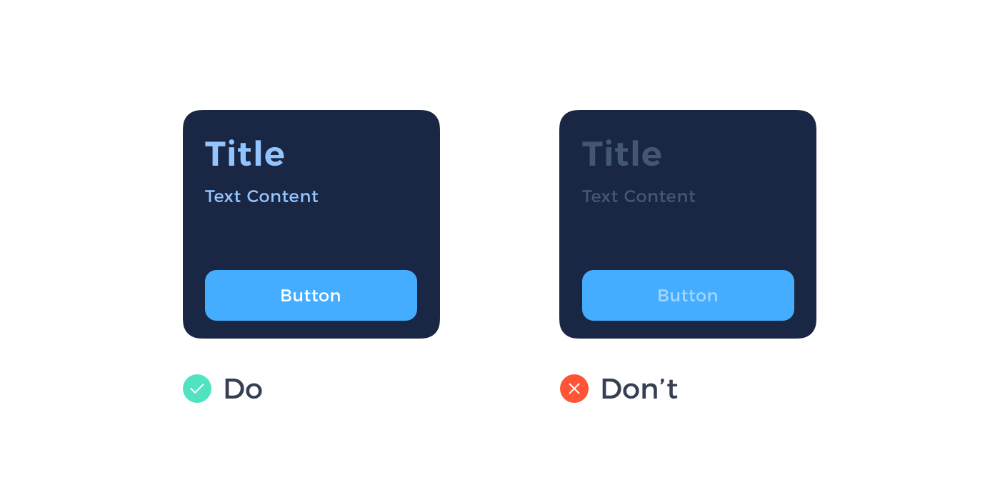

# Week 13 - Visual Design

## Visual Design: Bringing Your Designs to Life

Visual design transcends mere aesthetics, playing a pivotal role in shaping and enhancing user experiences. It's not just about making products look attractive; it's about thoughtful integration of elements like illustrations, photography, typography, space, layout, and color to make products both usable and appealing.

Imagine visual design as the final layer in a multi-tiered cake of design. It's not merely a superficial coat of paint; it's the culmination of a design process that gives your product a distinct, recognizable identity.

<YouTube
  title="Create a High-Fidelity Prototype"
  url="https://www.youtube.com/embed/Fr-f2NE6B3U?si=sRYsHtA1xUljYfmi"
/>

### Understanding High-fidelity Wireframes

High-fidelity wireframes serve as the bridge between your initial design ideas and the final product. They are intricate designs that encompass the visual and interactive aspects of your application. These wireframes:

- **Provide Realism**: High-fidelity wireframes closely resemble the final product, allowing stakeholders to visualize the end result.

- **Enhance User Experience**: They focus on aesthetics, interaction, and user interface details, contributing to a seamless and visually appealing user experience.

- **Ease Development**: With a detailed visual guide, developers can work efficiently, minimizing ambiguities in design implementation.

- **Gather Precise Feedback**: High-fidelity wireframes enable users and stakeholders to provide feedback on a design that closely resembles the actual application.

### Visual Design vs. Graphic Design

| **Visual Design:**                                                                                                                                                                                                                              | **Graphic Design:**                                                                                                                                                                                                                  |
| ----------------------------------------------------------------------------------------------------------------------------------------------------------------------------------------------------------------------------------------------- | ------------------------------------------------------------------------------------------------------------------------------------------------------------------------------------------------------------------------------------ |
| Focuses on optimizing user experience in digital spaces, using elements like typography and color to enhance interaction and usability. It's intertwined with functionality and user journey, emphasizing intuitive design in digital contexts. | Involves creating visual content for various media, using imagery and typography to communicate messages and solve problems. It spans digital and print mediums, often focusing more on artistic expression and visual storytelling. |

## Layout Best Practices

In high-fidelity wireframes, an organized and visually appealing layout is key to success. Here are some best practices to consider:

- **Use of Grid Columns**: Grids help maintain consistency in layout and alignment, making it easier to structure your design effectively.

- **Consistent Spacing**: Ensure that elements are consistently spaced, offering a balanced and harmonious design.

- **Responsive Design**: High-fidelity wireframes must adapt to different screen sizes and orientations, ensuring a consistent and user-friendly experience on various devices.

## Designing for Different Screen Sizes and Resolutions

Designing for various screen sizes and resolutions is a crucial aspect of high-fidelity wireframes. To accommodate the diverse digital landscape, consider the following:

- **Responsive Design**: Implement responsive design principles to ensure that your high-fidelity wireframes look and function seamlessly on devices with different screen sizes and resolutions.

- **Scaling Graphics**: Graphics and images should scale gracefully to maintain quality and visibility on a range of screens.

- **Optimized Typography**: Typography should be legible on both small and large screens, and you may need to adapt font sizes accordingly.

- **Consistent User Experience**: Regardless of the device used, the user experience should remain consistent, and all interactive elements should function correctly.

## Designing with Accessibility in Mind

Creating high-fidelity wireframes with accessibility in mind is essential for mobile app design. To ensure inclusivity and user-friendliness, incorporate recommendations from Apple's Human Interface Guidelines (HIG) and Google's Material Design, along with adherence to the Web Content Accessibility Guidelines (WCAG). Here's how these guidelines contribute to accessible design:

### Fonts and Color Contrast

- **Font Legibility**: Both Apple's HIG and Google's Material Design emphasize using legible fonts, such as San Francisco for iOS and Roboto for Android apps. Adhering to font recommendations from these guidelines ensures text remains clear and readable, especially on smaller screens.

- **Color Contrast**: Apple's HIG and Google's Material Design provide specific color contrast requirements to enhance accessibility. Following these standards helps maintain a sufficient contrast ratio, ensuring text and background colors are distinguishable. This practice aligns with the WCAG's contrast standards for text and contributes to better readability.

### Touch Targets and Interactive Elements

- **Touch Target Sizes**: Apple's HIG recommends a minimum touch target size of 44x44 points, which Google's Material Design also supports. This encourages designing interactive elements, like buttons, with a suitable size for comfortable tapping. This sizing aligns with the principle of touch targets emphasized by the WCAG, which focuses on ensuring elements are large enough to be interacted with accurately.
