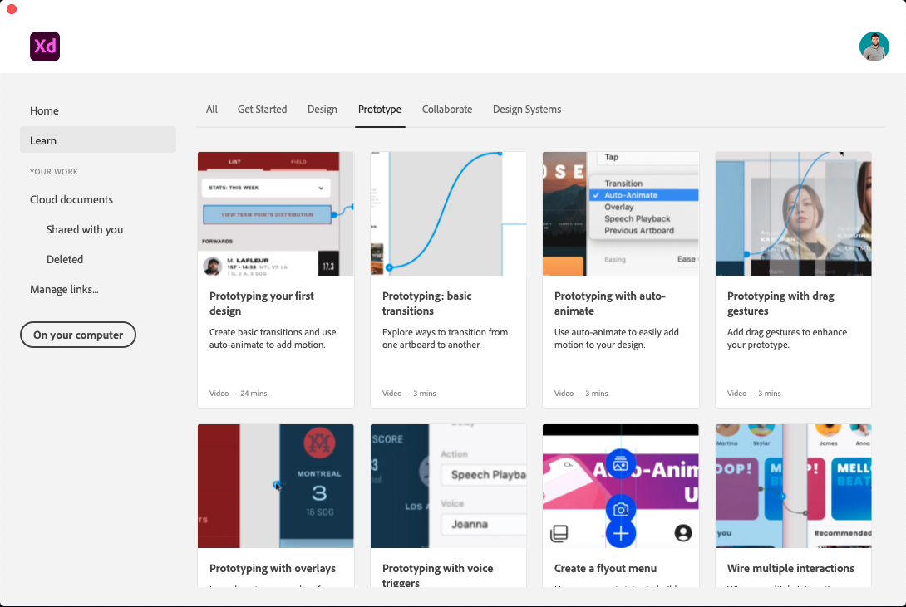

# Week 13 - Intro to Adobe Xd

::: tip Files
[Week 13 Tutorial Files Download](https://drive.google.com/uc?export=download&id=131s3TLxqdlr79sz892PJK5qFlk-2UJGd)
:::

## Introduction

Finally, welcome to Adobe XD (Xd), a vector-based user experience design tool for mobile and web apps. Xd supports rapid wireframing and click-through prototyping.

UI/UX designers use Adobe XD to seamlessly iterate and share interactive visual prototypes with team members and reviewers across devices and platforms.

- [Adobe XD User Guide](https://helpx.adobe.com/ca/xd/user-guide.html) — Contains all reference material
- [What's new in Adobe XD](https://helpx.adobe.com/ca/xd/help/whats-new.html) — Xd is a relatively new app from Adobe and gets more frequent updates and new features. This link will help us keep up with the UI changes from the Adobe XD monthly updates.

## What is Wireframe?

Before we dive into Adobe Xd, we need to know what wireframe is.

<YouTube
  url="https://www.youtube.com/embed/KdfO_e0yK-g"
  title="Advanced SVG: animations"
/>

## Explore Adobe Xd User Interface

Watch this video to get an overview of how Xd let designers create wireframes and interactive visual prototypes with speed, precision, and quality.

<YouTube
  url="https://www.youtube.com/embed/-hV9kKY5a94"
  title="Advanced SVG: animations"
/>

### Xd Workspace

We will get familiar with the workspace and the interface by exploring the in-app resources to learn how to use Adobe XD, or to get a head start on your designs. Learn their respective tools by navigating the Design and Prototype modes.

[Workspace basics](https://helpx.adobe.com/ca/xd/help/workspace-basics.html) is a quick reference for Adobe XD user interface.

#### Work with drawing and text tools

We can quickly create graphics and texts using the shape tools, Pen tool, and text tools in Adobe XD. Check out the [Work with drawing and text tools article](https://helpx.adobe.com/ca/xd/help/drawing-text-tools.html) for a quick reference.

## Xd Workflow: Design > Prototype > Share

Design, prototype, and share with Adobe XD article provides a quick reference in Adobe XD User Guide.

Follow the Xd tutorials below to obtain a hands-on mobile app prototyping experience. Xd supports SVG and bitmap files without any loss of fidelity. It integrates with Illustrator, Photoshop, and After Effects. You can also use plugins to automate repeat operations or parts of designer workflows that are tedious, complex, or repetitive.

Before starting the workflow of: Design, Prototype, Share, we will Download the XD kits.

### Design

In **design** step, we will learn the basics for designing splash screens, importing images, and working with Repeat Grid.

Note: Do you notice that you can click on the artboard name to select/move the artboard and double-click to edit the name?

### Prototype

In **prototype** step, we will turn our designs into interactive visual mockups. We will wire artboards together, switch back and forth between design and prototype mode and preview our UI experience.

Share designs and prototypes is a user guide that contains the current Xd UI features and screenshots.

### Share

In **preview &amp; share** step, we will learn to preview our interactive prototype on a mobile device and share prototype and design specs for feedback with other designers, developers and even for usability testing.

::: tip Note:
The Xd UI has been updated since the above video. There are some important features shown that are still used, so I've included it in this tutorial. However, please watch the video below to see the update "Share" tab in the top left corner and practice further.

<YouTube
  url="https://www.youtube.com/embed/3vj03O641GA"
  title="Advanced SVG: animations"
/>

#### Use Xd for Usability Studies

<YouTube
  url="https://www.youtube.com/embed/swKI-M-RViQ"
  title="Advanced SVG: animations"
/>

## Collaboration features in Adobe XD

Creative Cloud plan includes different types of cloud storage features for different uses and benefits: cloud documents, libraries, and Creative Cloud files (synced files).

Cloud documents in Adobe XD article is a comprehensive guide for Adobe XD Cloud sharing and collaboration.

### Using Xd Cloud Documents

Xd Cloud Documents let us auto-save files, safely keep everything in one place, make fast and easy sharing, and work and live collaborate with others anywhere by using the document versioning control.

#### Using Cloud Document Files

Let's practice using cloud document files. If you notice minor UI differences in the video, you can find your way around in the reference of Workspace basics page.

<YouTube
  url="https://www.youtube.com/embed/H_TmuOJmdkI"
  title="Advanced SVG: animations"
/>

#### Cloud Document Sharing

We will learn how to quickly share documents with collaborators and team members when we save them as cloud documents in Adobe XD.

<YouTube
  url="https://www.youtube.com/embed/qICToKxlxAc"
  title="Advanced SVG: animations"
/>

### Coediting & Document History

We can collaborate and coedit with others in the same document in real-time with Xd. We can also check document history to quickly see who's made edits and revert to old versions when needed. Let's follow this tutorial to use these features.

<YouTube
  url="https://www.youtube.com/embed/XDFE5DH2Z5E"
  title="Advanced SVG: animations"
/>

## Built-in XD Tutorials & Learning

Adobe Xd is a relatively new app and is constantly being updated with new features so it can be challenge to keep up with everything new. Luckily, Xd provides us with a tonne of resources and tutorials for these features in the Learn tab on the home screen and on the [Adobe Xd](https://www.adobe.com/products/xd/learn/get-started.html) page of the Adobe website.

::: tip To Do for Next Week

- Complete the Basic Wireframe exercise
- Complete first draft of the App Branding assignment
- Complete App Branding Feedback discussion post
- Review week 14 content
  :::
