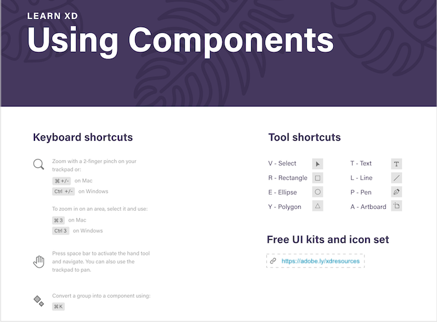

# Week 13 - Mobile UI Layout

## Xd Productivity tools, resources and layout best practices

In this lesson, we will harness our Adobe XD knowledge by using Xd productivity tools, UI Kits, and plugins. We will learn the common mobile user interface elements with ease and get an introduction to the industry design standards and guidelines: Human Interface Guidelines (AppleOS), Material Design (Android), and Universal Windows Platform (UWP) design guidance 

## Xd Productivity Tools

Let's follow this video to practice using some popular Xd features: `Object Flip`, `Search Layers`, and `Linked Symbols (now components)`

<YouTube
  title="Adobe XD December 2018 Release: Cloud Document Sharing"
  url="https://www.youtube.com/embed/wHlcOCJycxw"
/>

### COMPONENTS

Xd `Componenets` are previousely called *Symbols*. This tutorial gives us an introduction of `Master Components`, and `Component Overrides` features.

<YouTube
  title="Introducing Components in Adobe XD"
  url="https://www.youtube.com/embed/qrsuk6zl8B8"
/>

### USING COMPONENTS

This set of short video tutorals teaches us to create/nest/swap componenets, update master componenets and use different componenet states. We will follow along to practice. [Download tutorial file](https://www.dropbox.com/s/vfz93h52t0nsgvz/Components_Demo.xd?dl=0)

1. [Creating components](https://youtu.be/mKp50knMz00)
2. [Updating master components](https://youtu.be/lK9JBk4eIFQ)
3. [Nesting components](https://youtu.be/DPSlmgaF1J8)
4. [Swapping components](https://youtu.be/vzqScGDnrEE)
5. [Using states](https://youtu.be/U4HH8bDkK48)

#### Component hover states & Micro-Interactions

Check out this video to learn how component states allows you to save elements for future use and create additional versions of your buttons, toggles, fields, and more.

<YouTube
  title="Adobe XD – Hover & Micro-Interactions"
  url="https://www.youtube.com/embed/c8ov6IzFE0c"
/>

### XD INTERACTIONS 

Let's watch this set of short videos to practice popular prototype interacation design in Adobe XD. We will build prototype with screen animation, transitions, drag gesture, componenet overlay, and voice control. [Download tutorial file](https://www.dropbox.com/s/j12i70snyblerui/Prototyping_Demo.xd?dl=0)

1. [Basic Wiring](https://youtu.be/V2cXkakhh0Q)
2. [Auto-animate transitions](https://youtu.be/9pRgHdJrCj8)
3. [Drag gesture](https://youtu.be/8w7MdxfBRFQ)
4. [Overlay](https://youtu.be/3tu1_j4PCnE)
5. [Voice](https://youtu.be/LP_fiskLYqs)

#### Multiple Interactions

Xd 2020 release allows desingers to apply multiple interactions to the same UI object. Follow this video to make our prototype interaction more natural. 

<YouTube
  title="Multiple Interactions"
  url="https://www.youtube.com/embed/zWQv9Qszm7c"
/>

#### Content-Aware Layout

We will learn content-aware layout to quickly create and edit common design elements without a lot of tedious steps. We can also add group padding coupled with responsive resize.

<YouTube
  title="Content-Aware Layout"
  url="https://www.youtube.com/embed/h2yyNV4fnN0"
/>

**Links**
- [GETTING STARTED in Adobe XD](https://letsxd.com/getting-started)
- [Prototyping 101](https://letsxd.com/prototyping)

---

## XD Resources (Under "Features" Tab)

[*Adobe XD resources*, now under Features tab](https://www.adobe.com/products/xd/features/ui-kits.html) provides resources we can use to optimize our workflow and speed up the design process. They include `UI kits`, `icon sets`, `plugins`, `app integrations`, and more. 

### XD UI KITS

UI Kits content contains common buttons, form elements, headers, icons, and other UI elements. Follow this XD tutorial to learn how to get UI kits and use the Kit content in your own designs. 

Note: We will explorer UI Kits for [**Apple iOS**](https://developer.apple.com/design/resources/) and [**Material Design**](https://material.io/resources) in class to understand the platform standards together. Download [Apple iOS fonts & symbols](https://developer.apple.com/fonts/) and [Roboto fonts for Android devices](https://material.io/design/typography/understanding-typography.html#system-fonts)

**Let's start our design with UI kits.** We will follow this video to get the *Wireframes UI Kits* and use the content in our own XD file. 

**Leveraging UI Kits** tutorial shows multiple ways to access UI Kits in Xd and how to download *Tractiv* UI Kits from [Adobe Ressources](https://www.adobe.com/ca/products/xd/resources.html) website. 

<YouTube
  title="Leveraging UI Kits"
  url="https://www.youtube.com/embed/Jgk83qXOYSk"
/>

#### Resources
- [Material Design Resources](https://material.io/resources)
- [Apple Design Resources](https://developer.apple.com/design/resources/)
- [Design toolkits and samples for Windows apps](https://docs.microsoft.com/en-us/windows/uwp/design/downloads/)
- [Auto Animated UI Kit by Howard Pinsky & Jonathan Pimento](https://www.behance.net/gallery/72065227/Auto-Animate-UI-Kit-for-Adobe-XD)
- [Component States UI Kit](https://letsxd.com/states)

### XD PLUGIN MANAGER  

This tutorial provides a quick overview of `XD Plugin Manager` and multiple ways to access it. 

<YouTube
  title="XD Plugin Manager"
  url="https://www.youtube.com/embed/YAgKDA6c9_I"
/>

**Adobe XD Top 10 Plugins (2020)** 

Let's follow this tutorial to install some useful plugins. We will use these plugins for our class excercises: `Photosplash 2`, `Icons 4 Design`, and `UI Faces` but feel free to try as many as you like.

<YouTube
  title="Adobe XD Top 10 Plugins (2020)"
  url="https://www.youtube.com/embed/d-Hxze_r9rU"
/>

One last plugin we will use is `Google Spreadsheet` which is very useful when designing UI with data. 

<YouTube
  title="Google Sheets Plugin for Adobe XD – Design with Data"
  url="https://www.youtube.com/embed/g8z0l5moNIw"
/>

**Links**

Here are two plugins you may try for usability testing in Xd. They both provide free/education access. 

- [Useberry](https://www.useberry.com/integrations/adobe-xd/) - You can watch [Useberry vidoe demo](https://youtu.be/ecFwUeYtq78) 
- [Usertesting](https://help.usertesting.com/hc/en-us/articles/360014666372)

## Layout Best Practices

**Common Design Mistakes by Non-designers** – *A compilation of 15 most common design mistakes committed by non-designers and amateur visual artists. They include how to avoid using too many words instead of visuals, poor readability, and lack of negative space.* 

<YouTube
  title="GLearn the Most Common Design Mistakes by Non Designers"
  url="https://www.youtube.com/embed/mOA0WH00reA"
/>

## TODO

::: tip TODO Before next week

- If you have not read all these notes and watched the videos from this week, do that first.
- Read the notes and watch all the videos for Week 14.
- Hybrid 9 - In-class: Mobile layout in XD
  :::
