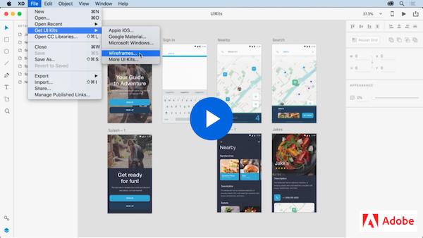

# Week 13 - Xd Productivity tools, resources and layout best practices

In this lesson, we will harness our Adobe XD knowledge by using XD productivity tools, UI Kits, and plugins. We will learn the common mobile user interface elements with ease and get an introduction to the industry design standards and guidelines: Human Interface Guidelines (Mac), Material Design (Android), and Universal Windows Platform (UWP) design guidance. 

## Xd Productivity Tools

Let's follow this video to practice using some popular XD features for `Object Flip`, `Search Layers`, and `Linked Symbols (now components)`.

<YouTube
  title="Adobe XD December 2018 Release: Cloud Document Sharing"
  url="https://www.youtube.com/embed/wHlcOCJycxw"
/>

### COMPONENTS

Xd `Componenets` are previousely called *Symbols*. This tutorial shows us how to effectively utilise the `Master Components`, and `Component Overrides` features.

<YouTube
  title="Introducing Components in Adobe XD"
  url="https://www.youtube.com/embed/qrsuk6zl8B8"
/>

### USING COMPONENTS

Let's follow this set of short video tutorals to create/nest/swap componenets, update master componenets and use different componenet states. [Download tutorial file](https://www.dropbox.com/s/vfz93h52t0nsgvz/Components_Demo.xd?dl=0)

1. [Creating components](https://youtu.be/mKp50knMz00)
2. [Updating master components](https://youtu.be/lK9JBk4eIFQ)
3. [Nesting components](https://youtu.be/DPSlmgaF1J8)
4. [Swapping components](https://youtu.be/vzqScGDnrEE)
5. [Using states](https://youtu.be/U4HH8bDkK48)

**Component hover states & Micro-Interactions**

Check out this video to learn how component states allows you to save elements for future use and create additional versions of your buttons, toggles, fields, and more.

<YouTube
  title="Adobe XD – Hover & Micro-Interactions"
  url="https://www.youtube.com/embed/c8ov6IzFE0c"
/>

### XD INTERACTIONS 

Let's watch this set of short videos to practice some popular prototype interacation design  in Adobe XD. We will build prototype with screen animation, transitions, drag gesture, componenet overlay, and voice control. [Download this tutorial file](https://www.dropbox.com/s/j12i70snyblerui/Prototyping_Demo.xd?dl=0)

1. [Basic Wiring](https://youtu.be/V2cXkakhh0Q)
2. [Auto-animate transitions](https://youtu.be/9pRgHdJrCj8)
3. [Drag gesture](https://youtu.be/8w7MdxfBRFQ)
4. [Overlay](https://youtu.be/3tu1_j4PCnE)
5. [Voice](https://youtu.be/LP_fiskLYqs)

**Multiple Interactions**

XD 2020 release allows desingers to apply multiple interactions to the same UI object. Follow this video to make our prototype interaction more natural. 

<YouTube
  title="Multiple Interactions"
  url="https://www.youtube.com/embed/zWQv9Qszm7c"
/>

**Content-Aware Layout**

Content-aware layout enables designers to quickly create and edit common design elements without a lot of tedious step. We can add group padding coupled with responsive resize.

<YouTube
  title="Content-Aware Layout"
  url="https://www.youtube.com/embed/h2yyNV4fnN0"
/>

---

## XD Resources

[*Adobe XD resources*](https://www.adobe.com/ca/products/xd/resources.html) website provides powerful free resources we can use to optimize our workflow and speed up the design process. They include `UI kits`, `icon sets`, `plugins`, `app integrations`, and more. 

### XD UI KITS

UI Kits content contains common buttons, form elements, headers, icons, and other UI elements.Follow this XD tutorial to learn how to get UI kits and use the Kit content in your own designs. Note: We will explorer UI Kits for [**Apple iOS**](https://developer.apple.com/design/resources/) and [**Material Design**](http://download.adobe.com/pub/adobe/xd/ui-kits/xd-resources-material-design-ui.zip?promoid=98SH4RH2&mv=other) in class to understand the platform standards together. 

**Start your design with UI kits**

We will follow this video to get the *Wireframes UI Kits* and then use the content in our own XD file. 

**Leveraging UI Kits** shows multiple ways to access UI KITs in Xd. 

<YouTube
  title="Leveraging UI Kits"
  url="https://www.youtube.com/embed/Jgk83qXOYSk"
/>

**Links**
- [Material Design Resources](https://material.io/resources)
- [Apple Design Resources](https://developer.apple.com/design/resources/)
- 

###  Plugin Manager 

https://youtu.be/YAgKDA6c9_I

## Cordova Running apps

Cordova also has a `cordova run` command which will compile your project, install it on an attached device, and launch the app on the device.

[Learn more about Running Apps in Cordova](./run.md)

## TODO

::: tip TODO Before next week

- If you have not read all these notes and watched the videos from this week, do that first.
- Finish reading the notes for week 13 and watch all the videos in the notes for week 14.
- Hybrid 9 - In-class: Mobile layout in XD

  :::
