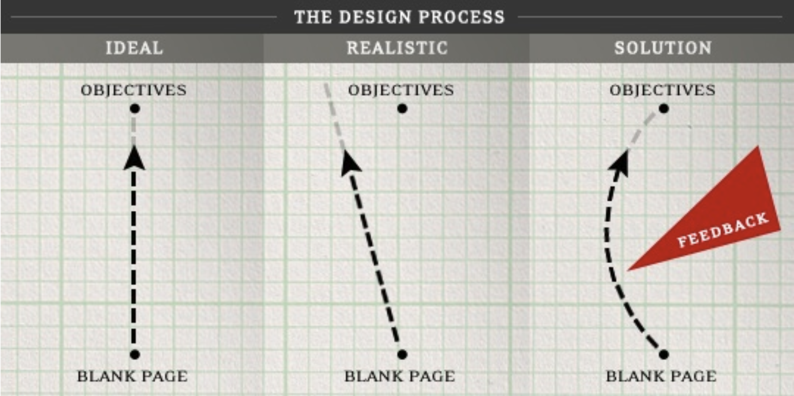

# Week 14 - Presenting Your Concepts

## Introduction to Design Critiques

Design critiques play a pivotal role in the development and refinement of design projects. They provide a structured platform for receiving constructive feedback, fostering collaboration, and enhancing the final design outcomes.

## What's a Design Review?

A design review is a session where a team collaboratively evaluates a design or a product prototype. It's essential to understand what a design review is not to set the right expectations and atmosphere:

- It's **not** a brainstorming or idea-generating session.
- It's **not** a personal attack on the designer.
- It's **not** a lengthy justification, history lesson, or sales pitch.
- It's **not** solely focused on criticism or negative feedback.
- It's **not** a confrontation or a 'battle to win.'
- It's **not** a final presentation.

## Why Have a Design Review?

- **To prevent a design from straying too far from its intended path.**
- **To incorporate diverse perspectives on a design problem at crucial stages.**
- **To navigate through design challenges and plateaus.**
- **To cultivate trust within the team and confidence in the design.**
- **To eliminate ownership and ego from the design process.**

### Early in a Project:

- Ensure alignment with overarching user and customer goals.
- Select a coherent design direction.
- Identify potential risks (technical, design, scope).
- Focus is **not** on finalizing specifics and aesthetics.

### Later in a Project:

- Make informed decisions on specific design solutions.

## How to Hold a Good Design Review

**Structure:**

- Clearly define the critique's objective.
- Provide sufficient background to enable meaningful feedback.
- Allocate ample time for discussion.

**Attitude:**

- Be open to having your design and perspective changed.
- Communicate using specific, respectful, and constructive language.
- Separate personal feelings from professional critique.

## Planning Your Presentation

- Determine the available time and essential coverage points.
- Identify your audience (designers, clients, developers, etc.) and their needs.
- Tailor the amount of background information accordingly.
- Select and prepare content that will elicit relevant feedback.
- Practice your presentation to ensure clarity and confidence.

## Presentation Tools

 
<ListItem
imageSrc="/f2024/moduleImages/week14/1.png"
title="In-person, Low-tech"
content="Utilize paper printouts, sketches, or a whiteboard.">
</ListItem>

<ListItem
imageSrc="/f2024/moduleImages/week14/2.png"
title="In-person, Mid-tech"
content="Gather around a computer screen, or use a projector for slides and live demos.">
</ListItem>

<ListItem
imageSrc="/f2024/moduleImages/week14/3.png"
title="In-person, Mid-tech"
content="Projector, slides, live demo, or the device itself">
</ListItem>

<ListItem
imageSrc="/f2024/moduleImages/week14/4.jpg"
title="Remote"
content="Employ screen-sharing tools like WebEx, Zoom, Teams, Google Meet, or Skype.">
</ListItem>
 

## Giving and Receiving Feedback

### What is Good Feedback?

Good feedback is specific, actionable, and aimed at enhancing the design. It should focus on the solution or concept rather than the individual.

| Instead of:                                                   | Try:                                                                                                                                                |
| ------------------------------------------------------------- | --------------------------------------------------------------------------------------------------------------------------------------------------- |
| “I don’t like it”, “I really love it!” ,“It feels wrong…”     | “I don’t think this screen will encourage users to get started.” or "This sequence will really guide users through the process well.”               |
| “I don’t like that font.”, “I don’t think we should use red.” | “This font doesn’t reflect the tone we’re trying to convey - it’s casual, and our users will be looking for security and confidence.”               |
| “I’d never use this - it makes no sense.”                     | “Do you think users will know what to do when they get to this screen? What do you think they’ll look at/tap first?”                                |
| “I still don’t like it."                                      | “Let me make sure I understand what you’re saying. Do you mean that…? Because I’m concerned about… Do you think there’s a better way to handle it?” |

### Receiving Feedback

- Understand that feedback is directed at the design, not at you personally.
- Embrace the critique as an opportunity for improvement.
- Avoid defensiveness and excuse-making; differentiate between explaining and defending.
- Seek clarity on the feedback to fully understand it.
- Consider all feedback, but use discretion in deciding what to incorporate.

## Incorporating Feedback

- Review and organize your notes from the critique.
- Discard off-topic feedback but save potentially relevant points for future discussion.
- Align feedback with your own insights and those opposing your views.
- Brainstorm ways to integrate this feedback into your design solutions.

## Tips for Effective Design Presentations and Critiques

Ensuring your design presentations and critiques are effective requires preparation, clear communication, and an open mindset. Here are some tips to help you maximize the benefits of these sessions:

1. **Preparation is Key**: Spend time preparing your presentation to ensure it's clear, concise, and focused on the key elements of your design. Know your audience and tailor your presentation to their interests and expertise level.

2. **Set Clear Objectives**: Start by clearly stating the objectives of your presentation or critique session. What feedback are you seeking? What decisions need to be made? This helps keep the session focused and productive.

3. **Embrace a Growth Mindset**: Approach each critique with the mindset that feedback is a valuable opportunity for growth, not a personal critique. Be open to ideas and suggestions that could enhance your design.

4. **Be Specific in Your Requests for Feedback**: Guide your audience on where you need feedback the most. Being specific helps you get actionable insights that can be readily applied to improve your design.

5. **Provide Context**: Offer enough background information to help your audience understand the design's purpose, target users, and key challenges. This context is crucial for meaningful feedback.

6. **Structure Your Presentation**: Organize your presentation logically, starting with an introduction to the project, followed by design decisions, challenges faced, and areas where you seek feedback. A structured presentation makes it easier for the audience to follow and contribute effectively.

7. **Use Visual Aids Wisely**: Whether it's sketches, wireframes, or prototypes, visual aids can significantly enhance understanding and engagement. Ensure they are clear, relevant, and effectively illustrate your points.

8. **Facilitate Open Discussion**: Encourage an open, respectful discussion where all participants feel comfortable sharing their thoughts. Facilitating a constructive dialogue can uncover valuable insights and foster a collaborative atmosphere.

9. **Take Notes**: Document feedback and suggestions during the session. Notes are invaluable for revisiting critiques and ensuring you can act on the feedback received.

10. **Follow Up**: After the critique, review your notes, identify actionable feedback, and plan how to incorporate it into your design. Consider following up with participants if you have further questions or to share how their feedback was implemented.

By incorporating these tips, you can make your design presentations and critiques more engaging, productive, and conducive to creating high-quality designs.
