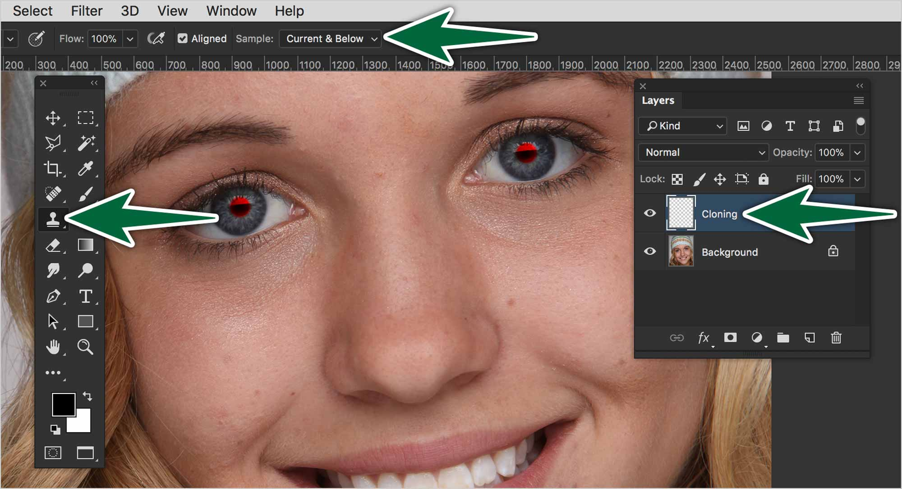
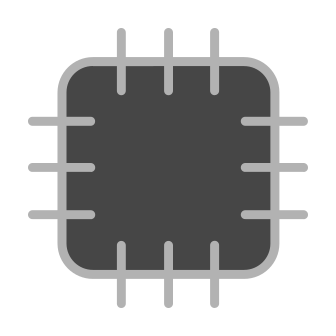
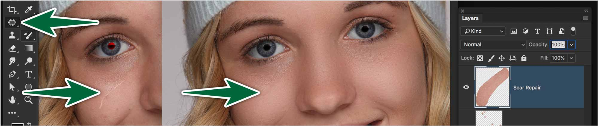
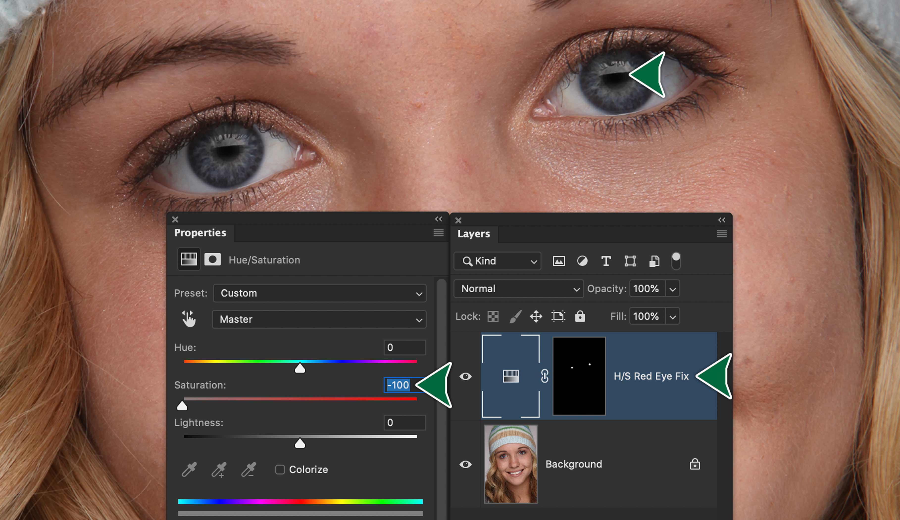
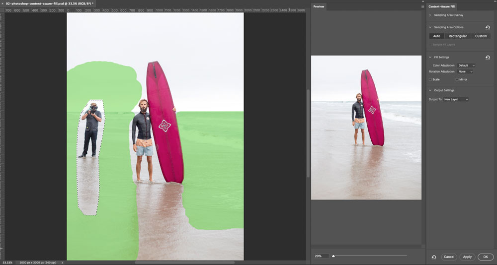

# Week 2 - Photo Retouching

<Badge text="Reminder: Photoshop quiz this week." type="error" />

## Introduction

Whether they’re blemishes on skin or stains on a surface, Photoshop has a tool to remove them quite easily. Our focus here will be on working non-destructively. That means that we don’t want to paint on the original photo at all. The added advantage working this way is that our painting will be accessible on their own layers.

## Retouching Tools

1. Clone Stamp Tool
2. Spot Healing Brush Tool
3. Healing Brush Tool
4. Patch Tool
5. Red Eye Tool

These are the tools we’ll focus on. They’re all made to repair photographs.

### Clone Stamp Tool

The Clone Stamp Tool is often called the rubber stamp tool for a reason. It works very similarly. You take a sample on your photo, then you replicate it at another location. The goal is most often to cover up something under the cloning.

::: tip Tip
Create a new empty layer called <strong>Retouching</strong>. Do not duplicate the photo's layer.
:::

The Clone Stamp Tool doesn’t do any calculations or adjustments. It just clones the pixels you sampled, no matter whether they match or not.

### Healing Brush

The Healing Brush Tool works very similarly to the Clone Stamp Tool, except that it’s a smarter tool. You need to sample an area first. When you release the mouse while cloning, it evaluates the surrounding pixels then adjusts the cloned pixels to blend into their surroundings.

### Spot Healing Brush Tool

The Spot Healing Brush works by simply clicking on blemishes. There’s no need to sample pixels first. Just adjust the diameter and hardness of your brush, then click away. Just make sure you’re on a new, empty layer.

This is the perfect tool for removing blemishes on a subject’s skin. It should be your go-to tool. If you find it not bending to your will, go back to the Clone Stamp Tool.

### Patch Tool

The Patch Tool is made to fix blemishes on large, rather flat surfaces in a photo. The idea is that you drag a good part of the photo on top of a damaged part of the photo. The tool does the work of blending the patch into its surroundings.

<figure>

<figcaption>
  The scar was repaired using the Patch tool on Content Aware mode on its own layer.
</figcaption>
</figure>

Note that if the Patch setting is at Normal, the tool doesn’t work on a separate layer. It’s best to set it to `Content Aware`, then work on a new empty layer named Patching.

#### Patch Settings

<dl>
<dt>Structure</dt>
<dd>
  Enter a value between 1 and 7 to specify how closely the patch should reflect existing image patterns. If you enter 7, the patch adheres very strongly to existing image patterns. If you enter 1, the patch adheres very loosely to the existing image patterns.</dd>
<dt>Color</dt>
<dd>
  Enter a value between 0 and 10 to specify the extent to which you want Photoshop to apply algorithmic color-blending to the patch. If you enter 0, color blending is disabled. A Color value of 10 applies maximum color blending.
</dd>
<dt>Sample All Layers</dt>
<dd>
  Enable this option to create the result of the move in another layer using information from all layers. Select the target layer in the Layers panel.
</dd>
</dl>

### Red Eye Tool

<strong>Let’s avoid using this tool</strong>. We’ll use a Hue/Saturation adjustment layer instead.

We’ve all seen the red eye effect in photos. Few know that it comes from light from your flash bouncing off the blood vessels at the back of the eye to return to your camera.

Use an Adjustmet Layer to desaturate the red from the eyes. This preserves the detail in the pupils.
Create a Hue/Saturation Adjustment Layer. Turn the Saturation down to -100. Invert your mask to make it black. Then pain the red eyes with a very soft white brush.

> A reflection of the camera flash in the subject’s retina causes red eye. You’ll see it more often when taking pictures in a darkened room because the subject’s iris is wide open. To avoid red eye, use the camera’s red eye reduction feature. Or, better yet, use a separate flash unit that you can mount on the camera farther away from the camera’s lens. [From: Adobe](https://helpx.adobe.com/photoshop/using/retouching-repairing-images.html)

### Key Points to Remember

The important factor is to never touch the original photo. Make sure edits you make are on their own layers. This allows you to return to the photo to make changes. You can also turn off your new layers to see the original photo.

## Content Aware Tools

The Content Aware Tools in Photoshop are truly magical. They make a really good guess at how you want to fill in shapes. All you do is lasso the unwanted area, then `Edit > Fill > Content Aware Fill`. Presto!

Make a selection, then use `Edit > Fill > Content Aware Fill` to open the Content Aware Fill dialogue. In this dialogue you can select which areas of the photo to sample from by painting on the green sections. On the right side you will see a preview of the fill. When you are happy with the results, make sure **Output to** is set to **New Layer** then click **OK** and it will automatically create a new layer with the filled area.

Depending on how complex the fill needs to be, you may need to layer a couple fills for best results. However, often with simpler fixes, one is enough.

Content on this page is used with permission from [cg.algonquindesign.ca](https://cg.algonquindesign.ca/topics/retouching-fundamentals.html)
