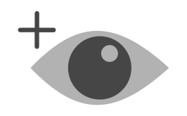

# Week 2 - Photo Retouching Techniques

<Countdown date="2024-12-25" customMessage="No need to rush ahead. This content will be available before this week's theory class, so just focus on what we're learning this week.">

## Learning Objectives

By the end of this week, students will be able to:

1. **Master Advanced Retouching Tools:** Utilize tools like Clone Stamp, Healing Brush, Patch Tool, and Generative Fill for photo repair.
2. **Implement Content-Aware Techniques:** Apply content-aware fill and other content-aware tools to seamlessly remove unwanted elements from images.
3. **Employ Non-Destructive Editing Methods:** Practice retouching and editing without altering the original image data.

## Introduction to Advanced Retouching

Explore advanced tools and techniques in Photoshop for retouching images, focusing on maintaining image quality and non-destructive editing methods. Learn to address common issues like blemishes, unwanted elements, and distractions using Photoshop's powerful toolkit, all while preserving the integrity of the original photo.

## Retouching Tools Overview

- **Clone Stamp Tool:** Replicate pixels from one area to another, ideal for covering unwanted elements.
- **Healing Brush & Spot Healing Brush Tools:** Blend and repair imperfections seamlessly by adjusting pixels to match their surroundings.
- **Patch Tool:** Cover larger flawed areas by dragging a good part of the photo over them, especially effective on flat surfaces.
- **Generative Fill (New):** Automatically generate new content in an image using AI to fill or extend backgrounds.
- **Red Eye Tool Alternatives:** Learn alternative, non-destructive methods to fix red-eye effects.

###  Clone Stamp Tool

The Clone Stamp Tool is often called the rubber stamp tool for a reason. It works similarly by sampling pixels from one area and replicating them in another. This is useful for covering unwanted elements, such as blemishes or distractions.

<Slideshow
  :key="'Clone Stamp Tool'"
  :images="[
    { label: 'Image 1', src: '/f2024/moduleImages/week1/psInterface/1.png' },
    { label: 'Image 2', src: '/f2024/moduleImages/week1/psInterface/2.png' },
    { label: 'Image 3', src: '/f2024/moduleImages/week1/psInterface/3.png' },
    { label: 'Image 4', src: '/f2024/moduleImages/week1/psInterface/4.png' },
    { label: 'Image 5', src: '/f2024/moduleImages/week1/psInterface/5.png' },
    { label: 'Image 6', src: '/f2024/moduleImages/week1/psInterface/6.png' },
    { label: 'Image 7', src: '/f2024/moduleImages/week1/psInterface/7.png' },
    { label: 'Image 8', src: '/f2024/moduleImages/week1/psInterface/8.png' }
  ]"
/>

::: tip Tip
Create a new empty layer called <strong>Retouching</strong>. Do not duplicate the photo's layer. This allows you to maintain a non-destructive workflow.
:::

###  Healing Brush

The Healing Brush Tool works similarly to the Clone Stamp Tool but is smarter. After sampling an area, the tool adjusts the pixels to match the surrounding area for seamless blending. It’s great for retouching small imperfections, such as skin blemishes.

<Slideshow
  :key="'Healing Brush Tool'"
  :images="[
    { label: 'Image 1', src: '/f2024/moduleImages/week1/psInterface/1.png' },
    { label: 'Image 2', src: '/f2024/moduleImages/week1/psInterface/2.png' },
    { label: 'Image 3', src: '/f2024/moduleImages/week1/psInterface/3.png' },
    { label: 'Image 4', src: '/f2024/moduleImages/week1/psInterface/4.png' },
    { label: 'Image 5', src: '/f2024/moduleImages/week1/psInterface/5.png' },
    { label: 'Image 6', src: '/f2024/moduleImages/week1/psInterface/6.png' },
    { label: 'Image 7', src: '/f2024/moduleImages/week1/psInterface/7.png' },
    { label: 'Image 8', src: '/f2024/moduleImages/week1/psInterface/8.png' }
  ]"
/>

###  Spot Healing Brush Tool

The Spot Healing Brush is quick and easy to use, requiring no sampling. You simply click on blemishes, and Photoshop automatically blends the area with the surrounding pixels. Adjust the brush diameter and hardness as needed, and always work on a new, empty layer to keep your edits non-destructive.

<Slideshow
  :key="'Spot Healing Brush Tool'"
  :images="[
    { label: 'Image 1', src: '/f2024/moduleImages/week1/psInterface/1.png' },
    { label: 'Image 2', src: '/f2024/moduleImages/week1/psInterface/2.png' },
    { label: 'Image 3', src: '/f2024/moduleImages/week1/psInterface/3.png' },
    { label: 'Image 4', src: '/f2024/moduleImages/week1/psInterface/4.png' },
    { label: 'Image 5', src: '/f2024/moduleImages/week1/psInterface/5.png' },
    { label: 'Image 6', src: '/f2024/moduleImages/week1/psInterface/6.png' },
    { label: 'Image 7', src: '/f2024/moduleImages/week1/psInterface/7.png' },
    { label: 'Image 8', src: '/f2024/moduleImages/week1/psInterface/8.png' }
  ]"
/>

###  Patch Tool

The Patch Tool is ideal for fixing larger blemishes or imperfections on flat surfaces. You drag a good section of the image over the flawed area, and Photoshop blends it with the surrounding pixels.

<Slideshow
  :key="'Spot Healing Brush Tool'"
  :images="[
    { label: 'Image 1', src: '/f2024/moduleImages/week1/psInterface/1.png' },
    { label: 'Image 2', src: '/f2024/moduleImages/week1/psInterface/2.png' },
    { label: 'Image 3', src: '/f2024/moduleImages/week1/psInterface/3.png' },
    { label: 'Image 4', src: '/f2024/moduleImages/week1/psInterface/4.png' },
    { label: 'Image 5', src: '/f2024/moduleImages/week1/psInterface/5.png' },
    { label: 'Image 6', src: '/f2024/moduleImages/week1/psInterface/6.png' },
    { label: 'Image 7', src: '/f2024/moduleImages/week1/psInterface/7.png' },
    { label: 'Image 8', src: '/f2024/moduleImages/week1/psInterface/8.png' }
  ]"
/>

::: tip Tip
Set the tool to `Content Aware` and work on a new empty layer for a more seamless blend with the surrounding content.
:::

<!-- #### Patch Tool Settings

<dl>
<dt><strong>Structure</strong></dt>
<dd>Set a value between 1 and 7 to control how closely the patch matches existing patterns. A higher value (7) matches closely, while a lower value (1) blends loosely.</dd>

<dt><strong>Color</strong></dt>
<dd>Set a value between 0 and 10 to determine how much Photoshop blends the patch’s colors with the surrounding area. Higher values apply more color blending.</dd>

<dt><strong>Sample All Layers</strong></dt>
<dd>Enable this option to apply the patch to another layer using data from all visible layers. This is useful for non-destructive editing.</dd>
</dl> -->

###  Red Eye Tool

<Slideshow
  :key="'Generative Fill'"
  :images="[
    { label: 'Image 1', src: '/f2024/moduleImages/week1/psInterface/1.png' },
    { label: 'Image 2', src: '/f2024/moduleImages/week1/psInterface/2.png' },
    { label: 'Image 3', src: '/f2024/moduleImages/week1/psInterface/3.png' },
    { label: 'Image 4', src: '/f2024/moduleImages/week1/psInterface/4.png' },
    { label: 'Image 5', src: '/f2024/moduleImages/week1/psInterface/5.png' },
    { label: 'Image 6', src: '/f2024/moduleImages/week1/psInterface/6.png' },
    { label: 'Image 7', src: '/f2024/moduleImages/week1/psInterface/7.png' },
    { label: 'Image 8', src: '/f2024/moduleImages/week1/psInterface/8.png' }
  ]"
/>

::: tip Red Eye Tool Alternative

Instead of using the Red Eye Tool, apply a **Hue/Saturation Adjustment Layer** to desaturate the red in the eyes, preserving detail in the pupils.

#### Steps:

1. Create a **Hue/Saturation Adjustment Layer** and set the saturation to -100.
2. Invert the mask to black, then paint over the red eyes with a soft white brush.
3. Adjust the settings as needed to make the eyes look natural.

:::

### Generative Fill (New)

<!--  -->

Generative Fill is a new AI-powered feature in Photoshop that allows you to generate content in your images automatically. By selecting an area, you can use this tool to fill it with relevant generated content, whether you’re extending backgrounds or removing objects. Generative Fill is perfect for removing large objects, extending backgrounds, or generating entirely new scenes in an image.

<Slideshow
  :key="'Generative Fill'"
  :images="[
    { label: 'Image 1', src: '/f2024/moduleImages/week1/psInterface/1.png' },
    { label: 'Image 2', src: '/f2024/moduleImages/week1/psInterface/2.png' },
    { label: 'Image 3', src: '/f2024/moduleImages/week1/psInterface/3.png' },
    { label: 'Image 4', src: '/f2024/moduleImages/week1/psInterface/4.png' },
    { label: 'Image 5', src: '/f2024/moduleImages/week1/psInterface/5.png' },
    { label: 'Image 6', src: '/f2024/moduleImages/week1/psInterface/6.png' },
    { label: 'Image 7', src: '/f2024/moduleImages/week1/psInterface/7.png' },
    { label: 'Image 8', src: '/f2024/moduleImages/week1/psInterface/8.png' }
  ]"
/>

<!-- #### How to Use Generative Fill

1. **Select an Area:** Use any selection tool to highlight the area you want to modify.
2. **Activate Generative Fill:** After selecting, click on the Generative Fill button or use the `Edit > Generative Fill` option.
3. **Generate Content:** Photoshop will analyze the surrounding pixels and generate new content to fill the selected area. You can guide the fill by typing a description (e.g., "fill with ocean").
4. **Non-Destructive Workflow:** Like with other tools, always work on a new layer to maintain flexibility. -->

## Content Aware Tools

The **Content Aware Tools** in Photoshop are incredibly powerful for removing unwanted elements from an image. Simply make a selection, then choose `Edit > Fill > Content Aware Fill`, and Photoshop will automatically fill in the area with surrounding content.

<Slideshow
  :key="'Content Aware Fill'"
  :images="[
    { label: 'Image 1', src: '/f2024/moduleImages/week1/psInterface/1.png' },
    { label: 'Image 2', src: '/f2024/moduleImages/week1/psInterface/2.png' },
    { label: 'Image 3', src: '/f2024/moduleImages/week1/psInterface/3.png' },
    { label: 'Image 4', src: '/f2024/moduleImages/week1/psInterface/4.png' },
    { label: 'Image 5', src: '/f2024/moduleImages/week1/psInterface/5.png' },
    { label: 'Image 6', src: '/f2024/moduleImages/week1/psInterface/6.png' },
    { label: 'Image 7', src: '/f2024/moduleImages/week1/psInterface/7.png' },
    { label: 'Image 8', src: '/f2024/moduleImages/week1/psInterface/8.png' }
  ]"
/>

#### Content Aware Fill Options

- **Output to New Layer:** Always select this option to keep the fill on a new layer, allowing for non-destructive editing.
- **Sampling Area Options:** In the Content Aware Fill dialogue, you can define which areas Photoshop should sample by painting in or out the green highlight sections.

### Key Points to Remember

1. **Non-Destructive Workflow:** Always create new layers for retouching to keep the original image intact.
2. **Leverage AI Tools:** Use new AI-powered tools like Generative Fill to streamline complex retouching tasks.
3. **Stay Flexible:** Keep your layers organized and editable by using Adjustment Layers, Layer Masks, and Smart Objects.

</Countdown>
