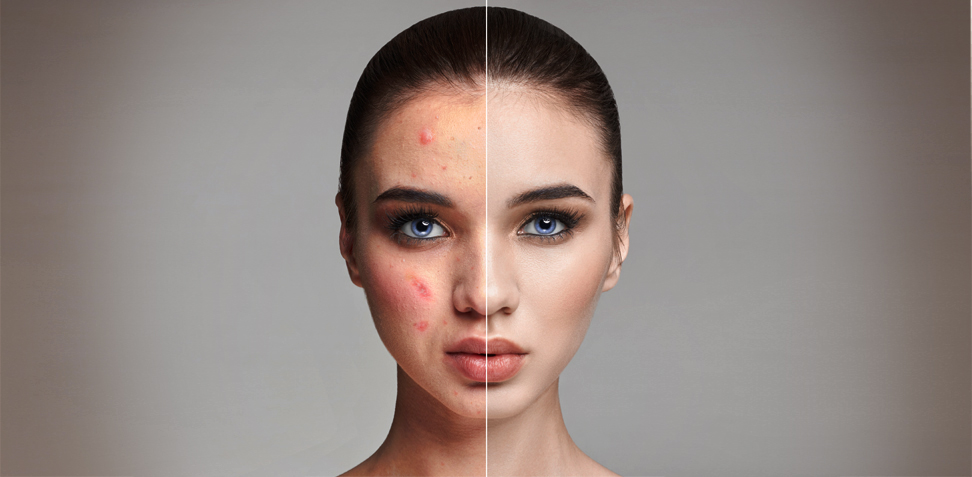

# Week 2 - Photo Retouching Techniques

<Countdown date="2024-09-11" customMessage="No need to rush ahead. This content will be available before this week's theory class, so just focus on what we're learning this week.">

::: tip Learning Objectives

By the end of this week, students will be able to:

1. **Master Advanced Retouching Tools:** Utilize tools like Clone Stamp, Healing Brush, Patch Tool, and Generative Fill for photo repair.
2. **Implement Content-Aware Techniques:** Apply content-aware fill and other content-aware tools to seamlessly remove unwanted elements from images.
3. **Employ Non-Destructive Editing Methods:** Practice retouching and editing without altering the original image data.

:::

## 1. Introduction to Advanced Retouching

Explore advanced tools and techniques in Photoshop for retouching images, focusing on maintaining image quality and non-destructive editing methods. Learn to address common issues like blemishes, unwanted elements, and distractions using Photoshop's powerful toolkit, all while preserving the integrity of the original photo.

## 2. Retouching Tools Overview

- **Clone Stamp Tool:** Replicate pixels from one area to another, ideal for covering unwanted elements.
- **Healing Brush & Spot Healing Brush Tools:** Blend and repair imperfections seamlessly by adjusting pixels to match their surroundings.
- **Patch Tool:** Cover larger flawed areas by dragging a good part of the photo over them, especially effective on flat surfaces.
- **Generative Fill (New):** Automatically generate new content in an image using AI to fill or extend backgrounds.
- **Red Eye Tool Alternatives:** Learn alternative, non-destructive methods to fix red-eye effects.

---

<h3 style="display: flex; align-items: center; gap: 24px;">2.1 Clone Stamp Tool</h3>

The Clone Stamp Tool is often called the rubber stamp tool for a reason. It works similarly by sampling pixels from one area and replicating them in another. This is useful for covering unwanted elements, such as blemishes or distractions.

<Slideshow
  :key="'Clone Stamp Tool'"
  :images="[
    { label: 'Image 1', src: '/f2024/moduleImages/week2/clone-stamp-tool/1.png' },
    { label: 'Image 2', src: '/f2024/moduleImages/week2/clone-stamp-tool/2.png' },
    { label: 'Image 3', src: '/f2024/moduleImages/week2/clone-stamp-tool/3.png' },
    { label: 'Image 4', src: '/f2024/moduleImages/week2/clone-stamp-tool/4.png' }
  ]"
/>

::: tip Tip
Create a new empty layer called <strong>Retouching</strong>. Do not duplicate the photo's layer. This allows you to maintain a non-destructive workflow.
:::

---

<h3 style="display: flex; align-items: center; gap: 24px;">2.2 Healing Brush Tool</h3>

The Healing Brush Tool works similarly to the Clone Stamp Tool but is smarter. After sampling an area, the tool adjusts the pixels to match the surrounding area for seamless blending. It’s great for retouching small imperfections, such as skin blemishes.

<Slideshow
  :key="'Healing Brush Tool'"
  :images="[
    { label: 'Image 1', src: '/f2024/moduleImages/week2/healing-brush-tool/1.png' },
    { label: 'Image 2', src: '/f2024/moduleImages/week2/healing-brush-tool/2.png' },
    { label: 'Image 3', src: '/f2024/moduleImages/week2/healing-brush-tool/3.png' },
    { label: 'Image 4', src: '/f2024/moduleImages/week2/healing-brush-tool/4.png' }
  ]"
/>

---

<h3 style="display: flex; align-items: center; gap: 24px;">2.3 Spot Healing Brush Tool</h3>

The Spot Healing Brush is quick and easy to use, requiring no sampling. You simply click on blemishes, and Photoshop automatically blends the area with the surrounding pixels. Adjust the brush diameter and hardness as needed, and always work on a new, empty layer to keep your edits non-destructive.

<Slideshow
  :key="'Spot Healing Brush Tool'"
  :images="[
    { label: 'Image 1', src: '/f2024/moduleImages/week2/spot-healing-brush-tool/1.png' },
    { label: 'Image 2', src: '/f2024/moduleImages/week2/spot-healing-brush-tool/2.png' },
    { label: 'Image 3', src: '/f2024/moduleImages/week2/spot-healing-brush-tool/3.png' }
  ]"
/>

---

<h3 style="display: flex; align-items: center; gap: 24px;">2.4 Patch Tool</h3>

The Patch Tool is ideal for fixing larger blemishes or imperfections on flat surfaces. You drag a good section of the image over the flawed area, and Photoshop blends it with the surrounding pixels.

<Slideshow
  :key="'Patch Tool'"
  :images="[
    { label: 'Image 1', src: '/f2024/moduleImages/week2/patch-tool/1.png' },
    { label: 'Image 2', src: '/f2024/moduleImages/week2/patch-tool/2.png' },
    { label: 'Image 3', src: '/f2024/moduleImages/week2/patch-tool/3.png' },
    { label: 'Image 4', src: '/f2024/moduleImages/week2/patch-tool/4.png' }
  ]"
/>

::: tip Tip
Set the tool to `Content Aware` and work on a new empty layer for a more seamless blend with the surrounding content.
:::

---

<h3 style="display: flex; align-items: center; gap: 24px;">2.5 Red Eye Tool</h3>

<Slideshow
  :key="'Redeye tool'"
  :images="[
    { label: 'Image 1', src: '/f2024/moduleImages/week2/redeye-tool/1.png' },
    { label: 'Image 2', src: '/f2024/moduleImages/week2/redeye-tool/2.png' }
  ]"
/>

::: tip Red Eye Tool Alternative

Instead of using the Red Eye Tool, apply a **Hue/Saturation Adjustment Layer** to desaturate the red in the eyes, preserving detail in the pupils.

#### Steps:

1. Create a **Hue/Saturation Adjustment Layer** and set the saturation to -100.
2. Invert the mask to black, then paint over the red eyes with a soft white brush.
3. Adjust the settings as needed to make the eyes look natural.

:::

## 3. Generative Fill (New)

<video width="100%" height="auto" controls autoplay muted>
  <source src="./generative-fill.mp4" type="video/mp4">
  Your browser does not support the video tag.
</video>

Generative Fill is a new AI-powered feature in Photoshop that allows you to generate content in your images automatically. By selecting an area, you can use this tool to fill it with relevant generated content, whether you’re extending backgrounds or removing objects. Generative Fill is perfect for removing large objects, extending backgrounds, or generating entirely new scenes in an image. Checkout all the things you can do with generative fill [here](https://www.adobe.com/ca/products/photoshop/ai.html).

### 3.1 How to Use Generative Fill

1. **Select an Area:** Use any selection tool to highlight the area you want to modify.
2. **Activate Generative Fill:** After selecting, click on the Generative Fill button or use the `Edit > Generative Fill` option.
3. **Generate Content:** Photoshop will analyze the surrounding pixels and generate new content to fill the selected area. You can guide the fill by typing a description (e.g., "fill with ocean").
4. **Non-Destructive Workflow:** Like with other tools, always work on a new layer to maintain flexibility.

## 4. Content Aware Tools

The **Content Aware Tools** in Photoshop are incredibly powerful for removing unwanted elements from an image. Simply make a selection, then choose `Edit > Fill > Content Aware Fill`, and Photoshop will automatically fill in the area with surrounding content.

### 4.1 Content Aware Fill Options

- **Output to New Layer:** Always select this option to keep the fill on a new layer, allowing for non-destructive editing.
- **Sampling Area Options:** In the Content Aware Fill dialogue, you can define which areas Photoshop should sample by painting in or out the green highlight sections.

### 4.2 Key Points to Remember

1. **Non-Destructive Workflow:** Always create new layers for retouching to keep the original image intact.
2. **Leverage AI Tools:** Use new AI-powered tools like Generative Fill to streamline complex retouching tasks.
3. **Stay Flexible:** Keep your layers organized and editable by using Adjustment Layers, Layer Masks, and Smart Objects.

## 5. Skin Smoothing Smart Filter

The **Skin Smoothing** smart filter in Photoshop is a powerful tool designed to enhance portraits by smoothing skin while preserving important details, such as skin texture and facial features. This filter is part of the **Neural Filters** feature, which uses AI to achieve professional results with minimal effort.

#### 5.1 How to Use the Skin Smoothing Filter

<Slideshow
  :key="'Skin Smoothing'"
  :images="[
    { label: 'Image 1', src: '/f2024/moduleImages/week2/skin-smoothing/1.png' },
    { label: 'Image 2', src: '/f2024/moduleImages/week2/skin-smoothing/2.png' },
    { label: 'Image 3', src: '/f2024/moduleImages/week2/skin-smoothing/3.png' }
  ]"
/>

1. **Open the Image:** Begin by opening your portrait or image where skin smoothing is needed.
2. **Convert to a Smart Object:** To ensure non-destructive editing, right-click on the layer and choose **Convert to Smart Object**.
3. **Open Neural Filters:**
   - Go to **Filter > Neural Filters**.
   - In the Neural Filters panel, find **Skin Smoothing** under the **Featured Filters** section and toggle it on.
4. **Adjust the Settings:**
   - **Blur:** Controls the amount of skin smoothing applied.
   - **Smoothness:** Adjusts the balance between natural skin texture and smoothing.
5. **Preview and Apply:** Review the changes in real-time and fine-tune the sliders until you get the desired effect. Click **OK** to apply the filter.

#### 5.2 Why Use the Skin Smoothing Smart Filter?

- **Non-Destructive Workflow:** By converting the layer to a Smart Object, you can always go back and adjust the filter or remove it entirely.
- **Quick & Professional Results:** The filter uses AI to identify skin areas and smooth them while keeping important details intact, making it faster than traditional manual techniques.
- **Customization:** With adjustable sliders, you can control the level of smoothing and ensure the result matches your vision, whether you want a subtle touch-up or a more polished look.

#### 5.3 Tips for Best Results

- **Use Moderation:** Avoid over-smoothing, which can make the skin look unnatural. Aim for a balance that retains skin texture while minimizing imperfections.
- **Combine with Other Techniques:** For a more refined result, combine the Skin Smoothing filter with other retouching tools like the Healing Brush or Clone Stamp to address specific blemishes.

By incorporating the **Skin Smoothing Smart Filter** into your retouching workflow, you can save time and achieve professional-quality skin retouching with ease.

</Countdown>
