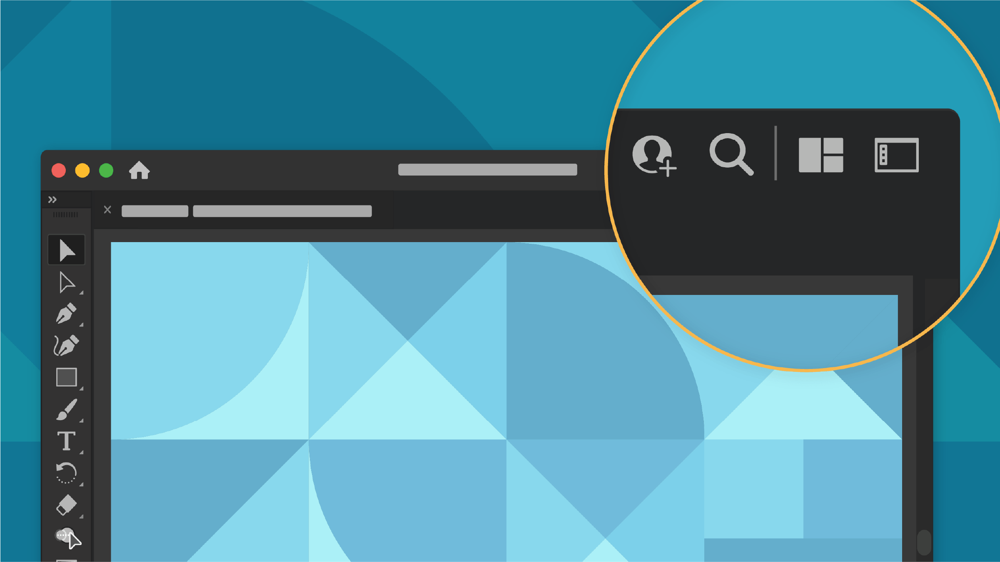
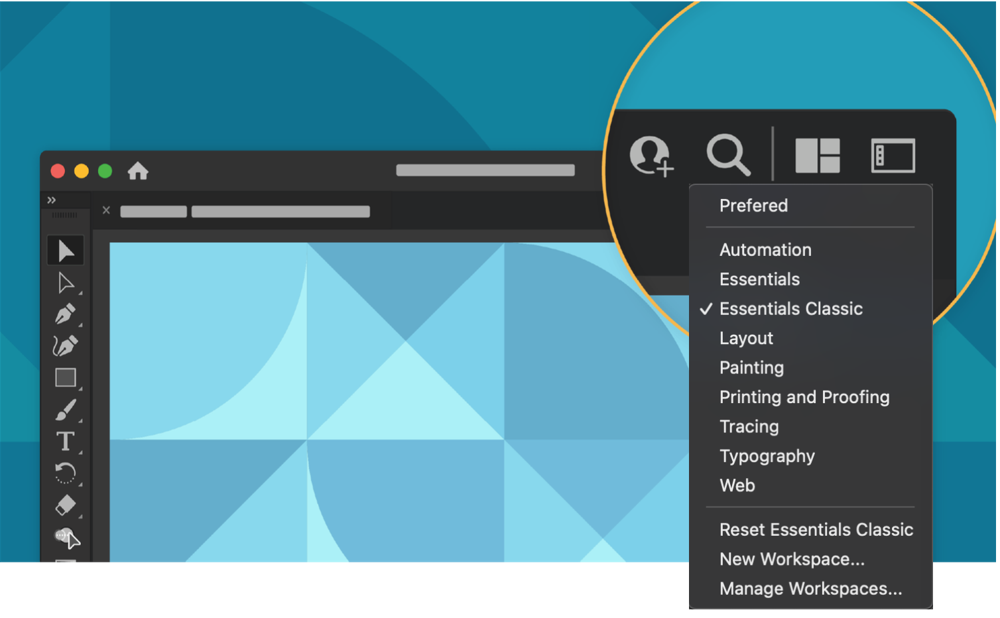
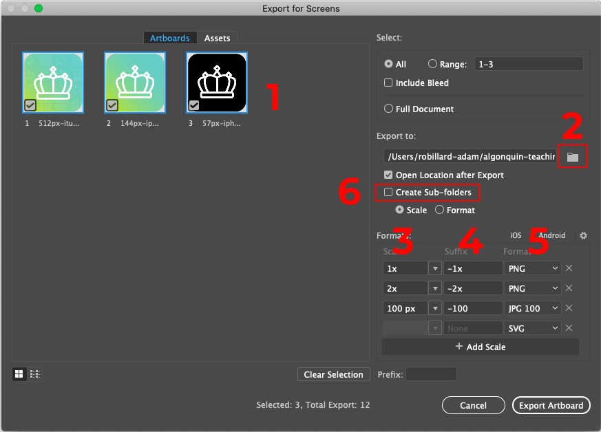

# Week 3 - Introduction to Illustrator

<Countdown date="2024-12-25" customMessage="No need to rush ahead. This content will be available before this week's theory class, so just focus on what we're learning this week.">

## Learning Objectives

By the end of this week, students will be able to:

- Grasp the essentials and advantages of vector graphics, including scalability and application versatility.
- Become proficient in using Adobe Illustrator's interface, including workspace customization and tool management.
- Master the skill of organizing and managing layers for complex graphic compositions in Illustrator.
- Learn to create and modify basic shapes and paths, laying the foundation for intricate designs.
- Gain expertise in using the Pen Tool for precision drawing and editing in Illustrator.
- Develop the ability to edit and refine shapes and paths for advanced graphic design projects.

## Demo Files

[demo-Pen-tool](https://drive.google.com/file/d/1WyE6E3UiAxKop_kY-YX1jTQdMw8Yx8qa/view?usp=sharing)

[demo-drawing-with-shapes](https://drive.google.com/file/d/1x3grcghX78odQJoGhX4uXiUD4Bo8HHyu/view?usp=sharing)

## What is Adobe Illustrator

Adobe Illustrator is a powerful vector graphics editing software used by designers and artists worldwide. It's ideal for creating logos, illustrations, typography, and complex graphics for both print and digital media.

### Understanding Vector Graphics and Their Advantages

Vector graphics are made up of paths, which are defined by a start and end point, along with other points, curves, and angles. A key advantage of vector graphics is their scalability; they can be enlarged or reduced without losing quality, making them ideal for various applications where resizing is necessary. Additionally, vector files tend to be smaller than raster images, and they are more versatile for detailed graphic work.

**Watch:** [Vector vs Raster Graphics](https://youtu.be/p2thSkOa_Xg?si=4Gy2tQhPVCGCw-5R)

## The Basics of Illustrator's Interface and Workspace

Illustrator's interface is a robust workspace with various tools and panels specifically designed for vector graphic creation. Understanding this interface is crucial for efficient workflow.

Familiarize yourself with Illustrator's interface and workspace through these tutorials:

**Watch:** [Get to know Illustrator (4 videos)](https://helpx.adobe.com/ca/illustrator/how-to/ai-basics-fundamentals.html)

- Illustrator workspace
- Zoom and Pan
- Create a new document
- Save your work

### Workspaces and Interface Overview

Learn about the various options available in Illustrator's workspace:

- **Share document**
- **Search and discover**
- **Arrange document**
- **Switch workspace**

### Detailed Workspace Overview

> We will use the **Essentials Classic** workspace.

## Artboards and Layer Management

Artboards are crucial for organizing different design elements. Artboards in Illustrator are like individual canvases within a single document. They can be used to create multi-page documents, different versions of a design, or separate elements that make up a larger graphic. Efficiently managing artboards is key to a streamlined workflow in Illustrator.

**Watch:** [Artboard tutorial (3 videos)](https://helpx.adobe.com/ca/illustrator/how-to/artboards-basics.html)

### Layer Management

Layers in Illustrator function similarly to those in other Adobe applications. They allow you to stack different elements, organize your artwork, and work on specific parts of a project without affecting others. Mastering layer management is crucial for keeping your workflow organized, especially when working on complex or multi-element designs.

## Creating Basic Shapes and Paths

Creating and manipulating shapes and paths is a core aspect of working in Illustrator. This section is designed to provide a comprehensive understanding of how to use Illustrator's various tools to create basic shapes and intricate paths.

### Understanding Shape Tools

Illustrator's shape tools allow for the creation of basic geometric forms like rectangles, circles, and polygons, which are the building blocks of more complex designs.

**Watch:** [Create and edit shapes (4 videos)](https://helpx.adobe.com/illustrator/how-to/shapes-basics.html)

In this section, you'll learn:

- How to use the Rectangle, Ellipse, and Polygon tools for basic shapes.
- Techniques for editing and transforming these shapes.
- Tips for combining simple shapes to create complex designs.

### Drawing Tools for Custom Shapes

Beyond basic geometric forms, Illustrator offers tools for creating custom shapes. This involves a deeper understanding of paths and how to manipulate them to achieve your desired design.

**Watch:** [Drawing tools tutorial (5 videos)](https://helpx.adobe.com/illustrator/how-to/drawing-tools-basics.html)

Key points include:

- Utilizing the Pen Tool for creating custom paths and shapes.
- Understanding Bezier curves and how to control them.
- Techniques for drawing both straight and curved paths.

## Transform Options: Rotate, Reflect, and Shear

Transforming artwork in Illustrator is crucial for creating dynamic and varied designs. Understanding how to rotate, reflect, and shear objects allows for creative manipulation of basic shapes into complex compositions.

Learn to transform your artwork with these tools:

## Understanding and Using Pathfinder Tools

Pathfinder tools in Adobe Illustrator are essential for creating complex shapes and designs by combining multiple simple shapes. These tools allow you to merge, subtract, intersect, and divide shapes to create intricate graphics and icons.

### Overview of Pathfinder Tools

The Pathfinder panel in Illustrator offers a set of tools that manipulate the interaction between two or more shapes. These tools are divided into two main groups: Shape Modes and Pathfinders.

**Shape Modes**:

- **Unite**: Combines selected shapes into one larger shape.
- **Minus Front**: Subtracts the top shape from the one beneath it.
- **Intersect**: Creates a shape from the overlapping area of selected shapes.
- **Exclude**: Removes the overlapping areas, leaving only the non-overlapping parts.

**Pathfinders**:

- **Divide**: Splits the selected shapes into individual components at their intersecting points.
- **Trim**: Removes the top shape’s area from the underlying shapes.
- **Merge**: Similar to Trim, but it also merges adjacent shapes that have the same fill.
- **Crop**: Uses the top object to define the area to keep; removes everything outside of it.
- **Outline**: Converts the shapes into a single compound path with outlines.
- **Minus Back**: Removes the shape at the back from the shape(s) in front.

### Practical Applications

Pathfinder tools are incredibly versatile and can be used for a variety of design tasks, such as:

- Creating complex logos by merging and subtracting basic shapes.
- Designing unique icons and graphic elements.
- Carving out intricate patterns and designs.
- Simplifying complex paths for easier editing and manipulation.

### Tips for Using Pathfinder Tools

- **Experimentation**: Don’t be afraid to experiment with different Pathfinder options to see their effects on your design.
- **Layer Order**: Remember that the order of your shapes can affect the result, especially with tools like Minus Front and Minus Back.
- **Compound Paths**: After using Pathfinder, you may need to create compound paths (Object > Compound Path > Make) for further editing.
- **Undo Function**: Use the undo function (Ctrl/Cmd + Z) liberally if you don’t get the desired result at first.

**Watch:** For a hands-on understanding, follow this tutorial series: [Using Pathfinder Tools in Illustrator](https://helpx.adobe.com/illustrator/how-to/use-pathfinder-panel.html)

## Colour of Fill and Stroke

Color application in Illustrator is not just about making designs visually appealing but also about conveying the right message. Understanding fill and stroke properties, and how to use color effectively, is vital for any Illustrator user.

Enhance your designs with color theory and application techniques:

**Watch:** [Learn about color basics (tutorial video)](https://helpx.adobe.com/illustrator/how-to/color-basics.html)

## Export for Screens

Exporting for screens is a critical step in finalizing digital designs. Illustrator's 'Export for Screens' feature allows you to efficiently save your work in various formats and resolutions, suitable for different digital platforms.

Understand how to efficiently export your designs with the Export for Screens feature:

- **Artboards preview**
- **Select export location**
- **Scale options**
- **Suffix and format selection**
- **Creating Sub-folders**

</Countdown>
