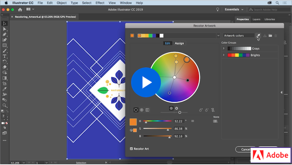

# Week 3 - Time to color

## Color theory and tools

Color theory is simpler than you think. Before we dive into it, let's understand the fundamentals of design. Next, we are going to learn why some colors look good together and some don't, how to choose the right ones, and the tools on Adobe Illustrator to manipulate and color shapes.

### DESIGN FUNDAMENTALS   

The fundamentals of design are going to play a very important role in your career and you will learn more about them later on, but for now take a look at this nice video to get an introduction on the elements of design.

<YouTube
  title="Beginning Graphic Design: Fundamentals"
  url="https://www.youtube.com/embed/YqQx75OPRa0"
/>

### COLOUR FUNDAMENTALS 

Being proficient at picking the right colors is very important but not an easy task and there is a lot of theory behind it, but if you follow some simple rules you are likely to make the right decision.

<YouTube
  title="Beginning Graphic Design: Color"
  url="https://www.youtube.com/embed/_2LLXnUdUIc"
/>

There are some great resources out there to help you, here is a great example; this site allows you to generate a color palette guaranteed to look good and shows you some examples of how to use each color as well with common elements on the web: **[Colormind.io](http://colormind.io/bootstrap/)**

## Colour in Adobe Illustrator 

Let's continue working with colors in Adobe Illustrator, including how to create swatches, trace images, recolor artwork, and more.

### COLOR SWATCHES

Take a look at this tutorial from lynda.com (Linkedin Learning) on color swatches, try to make your own and use them to color some shapes. As always, we will practice this in class. Don't worry about the last section on exporting and importing swatches, we will be learning about that later.

<YouTube
  title="Beginning Graphic Design: Color"
  url="https://www.youtube.com/embed/vvjgJ10DjKw"
/>

### TRACING IMAGES 

Adobe Illustrator works with vectors, we learned that last week, but we can import an image to illustrator and make it a vector object (or a collection of objects), take a look at this tutorial and see how it works. Make sure to sign in to your [**LinkedIn Learning**](https://www.linkedin.com/learning) account before clicking the video. If you are having difficulties getting into your LinkedIn learning account, take a look at this page from the school.

### RECOLORING ARTWORK 

Adobe Illustrator has many shortcuts and ways to get to the same place. It is always useful to keep it in your notes for later. In the following video, you will learn how to recolor artwork and how to access this tool from more than one place in your workspace. This workflow will help a lot and is a fun way to achieve different results with only a few clicks.

### GRADIENT TOOL     

The gradient tool allows you to color any vector shape in illustrator with a set of colors while transitioning smoothly between them; this tool is used very frequently and you will use it to do some of your assignments. Let's follow this video to create, edit, and apply custom gradients.

## Transform optoins: Rotate, reflect, and shear   

To streamline the process of drawing shapes and ensuring they are even, we use this set of tools to transform them and arrange them in the artboard, take a look at this video and try to follow along. The sample files are on the website you will be redirected to, make sure to download and open it before starting.

## TODO

::: tip TODO Before next week

- If you have not read all these notes and watched the videos from this week, do that first.
- Read the notes and watch all the videos for Week 4.
- Hybrid 2 - Design a button
- Discussion Forum: Pertinent Discussion
  :::