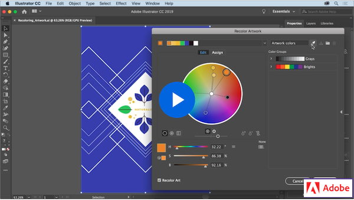
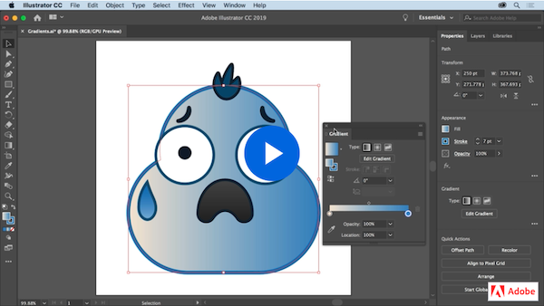

# Week 4 - Time to color

## Colour theory and tools

Colour theory is simpler than you think. Before we dive into it, let's understand the fundamentals of design. Next, we are going to learn why some colours look good together and some don't, how to choose the right ones, and the tools on Adobe Illustrator to manipulate and colour shapes.

## Design Fundamentals

The fundamentals of design are going to play a very important role in your career and you will learn more about them later on, but for now take a look at this nice video to get an introduction on the elements of design.

<YouTube
  title="Beginning Graphic Design: Fundamentals"
  url="https://www.youtube.com/embed/YqQx75OPRa0"
/>

## Colour Fundamentals

Being proficient at picking the right colours is very important but not an easy task and there is a lot of theory behind it, but if you follow some simple rules you are likely to make the right decision.

<YouTube
  title="Beginning Graphic Design: Color"
  url="https://www.youtube.com/embed/_2LLXnUdUIc"
/>

Creating good colour schemes can be challenging and take practice. But don't worry, there are some great resources out there to help you. Here are some great examples:

### [Adobe Color](https://color.adobe.com/)

Adobe Color allows you to generate create your own unique colour palettes and explore colour palettes created by others. You can also export the palettes as CSS, Sass, LESS, or save your palette into your CC Libraries and access the colours right in Illustrator, Photoshop, and other Adobe applications.

### [Colormind.io](http://colormind.io/bootstrap/)

This site allows you to generate a colour palette guaranteed to look good and shows you some examples of how to use each colour as well with common elements on the web.

## Colour in Adobe Illustrator

Let's continue working with colors in Adobe Illustrator, including how to create swatches, trace images, recolor artwork, and more.

### Working with Colours In Illustrator

To learn how to change colour, create swatches, recolour artwork, we will begin with this set of short video tutorials on [Change colour and strokes. (5 videos)](https://helpx.adobe.com/illustrator/how-to/color-basics.html)

- Change the colour of artwork
- Create colour swatches
- Add dashed lines and arrows
- Create colour gradients
- Recolour artwork

### Tracing Images

Adobe Illustrator works with vectors, we learned that last week, but we can import an image to illustrator and make it a vector object (or a collection of objects), take a look at this tutorial and see how to set options and preferences to optimise your conversion from raster to vector.

<YouTube
  title="How to use Image Trace in Illustrator by Solopress.com"
  url="https://www.youtube.com/embed/Qgsm-Hx-lTE"
/>

### Recolouring Artwork

Adobe Illustrator has many shortcuts and ways to get to the same place. It is always useful to keep it in your notes for later. In the following video, you will learn how to recolour artwork and how to access this tool from more than one place in your workspace. This workflow will help a lot and is a fun way to achieve different results with only a few clicks.

### Gradient Tool

The gradient tool allows you to colour any vector shape in illustrator with a set of colours while transitioning smoothly between them; this tool is used very frequently and you will use it to do some of your assignments. Let's follow this video to create, edit, and apply custom gradients.

