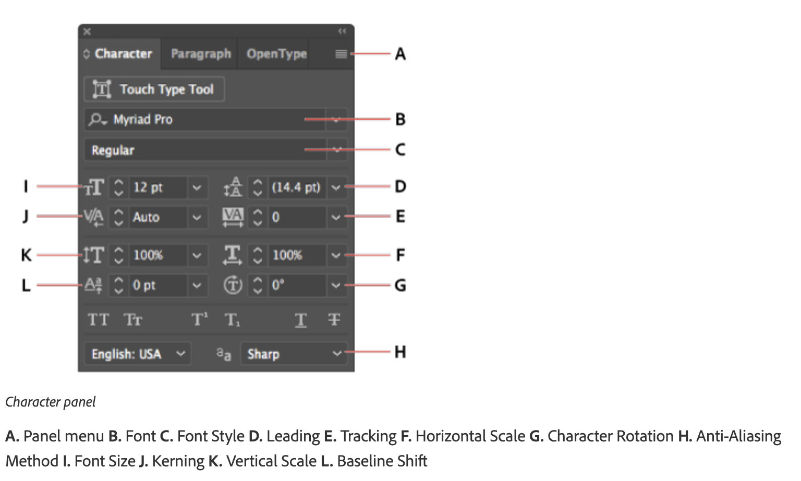
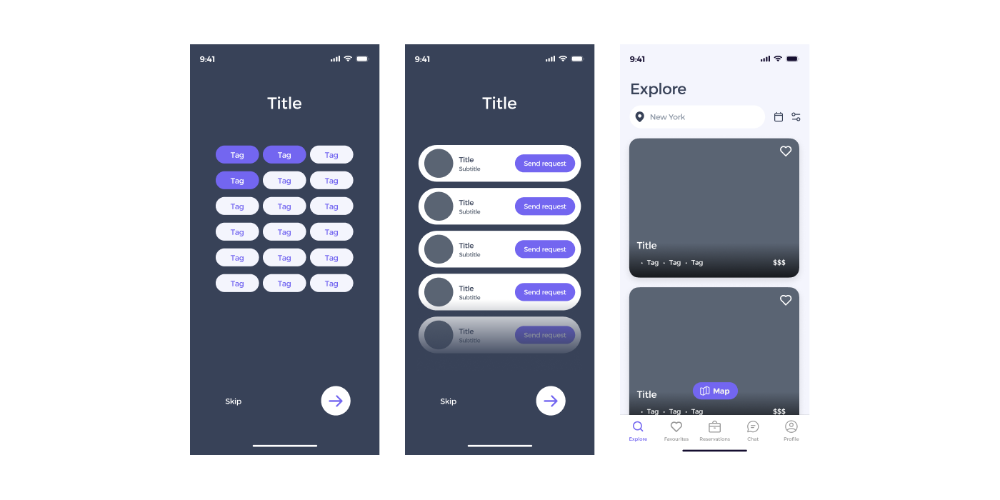
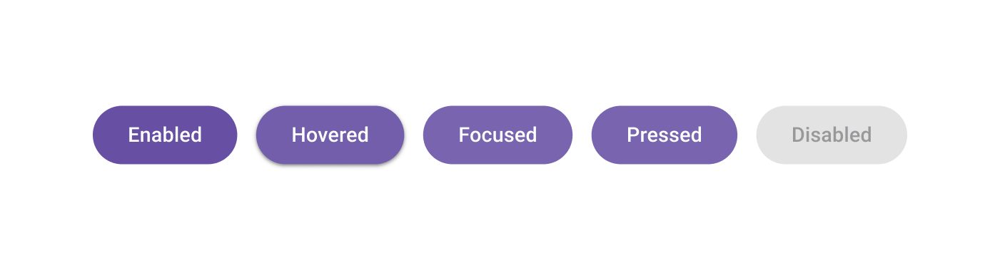

# Week 4 - Color and Design Elements

<Countdown date="2024-12-25" customMessage="No need to rush ahead. This content will be available before this week's theory class, so just focus on what we're learning this week.">

## Learning Objectives

By the end of this week, students will be able to:

- Grasp the basics of various color modes like RGB, CMYK, Greyscale, and Web Safe RGB, and their applications in different design contexts.
- Learn to change color modes in Adobe Illustrator and effectively use tools like the Color Picker and Swatches for color manipulation.
- Gain an understanding of color theory, including complementary colors and color harmony, and how to create and save custom color palettes.
- Master the use of gradients in designs and perform color correction and adjustment techniques in Adobe Illustrator.
- Develop an understanding of color accessibility, ensuring designs are accessible to a wider audience, including those with visual impairments.
- Learn to use Illustrator's typography tools, including the character and paragraph panels, for effective text styling in designs.
- Acquire skills to apply effects such as drop shadows, inner/outer glows, and feathering to enhance the visual appeal of designs.

## Demo Files

[Gradient Demo: Bubble](https://drive.google.com/drive/folders/1M5m3ZtZh9FATY83xFqRZximU786w0yCc?usp=sharing)

[Shape Builder/Gradient Demo: Bird](https://drive.google.com/file/d/1UPAfVZvz45IiOLpQBClxv5jz-L2T3uuQ/view?usp=sharing)

## Introduction to Color Modes

Explore the simplicity of color theory, starting with design fundamentals. Understand why certain colors complement each other, learn to choose the right combinations, and discover how to manipulate colors in Adobe Illustrator for effective design. Understanding these modes is crucial for creating designs that are both aesthetically pleasing and technically sound.

### Color Modes: Types and Uses

- **RGB (Red, Green, Blue)**: Used for digital screens, where colors are produced by light. Ideal for web and digital media.
- **CMYK (Cyan, Magenta, Yellow, Key/Black)**: Utilized in print media, where colors are created by layering inks. Essential for print material.
- **HSB (Hue, Saturation, Brightness)**: A user-friendly model for selecting colors based on human perception, often used in digital art and design software.
- **Greyscale**: Uses shades of gray only. It's important for certain types of printing and artistic design where color is not required or not available.
- **Web Safe RGB**: A color selection that ensures consistency across different web browsers and monitors, especially important in the early days of the internet when display technology was less consistent.

### Changing Color Modes

Switching between color modes can significantly impact your design's appearance and reproduction. Here’s how you can change color modes in Adobe Illustrator:

1. **For the entire document**: Go to `File > Document Color Mode` and select either `RGB` or `CMYK`.
2. **For individual elements**: Select the element, then go to the Color panel. Click the fly-out menu and choose either `RGB` or `CMYK` mode.

Understanding and choosing the right color mode is essential for your design process, whether it's for digital viewing or print. It ensures color consistency across different mediums and devices.

## Colour in Adobe Illustrator

Enhance your skills in Adobe Illustrator by learning to create swatches and recolor artwork. Explore a series of Adobe tutorials for a hands-on approach.

**Tutorial Series**: [Change Colour and Strokes (5 videos)](https://helpx.adobe.com/illustrator/how-to/color-basics.html)

**Topics Covered:**

- Changing artwork color
- Creating color swatches
- Adding dashed lines and arrows
- Creating color gradients
- Recoloring artwork

### Gradient Tool

Master the gradient tool in Illustrator to color vector shapes with smooth color transitions.

- **Watch**: [Creating and Applying Custom Gradients](https://helpx.adobe.com/illustrator/how-to/color-basics.html#create_color_gradients)

## Effects

Learn to apply various effects like drop shadows, inner or outer glows, and feathered edges to enhance the visual appeal of your designs. These effects can add depth, texture, and interest, making your designs more engaging.

### Applying Drop Shadows

Drop shadows add depth to your designs by creating a shadow effect behind an object, making it appear as if it is raised above the background.

1. **Select Your Object**: Choose the object you want to add a shadow to.
2. **Go to Effect Menu**: Click on `Effect > Stylize > Drop Shadow`.
3. **Adjust Settings**: In the Drop Shadow dialog box, you can adjust the opacity, angle, distance, blur, and color of the shadow.
4. **Preview and Apply**: Use the preview option to see the effect in real-time. Once satisfied, click `OK` to apply.

### Applying Inner or Outer Glow

Inner or Outer Glow creates a soft halo around an object, which can be used to highlight elements or create a specific mood.

- **Inner Glow**: Adds a glow that emanates from the inside edges of your object.
- **Outer Glow**: Adds a glow that radiates outward from your object.

1. **Select the Object**: Click on the object to which you want to apply the glow.
2. **Access the Glow Options**: Choose `Effect > Stylize` and select `Inner Glow` or `Outer Glow`.
3. **Customize the Glow**: Adjust the color, opacity, and blur radius. For Inner Glow, you can also set the glow to emanate from the edge or center.
4. **Apply the Effect**: Preview the effect and click `OK` to apply it.

### Applying Feather to the Edges of an Object

Feathering softens the edges of an object, creating a gradual transition between the object and the background.

1. **Select the Object**: Click on the object whose edges you want to feather.
2. **Feather the Edges**: Navigate to `Effect > Stylize > Feather`.
3. **Set the Radius**: In the Feather dialog box, set the radius to determine how soft and wide the feathered edge will be.
4. **Preview and Apply**: Use the preview feature to see how the feathered edge looks. Adjust the radius as needed and click `OK` to apply the feather effect.

## Typography in Illustrator

Typography is a critical element in design, conveying messages not just through words but also through their visual representation. In this section, we'll explore how to use Adobe Illustrator's powerful typography tools to create compelling text elements in your designs.

### Understanding Typography Basics

Before delving into Illustrator, let's understand the fundamentals of typography:

- **Typefaces vs. Fonts**: Understand the difference between a typeface (design of letters and characters) and a font (specific style and size of a typeface).
- **Serif vs. Sans Serif**: Learn the characteristics of serif (with small lines at the ends of characters) and sans serif (clean, no lines) typefaces.
- **Hierarchy and Legibility**: The art of arranging type to make the text legible and appealing.

### Working with Type in Illustrator

Illustrator offers a range of tools to manipulate text:

1. **Type Tool**: Learn how to add and edit text in your artwork.
2. **Area Type vs. Point Type**: Understand the difference and use cases for Area Type (text in a defined area) and Point Type (text begins where you click).

#### Character and Paragraph Panels

The Character and Paragraph panels in Illustrator are essential tools for fine-tuning the appearance of your text. Here's how you can use them effectively:

**Character Panel**:

- **Font Size**: Adjust the size of your text to ensure readability and fit within your design layout.
- **Leading**: Control the vertical space between lines of text. Ideal leading makes text more legible and visually appealing.
- **Kerning**: Adjust the space between specific pairs of characters, essential for maintaining a uniform appearance in your text.
- **Tracking**: Alter the spacing across a range of characters to affect the density of your text. This can be used for stylistic emphasis or improved readability.
- **Horizontal & Vertical Scaling**: Stretch or compress text horizontally or vertically, allowing for creative typographic designs.
- **Baseline Shift**: Move text up or down relative to its baseline, useful for aligning text with different font sizes or creating superscript/subscript effects.
- **Rotation**: Rotate your characters for artistic text effects.

**Paragraph Panel**:

- **Alignment**: Choose from left, right, centered, or justified text alignments to suit the layout and design of your content.
- **Indentation**: Adjust the indent of your paragraphs from the left or right margins, or indent the first line of a paragraph for classic typesetting.
- **Spacing Before and After Paragraphs**: Control the amount of space before and after paragraphs to create distinct sections or improve the flow of text.
- **Hyphenation**: Enable or disable hyphenation to control how words break at the end of a line, affecting the aesthetics and readability of your text.

## Utilizing Colors in UI Design

Color is a pivotal element in design, shaping user perception and bolstering brand identity. Effective color palettes are instrumental in crafting visually captivating and meaningful designs.

### Color Theory

Color theory today is primarily based on Isaac Newton's colour wheel, which he established in 1666. The main colour wheel illustrates three colour categories: primary colours, secondary colours, and tertiary colours. Let’s understand it...

**Primary colors** are those that cannot be produced by mixing two or more other colors. Red, blue, and yellow are the main colors.

The **secondary colors** are orange, purple, and green, which may be created by mixing any two of the three basic colors.

**Tertiary colors** are created when you combine a main and a secondary color. Magenta, vermillion, violet, teal, amber, and chartreuse are the tertiary hues.

<YouTube
  title="Beginning Graphic Design: Color"
  url="https://www.youtube.com/embed/_2LLXnUdUIc?si=49DeBHq2p6bInb7G"
/>

#### Helpful Tools for Color Schemes

- **[Adobe Color](https://color.adobe.com/)**: Create and explore unique color palettes. Export palettes as CSS, Sass, LESS, or save directly to your CC Libraries for use in Adobe applications.
- **[Colormind.io](http://colormind.io/bootstrap/)**: Generate aesthetically pleasing color palettes with practical web element examples.

### The 60-30-10 Color Rule

A popular approach to achieving color balance is the 60-30-10 rule, often associated with the notion of a Golden Ratio in design. This rule suggests that:

- A neutral color for **60%** of your design
- A secondary brand color for **30%**
- **10%** in your UI design should be your main brand color

Effective UI design leverages this rule to achieve an impeccable color coordination, enhancing the user's interaction with the design.

### Example of 60-30-10 Color Rule in a Mobile App

**Dominant Color (60%) - Light Lavender:**

- **Usage:** Ideal for backgrounds and large UI elements. This light lavender (`#F4F5FD`) offers a clean, calming, and modern backdrop that's easy on the eyes.
- **Hex Code:** `#F4F5FD`

**Secondary Color (30%) - Deep Slate:**

- **Usage:** For text, headers, footers, and less prominent buttons. Deep slate (`#384258`) provides a strong contrast against the light lavender, adding depth and sophistication to the design.
- **Hex Code:** `#384258`

**Accent Color (10%) - Vibrant Purple:**

- **Usage:** For call-to-action buttons, highlights, and key interactive elements. Vibrant purple (`#7366F0`) stands out against both the light lavender and deep slate, drawing attention to important actions and features.
- **Hex Code:** `#7366F0`

**Application in UI Elements:**

- **Backgrounds and Large Areas:** Light Lavender (`#F4F5FD`)
- **Text and Secondary Elements:** Deep Slate (`#384258`)
- **Interactive Elements and Highlights:** Vibrant Purple (`#7366F0`)

## UI Button Design

Explore the nuances of UI button design with a focus on color. Learn about best practices, the impact of color on user interaction, and engage in practical design exercises.

### UI Button Design Fundamentals

Designing UI buttons involves understanding both aesthetics and functionality. A well-designed button not only looks good but is also easy to interact with.

- **Clarity**: Buttons should clearly indicate that they can be clicked or tapped.
- **Consistency**: Use consistent styling for buttons throughout your application for better user experience.
- **Feedback**: Buttons should provide visual feedback when interacted with (like hover effects).

### States

Buttons have different states that indicate their interaction status:

1. **Normal**: The default state of the button.
2. **Hover**: Indicates the mouse is over the button (for desktop).
3. **Active**: Shows the button is being clicked or tapped.
4. **Disabled**: Indicates the button is not interactive at the moment.

Design each state to visually communicate the button's status.

### Size

Button size should be large enough to be easily clickable or tappable but balanced with the overall design. Consider the following:

- **Finger-friendly tap targets**: For mobile, the average finger pad is about 10mm wide, and the minimum touch target size should be around 44px.
- **Visual Hierarchy**: Larger buttons for primary actions and smaller for secondary actions.

### Color

Color plays a crucial role in button design:

- **Visibility**: Choose colors that stand out but complement the overall color scheme.
- **Emotion and Action**: Use color psychology to prompt action (e.g., green for ‘go’ or red for ‘stop’).
- **Accessibility**: Ensure sufficient color contrast for readability and accessibility.

### Fonts

The right font ensures readability and aligns with the button’s intent:

- **Legibility**: Choose clear, easy-to-read fonts.
- **Size and Weight**: Ensure the text is easily legible at the button size. Bold or semi-bold fonts can be effective.
- **Color**: Text color should contrast well with the button color for readability.

</Countdown>
