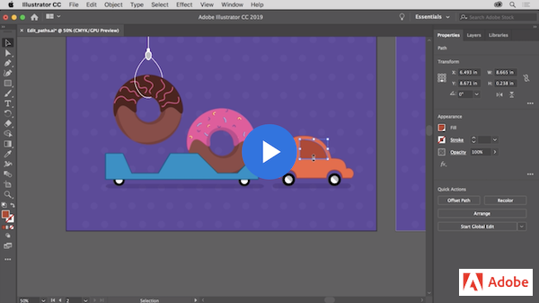
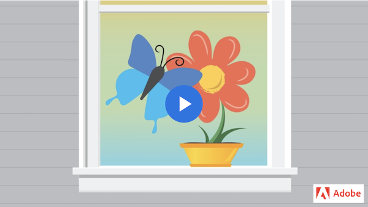
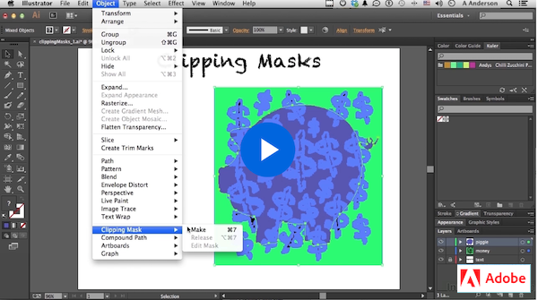

# Week 4 - Time to draw 

## Drawing tools

Let's get drawing!

In this section, we are going to learn how to draw shapes and edit them using different tools.

First, we will learn about the `pen` tool, how to use it and what is made of, then we will cover the `pencil` and `brushes` tools and learn how to edit shapes using the `blend` and `pathfinder` tools. Finally, we are going to see how the `clipping mask` is used and how it makes our lives easier.

### THE PEN TOOL

The pen tool is one of the most important tools in the software; most of the drawing will be done using the pen tool and then edited with other tools to achieve the expected result, but it is usually the start to all shapes. 

This tool is very versatile and has a couple of different settings that can also be mastered with practice, so make sure to follow the tutorials and try it yourself.

#### Now let's practice!

#### Edit paths you draw

A huge part of creating shapes with the pen tool is being able to manipulate them and edit them. Check this tutorial and try to follow along.

### THE PENCIL AND PAINTBRUSH TOOLS

These tools allow you to draw shapes as you would with real pencils and brushes, and the resulting elements can be adjusted after.

You will learn how to create the paths, edit them and change the style to mimic different types of brushes.

You will also see the properties panel in action and a few quick actions, such as grouping.

### PATHFINDER AND BUILDER TOOLS 

Some more complex geometric shapes are more easily created starting from the basic geometric shapes and breaking them and combining them.

To do this, we use the pathfinder tool or the builder tool.

Both tools can be used to achieve the same result using different methods, try them both to see which one you feel more comfortable with.

## Clipping Mask

Finally, let's take a look at the clipping mask effect. Clipping masks are objects that mask other artwork so only areas within the shape are visible. Challenge: Try to edit the clipping mask or image sets in Isolation mode. 

## TODO

::: tip TODO Before next week

- If you have not read all these notes and watched the videos from this week, do that first.
- Read the notes and watch all the videos for Week 5.
- Hybrid 3 - Character vectorization
- Assignment 01 - Avatar icon for Apple (including peer review)
  :::
