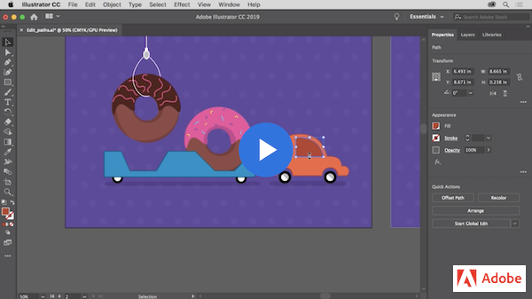
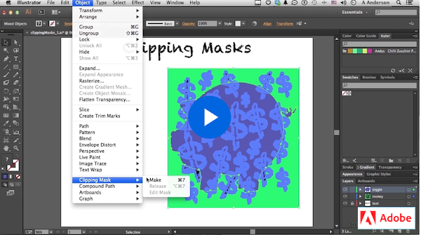
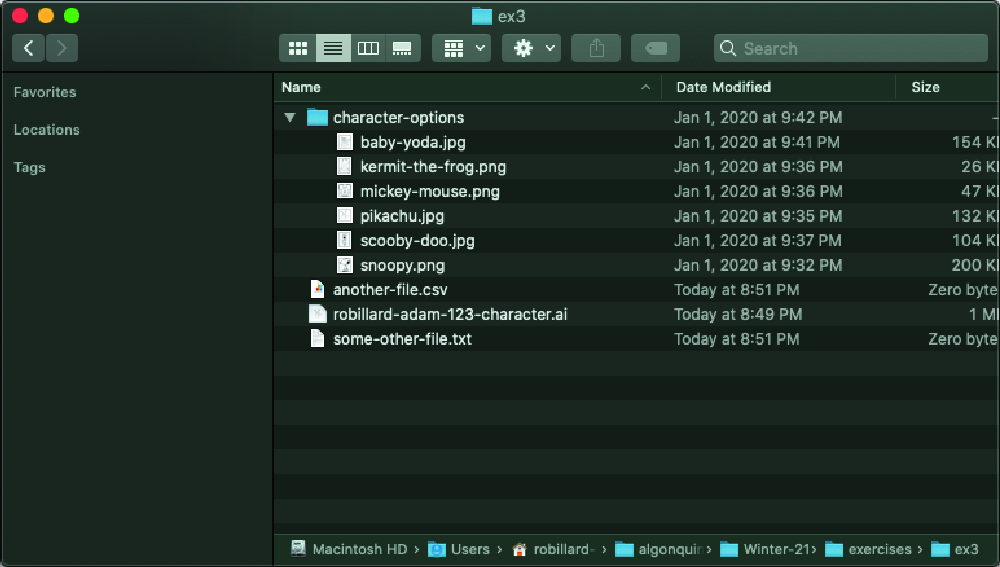
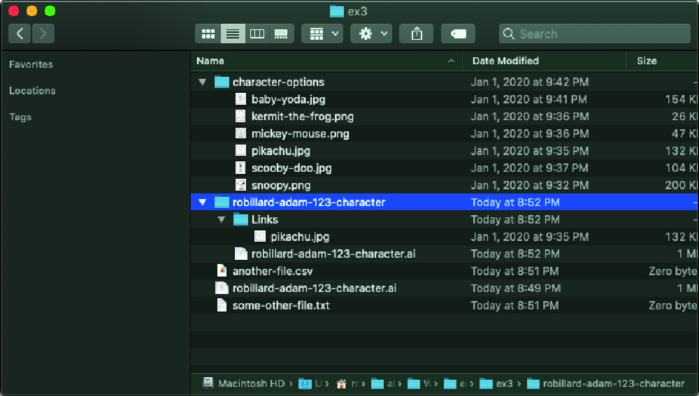

# Week 5 - Time to draw

::: tip Files
[Week 5 Tutorial Files Download](https://drive.google.com/uc?export=download&id=1kgTnrs0QLGJ2fb3Oa0wUqgfIvR-X7YSM)
:::

## Drawing tools

::: tip Introduction
In this section, we are going to learn how to draw shapes and edit them using different tools.
:::

First, we will learn all about the pen tool, which can be tricky to master, but is the most essential drawing tool in Illustrator. Then we will cover the pencil and brushes tools and learn how to edit shapes pathfinder tools. Finally, we are going to see how the clipping mask is used and how it makes our lives easier.

## The Pen Tool

The pen tool is one of the most important tools in the software; most of the drawing will be done using the pen tool and then edited with other tools to achieve the expected result, but it is usually the start to all shapes.

This tool is very versatile and has a couple of different settings that can also be mastered with practice, so make sure to follow the tutorials and try it yourself.

### Now let's practice!

### Edit paths you draw

A huge part of creating shapes with the pen tool is being able to manipulate them and edit them. Check this tutorial and try to follow along.

## The Pencil & Paintbrush Tools

These tools allow you to draw shapes as you would with real pencils and brushes, and the resulting elements can be adjusted after.

You will learn how to create the paths, edit them and change the style to mimic different types of brushes.

You will also see the properties panel in action and a few quick actions, such as grouping.

## Blend Tool

The Blend tool (W) creates a series of objects blended between the color and shape of multiple objects. Let's follow this video to transform shapes and colors into beautiful objects.

<YouTube
  title="Blend Tool Features You Might Not Know!"
  url="https://www.youtube.com/embed/c_ZA5FPxkAo"
/>

## Pathfinder & Builder Tools

Some more complex geometric shapes are more easily created starting from the basic geometric shapes and breaking them and combining them.

To do this, we use the pathfinder tool or the builder tool.

Both tools can be used to achieve the same result using different methods, try them both to see which one you feel more comfortable with.

## Clipping Mask

Finally, let's take a look at the clipping mask effect. Clipping masks are objects that mask other artwork so only areas within the shape are visible. You can edit the clipping mask or image sets in Isolation mode, too.

## Packaging Your Files

Properly packaging and organizing your files is an incredibly important. When you drag and drop or place an image into Illustrator, Illustrator saves a linked reference to where that file lives in your computer. So if you move/delete a linked file that will break the link and Illustrator will no longer be able to load it into your project.

Luckily, Illustrator provides us with the `Package...` feature that will do the heavily lifting and organize linked files for us. It will make a new folder that has a copy of the original Illustrator file and it will copy all linked files into a **Links** folder and all fonts (other than Adobe Fonts) into a **Fonts** folder. You can access this feature in the dropdown menus `File > Package...` or with keyboard shortcut `Shift + Option + Command + P` on Mac or `Shift + Alt + Control + P` on Windows.

<figure>
  
  <figcaption>Disorganized files before packaging.</figcaption>
</figure>
<figure>
  
  <figcaption>Organized files in single organized folder after packaging</figcaption>
</figure>

Any time you submit any files that contain linked images, you **must** first package the file, and **submit a compressed folder of the entire package**. This will insure that I properly receive all of the necessary files to review and mark your assignments. It is also good habit to get into now, your future co-workers and clients will thank you!

## To Do

::: tip To Do for Next Week

- Complete Character Vectorization exercise
- Continue working on App Icon
- Review content from this week
- Read ahead to week 6
  :::
