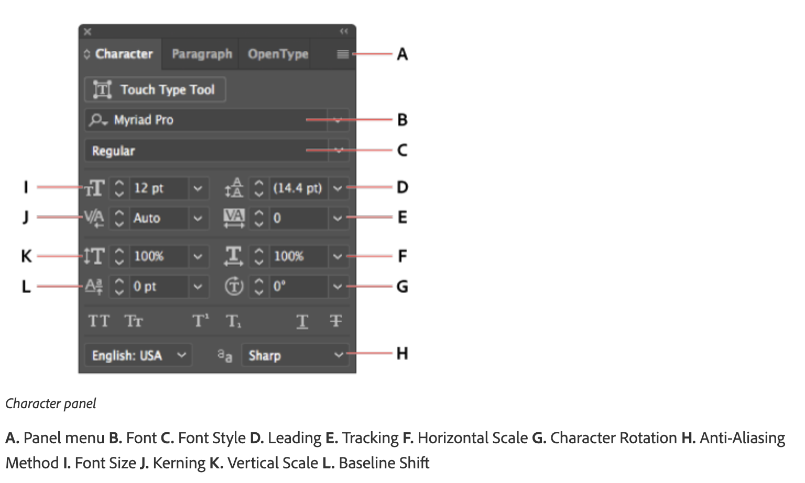
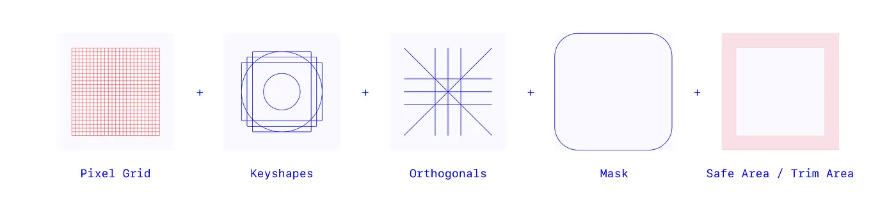
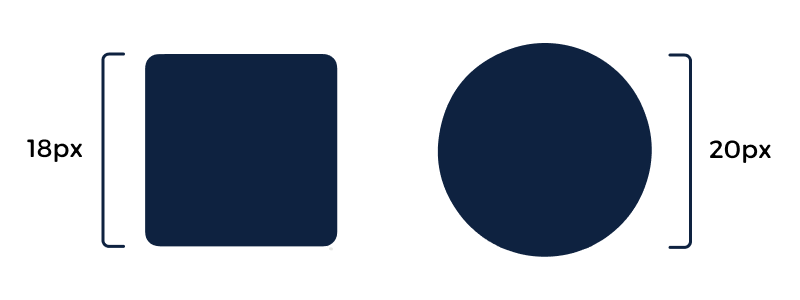

# Week 5 - Creating Icons and Typography in Illustrator

<Countdown date="2024-12-25" customMessage="No need to rush ahead. This content will be available before this week's theory class, so just focus on what we're learning this week.">

## Learning Objectives

By the end of this week, students will be able to:

- **Typography:**

  - Understand the fundamentals of typography, including the difference between typefaces and fonts, and the characteristics of serif and sans serif typefaces.
  - Apply principles of hierarchy and legibility to enhance the readability and visual appeal of text elements.
  - Utilize Adobe Illustrator's typography tools, including the Type Tool, Character and Paragraph panels, to create and manipulate compelling text elements.
  - Implement design principles such as clarity, consistency, and contextual relevance in typography to support overall UI design.

- **UI Icons:**
  - Understand the significance of icons within user interfaces and how they enhance user experience and navigation.
  - Identify different types of UI icons (symbolic, representational, abstract) and their appropriate application in digital interfaces.
  - Appreciate the psychological impact of icons on user perception and how it influences user interaction.
  - Master the principles of icon design, including clarity, recognizability, consistency, and simplicity versus detail.
  - Learn cultural considerations and the impact of color psychology in designing icons to ensure they are effective and appropriate for the target audience.
  - Develop skills in creating a cohesive set of icons using Adobe Illustrator, focusing on technical aspects such as outlining strokes and testing for effectiveness.

## Typography in Illustrator

Typography is a critical element in design, conveying messages not just through words but also through their visual representation. In this section, we'll explore how to use Adobe Illustrator's powerful typography tools to create compelling text elements in your designs.

### Understanding Typography Basics

Before delving into Illustrator, let's understand the fundamentals of typography:

- **Typefaces vs. Fonts**: Understand the difference between a typeface (design of letters and characters) and a font (specific style and size of a typeface).
- **Serif vs. Sans Serif**: Learn the characteristics of serif (with small lines at the ends of characters) and sans serif (clean, no lines) typefaces.
- **Hierarchy and Legibility**: The art of arranging type to make the text legible and appealing.

### Working with Type in Illustrator

Illustrator offers a range of tools to manipulate text:

1. **Type Tool**: Learn how to add and edit text in your artwork.
2. **Area Type vs. Point Type**: Understand the difference and use cases for Area Type (text in a defined area) and Point Type (text begins where you click).

#### Character and Paragraph Panels

The Character and Paragraph panels in Illustrator are essential tools for fine-tuning the appearance of your text. Here's how you can use them effectively:

**Character Panel**:

- **Font Size**: Adjust the size of your text to ensure readability and fit within your design layout.
- **Leading**: Control the vertical space between lines of text. Ideal leading makes text more legible and visually appealing.
- **Kerning**: Adjust the space between specific pairs of characters, essential for maintaining a uniform appearance in your text.
- **Tracking**: Alter the spacing across a range of characters to affect the density of your text. This can be used for stylistic emphasis or improved readability.
- **Horizontal & Vertical Scaling**: Stretch or compress text horizontally or vertically, allowing for creative typographic designs.
- **Baseline Shift**: Move text up or down relative to its baseline, useful for aligning text with different font sizes or creating superscript/subscript effects.
- **Rotation**: Rotate your characters for artistic text effects.

**Paragraph Panel**:

- **Alignment**: Choose from left, right, centered, or justified text alignments to suit the layout and design of your content.
- **Indentation**: Adjust the indent of your paragraphs from the left or right margins, or indent the first line of a paragraph for classic typesetting.
- **Spacing Before and After Paragraphs**: Control the amount of space before and after paragraphs to create distinct sections or improve the flow of text.
- **Hyphenation**: Enable or disable hyphenation to control how words break at the end of a line, affecting the aesthetics and readability of your text.

### Integrating Typography with Icon Design

Effective UI design often combines both icons and typography to create a cohesive and intuitive user experience. Here's how to seamlessly integrate typography into your icon-based designs:

- **Complementary Styles**: Ensure that the style of your typography complements the style of your icons. For example, minimalist icons pair well with clean, sans serif fonts.
- **Consistent Hierarchy**: Use typography to establish a clear hierarchy, guiding users through the interface in conjunction with icons.
- **Alignment and Spacing**: Pay attention to the alignment and spacing between text and icons to maintain visual balance and harmony.
- **Color Coordination**: Use colors in your typography that complement or match the colors used in your icons to create a unified color scheme.

## Introduction to UI Icons

Icons are integral components of modern user interfaces, serving as visual representations that communicate function, meaning, or content succinctly and effectively. They play a crucial role in enhancing the user experience by simplifying navigation, supporting content comprehension, and facilitating user interaction with digital interfaces.

### Types and Functions of UI Icons

- **Symbolic Icons**: Represent ideas or concepts in a simplified manner, often used for common actions like search or settings.
- **Representational Icons**: Directly depict the object or action they represent, such as a trash can for delete function.
- **Abstract Icons**: Use visual abstraction to convey complex actions or features, requiring user learning to understand their meaning.

### Psychological Impact of Icons

Icons are not just simple visual elements; they carry a significant psychological impact that influences how users perceive and interact with digital interfaces. The design and implementation of icons can deeply affect the overall user experience by:

- **Immediate Recognition**: Well-designed icons can be recognized instantly, reducing cognitive load for users. This immediate recognition is crucial for efficient navigation and interaction, as users often rely on visual cues to understand and use digital products.
- **Emotional Connection**: Icons can evoke emotions and feelings, creating a more engaging and personalized user experience. For example, a smiley icon can convey happiness or satisfaction, while a heart icon can evoke love or favorite items. This emotional connection can enhance user satisfaction and loyalty to a product.
- **Cultural Significance**: Icons can carry different meanings in different cultural contexts. Understanding the cultural implications of certain icons is essential to avoid misunderstandings and ensure that the iconography is appropriate and inclusive for a global audience.
- **Visual Harmony and Aesthetics**: The aesthetic design of icons, including their color, shape, and style, contributes to the overall visual appeal of the interface. A harmonious icon set can enhance the aesthetic value of the product, making it more attractive and enjoyable to use.
- **Usability and Accessibility**: The clarity and recognizability of icons play a vital role in usability and accessibility. Icons that are designed with clear symbolism and contrast can aid users with visual impairments or cognitive disabilities, ensuring that the product is accessible to a wider audience.
- **Brand Identity**: Icons can also serve as an extension of a brand's identity, reinforcing brand values and personality through their design. Custom icon sets that align with the brand's aesthetic can strengthen brand recognition and differentiation in a crowded market.
- **Expectation Setting and Functionality**: The design of an icon can set user expectations about its functionality. For example, a magnifying glass icon universally suggests a search function. Ensuring that icons match their intended actions prevents user frustration and supports a seamless interaction.

## Design Principles for Icons

Learn about the key design principles that ensure icons are effective and intuitive:

- **Clarity and Recognizability**: Icons should be instantly recognizable and convey their function without ambiguity.
- **Consistency in Style and Size**: Maintaining a consistent style and size across all icons to ensure coherence and familiarity.
- **Contextual Relevance**: Icons must be relevant to the context in which they are used, enhancing their intuitiveness.
- **Simplicity vs. Detail**: Finding the right balance between simplicity and detail to ensure icons are understandable at a glance.
- **Accessibility**: Design icons with accessibility in mind, considering color contrast, size, and alternative text for users with visual impairments.

### Creating a Set of Icons

Consistency in icon design is crucial for creating a cohesive user experience. When icons within a UI maintain a uniform appearance, they not only become more recognizable to users but also contribute to the overall aesthetic harmony of the interface. To achieve this consistency, designers should focus on several key aspects of icon design:

<ThreeColumnComponent
imageSrc="/w2024/moduleImages/week5/stroke-thumbnail.png"
title="Line (Stroke) Weight"
description="The thickness of the lines used in icons, known as line weight or stroke weight, plays a significant role in visual consistency. Choosing a uniform line weight across all icons ensures that they appear as part of a cohesive set. This consistency in line weight helps maintain visual balance, especially in interfaces where icons are displayed together or in close proximity."
/>

<ThreeColumnComponent
imageSrc="/w2024/moduleImages/week5/fill-outline-thumbnail.png"
title="Filled (Glyph) or Outlined Styles"
description="Icons can be designed in filled (glyph) styles, where the shapes are solid, or outlined styles, which consist of only the edges of the shapes. The choice between filled and outlined icons should be consistent across the UI to avoid visual discord. Each style offers different visual weights and can impact the user's ability to quickly recognize and interact with the icons, so it's important to choose the style that best fits the overall design and usability goals of the interface."
/>

<ThreeColumnComponent
imageSrc="/w2024/moduleImages/week5/corners-thumbnail.png"
title="Sharp vs. Rounded Corners"
description="The geometry of icon corners—whether they are sharp or rounded—significantly affects their appearance and how they're perceived by users. Sharp corners can convey a more formal or technical feel, while rounded corners are often seen as friendlier and more approachable. Consistency in corner style across an icon set can subtly influence the user's perception of the app or website, contributing to a unified user experience."
/>

<ThreeColumnComponent
imageSrc="/w2024/moduleImages/week5/style-thumbnail.png"
title="Minimalist, Detailed, or Even Hand-Drawn “Sketch” Styles"
description="Icon design can vary from minimalist to highly detailed, or even sketch-style, depending on the UI's design language and user experience goals. Minimalist icons offer clarity and are favored in modern interfaces, while detailed icons suit complex concepts or need expressive visuals. Sketch-style icons add uniqueness and personality. Consistency in chosen style across icons is crucial for a cohesive appearance."
/>

### Tips for Consistency

#### Define a Style Guide

Establish a comprehensive style guide that outlines the specifications for icon design, including line weight, corner style, and level of detail. This guide should serve as a reference for all current and future icon designs to ensure consistency.

#### Use a Grid System

Designing icons on a grid system can help maintain uniform proportions and alignment, contributing to a cohesive visual language.

#### Consistent Icon Sizing

Ensure that icons are designed with consistent sizing in mind, taking into account both the icon's visual weight and its functional role within the interface.

## Additional Resources

- [Material Design: System Icons](https://m2.material.io/design/iconography/system-icons.html#design-principles)
- [Understanding Color Psychology in Icon Design](https://www.colorpsychology.org/)
- [Adobe Illustrator Typography Guide](https://helpx.adobe.com/illustrator/how-to/typography-basics.html)

</Countdown>
