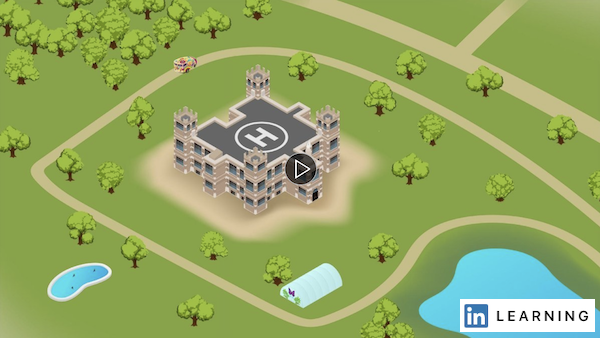

# Week 5 - Typography & Depth

## Typography, special effects, perspective grid, flare tool and exporting

In this module, you will be learning how to add text to your designs, apply `effects` to that text and other objects, use the `perspective grid` to give a three-dimensional effect to the artboard contents and use the `flare` tool to replicate the effect of light.

Once your design is complete, you are going to need to `export` it to be able to use it for the online and print projects. Here you will learn how to export to different types of files.

Let's get familiar with the basics of Typography.
<YouTube
  title="Beginning Graphic Design: Typography"
  url="https://youtu.be/sByzHoiYFX0"
/>

### TYPOGRAPHY

Typography is the arrangement of type to reflect a particular style and appearance. Take a look at this series of short tutorials and practice [**adding text to your designs.**](https://helpx.adobe.com/ca/illustrator/how-to/text-basics.html)

- Add a line of text
- Add paragraphs of text
- Format text
- Place text on or inside a path
- Re-shape text

### SPECIAL EFFECTS

The effects menu has a set of really interesting options that can make your design really interesting. Check this set of short tutorials to [**add images and artistic effects.**](https://helpx.adobe.com/ca/illustrator/how-to/image-effects-basics.html)

- Add images (vector vs raster)
- Understand effects
- Add effects
- Add creative brush strokes

### PERSPECTIVE GRID

The perspective grid tool allows you to easily create three-dimensional designs starting from two-dimensional shapes and in only a couple of steps. 

To access `Perspective Grid` Tool and `Perspective Selection` Tool in the Advanced toolbar, read [helpx.adobe.com/illustrator/using/tools.html](https://helpx.adobe.com/illustrator/using/tools.html)

## TODO

::: tip TODO Before next week

- If you have not read all these notes and watched the videos from this week, do that first.
- Finish reading the notes for week 5 and watch all the videos in the notes for week 6.
  :::
