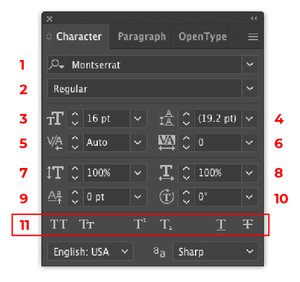
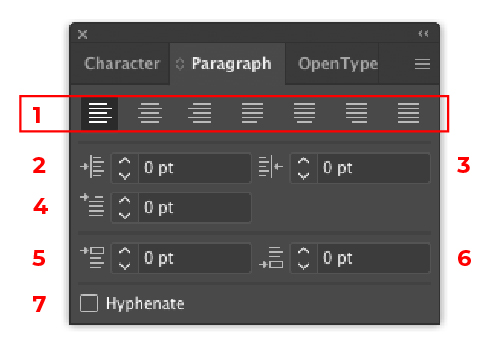
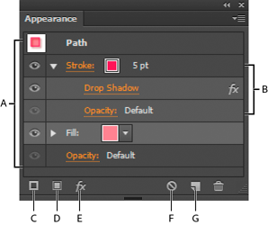

# Week 6 - Typography & Appearance

## Introduction

In this module, you will be learning how to add properly styled text to your designs, apply effects to that text and other objects, how to properly export your artwork properly for the web to multiple sizes and file types all at once.

## Basics of Typography

<YouTube
  title="Beginning Graphic Design: Typography"
  url="https://www.youtube.com/embed/sByzHoiYFX0"
/>

Typography is the arrangement of type to reflect a particular style and appearance. Take a look at this series of short tutorials and practice [adding text to your designs](https://helpx.adobe.com/ca/illustrator/how-to/text-basics.html).

- Add a line of text
- Add paragraphs of text
- Format text
- Place text on or inside a path
- Re-shape text

### Font Classifications

The two most common types of font classifications are Serif and Sans-serif. A serif is the small line or stroke at the end of characters in some type faces. Other common classifications you may run into include script (or cursive in CSS), slab serif, mono, and decorative, however there are many other classifications.

::: tip Font classifications

  

    Serif
     Ex: Georgia, Times New Roman
  

  

    Sans Serif
     Ex: Arial, Helvetica
  

  

    The font used on this site is called , which is a <strong>sans-serif</strong> font.
  

:::

#### Recommended Font Sites

- [Adobe Fonts](https://fonts.adobe.com) - large collection of premium fonts that are included in your subscription. Can be used effectively for both print and web.
- [Google Fonts](https://fonts.google.com) - large collection of well made free fonts. Great for use on the web and for clients with small budgets.

::: tip Careful of Free Font Websites!
There are a lot of websites that give away free fonts, however you need to be careful with the fonts you find online. Often, they are community made fonts that will have issues such as lacking all the proper characters needed for the web, or are just poorly designed and hard to read. Some sites also provide free downloads for fonts that they do not have the legal right to provide, which could land you in trouble in the future if you use that font for a real job/client.

In general, I would suggest sticking with the above font site suggestions!
:::

## Type Tools

### Character Panel

The character panel is used to format the styles of characters of your type. Here you can pick your fonts, weight, style, size, and numerous other settings.

<figure>

<figcaption>
<ol>
<li><strong>Font Family</strong> 

  A group of fonts containing varying weight and styles options of the same design.

</li>
<li><strong>Font Weight/Style</strong> 

  The weight and style options within a single font family.

</li>
<li><strong>Font Size</strong> 

  The size of the characters.

</li>
<li><strong>Leading</strong> 

  The space between lines of type. Measured from the bottom of one line of characters to the bottom of the next line of characters.

</li>
<li><strong>Kerning</strong> 

  Modify spacing between specific characters.

</li>
<li><strong>Tracking</strong> 

  Modify spacing between all characters.

</li>
<li><strong>Vertical Scaling</strong> 

  Vertically stretches type. Do not stretch type. Stretching type is considered bad typography. You should always see 100% here.

</li>
<li><strong>Horizontal Scaling</strong> 

  Horizontal stretches type. Do not stretch type. Stretching type is considered bad typography. You should always see 100% here.

</li>
<li><strong>Baseline Shift</strong> 

  Shifts the baseline (the invisible line which type sits on) up or down.

</li>
<li><strong>Character Rotation</strong> 

  Rotates characters within the text box.

</li>
<li><strong>Character Options</strong> 

  Allows you to apply styling options such as All Caps, Small Caps, Superscript, Subscript, Underline, and Strikethrough

</li>
</ol>
</figcaption>
</figure>

### Paragraph Panel

The paragraph panel is used to format styles that affect a group of text, or a paragraph. Paragraph styles include text alignment, indentation, spacing before and after, and hyphenation.

Different paragraphs within the same text box can have different paragraph styles, however they must be divided by new line or a hard return. Characters within the same paragraph all share the same paragraph styles.

<figure>

<figcaption>
<ol>
  <li><strong>Text Alignment</strong>

    Text alignment options including align left, align center, align right, justify left, justify center, justify right, and full justify.
  
</li>
  <li><strong>Left Indent</strong>

    Control how much indent is on the left hand side of text.
  
</li>
  <li><strong>Right Indent</strong>

    Control how much indent is on the right hand side of text.
  
</li>
  <li><strong>First-Line Left Indent</strong>

    Control how much indent is on only the first line of the left hand side of text.
  
</li>
  <li><strong>Space Before</strong>

    Controls how much space is made before the paragraph separating it from the previous paragraph in the same text box.
  
</li>
  <li><strong>Space After</strong>

    Controls how much space is made after the paragraph separating it from the next paragraph in the same text box.
  
</li>
  <li><strong>Hyphenation</strong>

    Turns on or off automatic word hyphenation. Word hyphenation is used to balance the length of lines in a paragraph and spacing between words. Hyphenation is generally not used on the web so you should have this unchecked.
  
</li>
</ol>
</figcaption>
</figure>

## Appearance panel

The Appearance panel gives us more direct control over the styling of our shapes and type. It allows us to apply and layer multiple strokes, fills, and effects to make more interesting designs.

- **A.** Path with stroke, fill, and drop shadow effect
- **B.** Path with effect
- **C.** Add New Stroke button
- **D.** Add New Fill button
- **E.** Add Effect button\*
- **F.** Clear Appearance button
- **G.** Duplicate Selected Item button

\* Effects can be applied to the entire shape, or individual strokes or fills.
