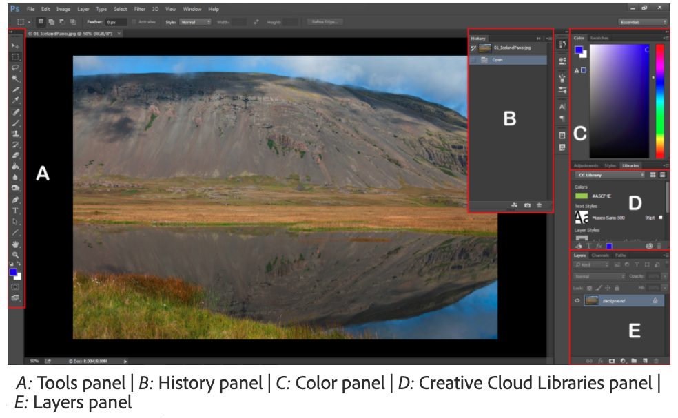
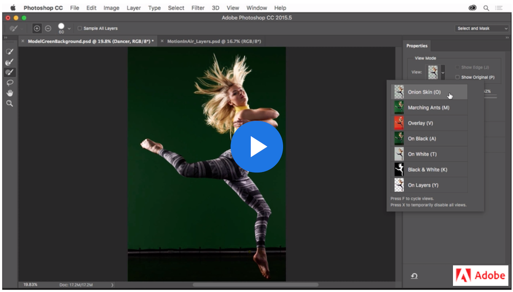
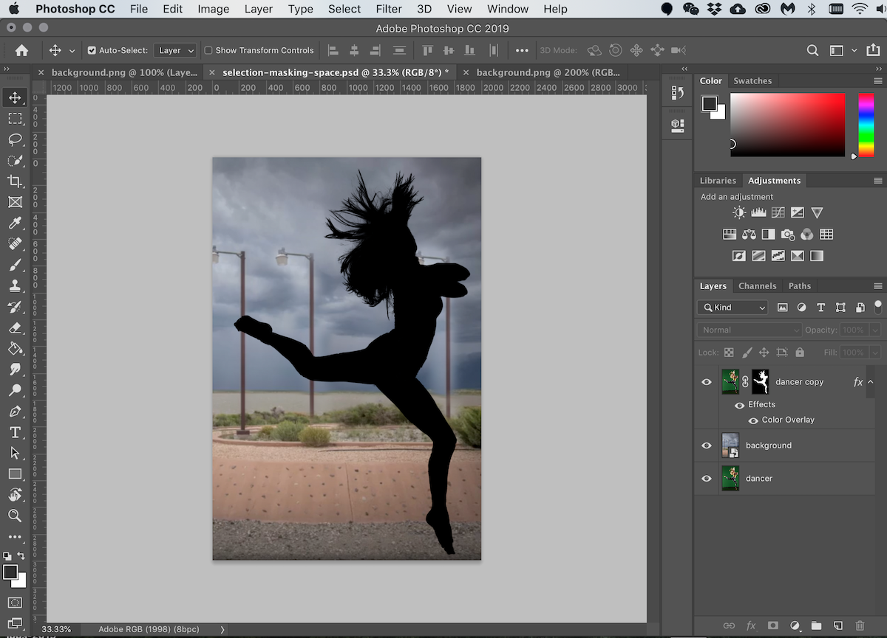
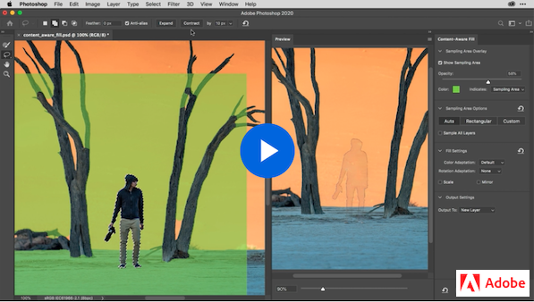

# Week 6 - Introduction to Adobe Photoshop

## Howdy!

Welcome to Adobe Photoshop, we will use Ps to create **raster-based** (bitmap) graphics. Our focus will be on mobile features, including designing User Interface(UI), creating/composing graphics and the necessary colour basics. Let's first get familiar with Photoshop `workspace` and then move to the basic features and tools.

## Common features & tools

### OPENING, CREATING, SAVING DOCUMENTS

 We will learn the how's and why's of setting up documents to open or create a new document, save a document, navigate the work area, zoom in/out, and undo mistakes. Take a look at this series of short tutorials to [**Get to know Photoshop.** (5 videos)](https://helpx.adobe.com/photoshop/how-to/ps-basics-fundamentals.html)

- Open images
- Get familiar with the work area
- Learn how to zoom and pan
- Undo a command
- Save your work

### USING ARTBOARDS

[*Artboards*](https://helpx.adobe.com/photoshop/using/artboards.html) article provides a quick reference in Photoshop User Guide. 

Think of an artboard as **a special type of layer group**. We will learn all kinds of Photoshop layers in the next few weeks. Have you noticed how similar or different artboard layers are in PhotoShop than in Illustrator? To begin, follow along this video tutorial. 

<YouTube
  title="Photoshop CC Artboards"
  url="https://www.youtube.com/embed/m6Wb2R2FTAc"
/>

### CHANGING IMAGE SIZE

We will learn to resize, crop, and straighten an image and change the canvas size. **NOTE:** Canvas and image resize won't work when artboards are used. Resize artboards instead. Let's Begin the video tutorials to [**Change the image size.** (4 videos)](https://helpx.adobe.com/photoshop/how-to/image-resizing-basics.html)

- Resize an image
- Set the resolution
- Crop and straighten an image
- Expand the canvas

### MAKING SELECTIONS

A selection isolates part of an image so you can work on that area without affecting the rest of the image. Take a look at this series of short tutorials and practice [**making selections.** (3 videos)](https://helpx.adobe.com/photoshop/how-to/selection-tools-basics.html)

- Learn selection basics
- Learn how to use the Quick Selection and Lasso tools
- Fine-tune a selection

#### New Object Selection Tool

Don't forget to try one of the 2020 new tools: `Object Selection`

<YouTube
  title="Object Selection Tool"
  url="https://www.youtube.com/embed/0Qm5nS2PMBs"
/>

### CREATING SILHOUETTES 

First, we will make and refine selections in the Selection and Masking Space to create a masking image. Let's practice along with this [Accurately select image areas tutorial.](https://helpx.adobe.com/photoshop/how-to/selection-masking-space.html)

Next, we will convert the masking image to a `Smart Object Layer` and change the `Blending Mode` of that layer to create a silhouette. To make the image more interesting, add a nice background layer. Here is a completed example. 

### CONTENT-AWARE FILL

Content-Aware Fill makes removing unwanted objects or distracting elements from your photos easy. Simply by drawing a selection around an area, Photoshop can instantly replace it with new image detail from the surrounding areas. Follow along this 5-min video, we will learn Content-aware fill workspace with the `Auto`, `Rectangular`, and `Custom` options.

### CONTENT AWARE FILL TOOLS 

The `Clone Stamp`, `Spot Healing Brush` and `Patch` tools are also content-aware fill tools. We use Spot Healing Brush to retouch unwanted dust spots, blemishes, scratches, stray hairs and other small image imperfections. In this short video, it introduces these tools to us. We will go over all other content-aware tools later in the photo retouching lesson. 

<YouTube
  title="Object Selection Tool"
  url="https://www.youtube.com/embed/aC3eyz7evBo"
/>

Follow the link to read over Adobe tutorials to enforce your knowledge of these tools: 
- Remove objects with the <a href="https://helpx.adobe.com/photoshop/how-to/clone-stamp-remove-object.html" target=”_blank”>Clone Stamp tool</a> 
- Clean up imperfections with <a href="https://helpx.adobe.com/photoshop/how-to/spot-healing-retouch-imperfections.html" target=”_blank”>Spot Healing Brush tool</a>
- Hide unwanted content with the <a href="https://helpx.adobe.com/photoshop/how-to/patch-tool-replace-content.html" target=”_blank”>Patch Tool</a>

## TODO

::: tip TODO Before next week

- If you have not read all these notes and watched the videos from this week, do that first.
- Read the notes and watch all the videos for Week 7.
- Hybrid 5 - In-class: Cut a silhouette
- Assignment 1 Due 
  :::