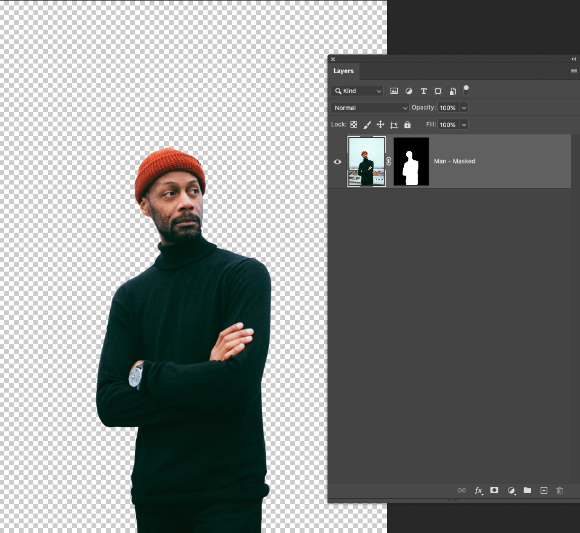
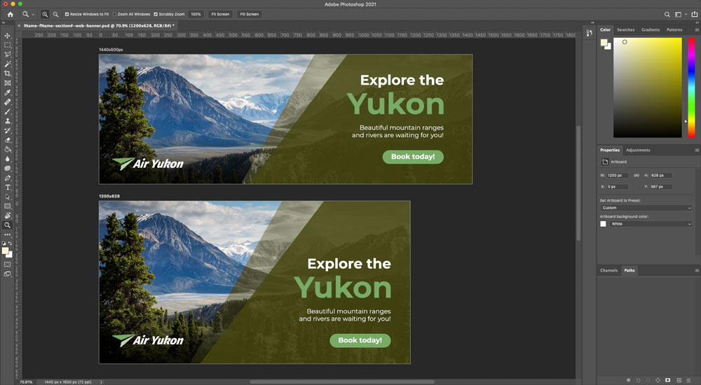
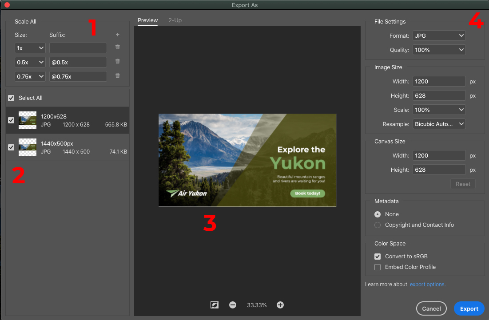

# Week 6 - Introduction to Photoshop

::: tip Files
[Week 6 Tutorial Files Download](https://drive.google.com/uc?export=download&id=1tldwDUhs1cc3Uiv_O8kAOz7kBsTDZsqU)
:::

## Introduction

Welcome to Adobe Photoshop, we will use Ps to create raster-based (bitmap) graphics. Our focus will be on mobile features, including designing User Interface(UI), creating/composing graphics and the necessary colour basics. Let's first get familiar with Photoshop `workspace` and then move to the basic features and tools.

### Helpful Photoshop Resources

- [Photoshop User Guide](https://helpx.adobe.com/photoshop/user-guide.html)
- [Photoshop Tool Galleries](https://helpx.adobe.com/photoshop/using/tools.html)
- [Photoshop Artboards](https://helpx.adobe.com/photoshop/using/artboards.html)
- [Keyboard Shortcuts](https://helpx.adobe.com/ca/photoshop/using/default-keyboard-shortcuts.html)
- [Adobe PS Tutorials](https://helpx.adobe.com/ca/photoshop/tutorials.html)
- [A comprehensive tutorial for Photoshop Tools](http://www.photoshop-bootcamp.com/beginners-guide-photoshop-tools-toolbar/)

### Free stock photos & videos sites:

- [Unsplash](https://unsplash.com/)
- [Pixabay](https://pixabay.com/)
- [Pexels](https://www.pexels.com/)

## Common Features & Tools

### Opening, Creating, Saving Documents

We will learn the how's and why's of setting up documents to open or create a new document, save a document, navigate the work area, zoom in/out, and undo mistakes. Take a look at this series of short tutorials to Get to know [Photoshop](https://helpx.adobe.com/photoshop/how-to/ps-basics-fundamentals.html). (5 videos)

- Open images
- Get familiar with the work area
- Learn how to zoom and pan
- Undo a command
- Save your work

### Using Artboards

[Artboards](https://helpx.adobe.com/photoshop/using/artboards.html) article provides a quick reference in Photoshop User Guide.

Think of an artboard as a special type of layer group. We will learn all kinds of Photoshop layers in the next few weeks. Have you noticed how similar or different artboard layers are in PhotoShop than in Illustrator? To begin, follow along this video tutorial.

<YouTube
  title="Photoshop CC Artboards"
  url="https://www.youtube.com/embed/m6Wb2R2FTAc"
/>

### Changing Image Size

We will learn to resize, crop, and straighten an image and change the canvas size. **Note:** Canvas and image resize won't work when artboards are used. Resize artboards instead. Let's Begin the video tutorials to [**Change the image size.** (4 videos)](https://helpx.adobe.com/photoshop/how-to/image-resizing-basics.html)

- Resize an image
- Set the resolution
- Crop and straighten an image
- Expand the canvas

### Making Selections

A selection isolates part of an image so you can work on that area without affecting the rest of the image. Take a look at this series of short tutorials and practice [**making selections.** (3 videos)](https://helpx.adobe.com/photoshop/how-to/selection-tools-basics.html)

- Learn selection basics
- Learn how to use the Quick Selection and Lasso tools
- Fine-tune a selection

### Object Selection Tool

Don't forget to try one of the 2020 new tools: `Object Selection`

<YouTube
  title="Object Selection Tool"
  url="https://www.youtube.com/embed/0Qm5nS2PMBs"
/>

## Creating Silhouettes with Masks

First, we will make and refine selections in the Selection and Masking Space to create a masking image. Let's practice along with this [Accurately select image areas tutorial.](https://helpx.adobe.com/photoshop/how-to/selection-masking-space.html)

Next, we will convert the masking image to a `Smart Object Layer` and change the `Blending Mode` of that layer to create a silhouette. To make the image more interesting, add a nice background layer. Here is a completed example.

## Destructive V.S. Non-destructive Editing

In Adobe Photoshop there is a incredibly important concept called **non-destructive editing**. What does that mean exactly? Non-destructive editing means that the edits, changes, filters, etc. that you do in your PSD file are all done in a way that is reversible and non-permanent. Meaning, if you make a mistake or make a large revision, you could easily undo certain changes and revert your work to an earlier state if necessary. This is important for a number of reasons:

1. It protects your assets so you don't accidentally change the original and no longer have access to the original asset (It's really embarrassing if you accidentally permanently change an asset and have to go back to your client to ask for another copy of the originals)
2. It makes it easy to revert to an earlier version if you decide to go another direction with your work
3. It protects your assets and does not remove image data, preserving the quality of your images.

### How do you edit non-destructively?

Some best practices to insure you are working non-destructively include:

1. **Maintain strong file organization** - helps to insure layers aren't deleted or modified unintentionally
2. **Use effective `Layer Masks`** - this allows you to hide portions of a layer without deleting pixels, preserving the ability to edit and change later on
3. **Use `Smart Objects` as much as possible** - making a layer a `Smart Object` protects the layer while allowing you to add/remove/edit filters, effects, and more without making them permanent

We will go into more detail on these topics as we move through the semester, but for now just make sure to keep those terms in mind.

### Destructive V.S. Non-destructive Editing Example

The simplest example of destructive v.s. non-destructive, and one of the most important to **always** remember, is to use a layer mask to remove unwanted areas of an image instead of erasing. Take a look at the example below. In both images, the background is removed, showing the checkered pattern representing a transparent background. The first example is destructive, with the pixels in the background being permanently erased, which makes it difficult or impossible to edit or undo those changes afterwards. The second example accomplishes the same result in a non-destructive way. The background is simply hidden with a layer mask, which can be edited and altered as many times as necessary.

<figure>

<figcaption><strong class="text-secondary">Destructive edit:</strong> the background has been erased and the pixels data is permanently lost</figcaption>
</figure>

<figure>

<figcaption><strong class="text-secondary">Non-destructive edit:</strong> the background has been removed with a mask. That masked can be edited afterwards to show/hide more areas of the image, or undone entirely if needed.</figcaption>
</figure>

It is expected in this course to always edit non-destructively\*, especially in the above scenario with masking. You will lose marks on exercises and assignments if destructive editing techniques are used when a non-destructive could have been used.

\*There are some edits that are only possible in a destructive manner. We will discuss some such edits throughout the course. In cases where destructive edits are required, you should create a duplicate of your layer before making a destructive edit in case you need to revert the edit. You can create a duplicate by right clicking on the layer and selecting `Duplicate Layer` or with keyboard shortcut `Command + J` on Mac or `Control + J` on Windows when the layer is selected.

## Exporting from Photoshop

Photoshop has numerous processes for exporting your artwork, all of which can be found in the `File > Export` dropdown menu. We are are going to focus on the `Export As` dialogue because:

1. It provides us with the most efficient options for exporting our images at the correct format and resolution for the web. It will automatically export the image in **RGB colour mode** at **72ppi**.
2. It can process multiple individual artboards at the same time, while providing options for customizing each artboards' output options.

This dialogue can be can be accessed through `File > Export > Export As` or with the (dangerous) keyboard shortcut `Shift + Option + Command + W` on Mac or `Shift + Control + Alt + W` on Windows.

<figure>

<figcaption>A Photoshop file that contains multiple artboards of different sizes.</figcaption>
</figure>

Take a look at the `Export As` dialogue and the options it provides. It should feel very familiar as it functions similarly to the `Export for Screens` dialogue in Adobe Illustrator.

<figure>

<figcaption>
<ol>
  <li><strong>Output Scales</strong>

    You can output the artboard at multiple different scales at once. Keep in mind, Photoshop is <strong>raster</strong> so you can only scale down, you cannot scale up.
  
</li>
  <li><strong>Artboard Select</strong>

    Select which artboards you wish to export by clicking on the check box. Click on the card to select the artboard that you want to update the settings.
  
</li>
  <li><strong>Preview Window</strong>

    Previews the artboard currently selected.
  
</li>
  <li><strong>Output Settings</strong>

    Control the settings of the outputted image including format, size, etc.
  
</li>
</ol>
</figcaption>
</figure>

It is important to properly **name your artboards** as the `Export As` dialogue uses the artboard names to name the exported file.

## To Do

::: tip To Do for Next Week

- Complete Select & Mask exercise
- Review Profile Card assignment
- Review week 7 content

  :::
