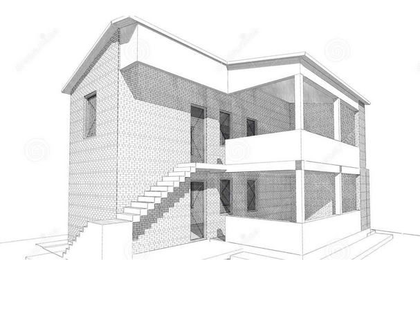
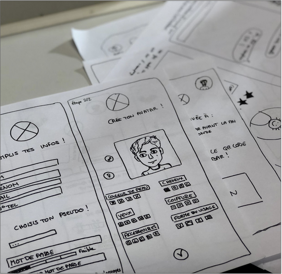
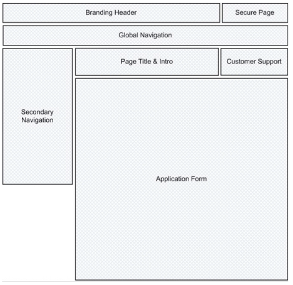
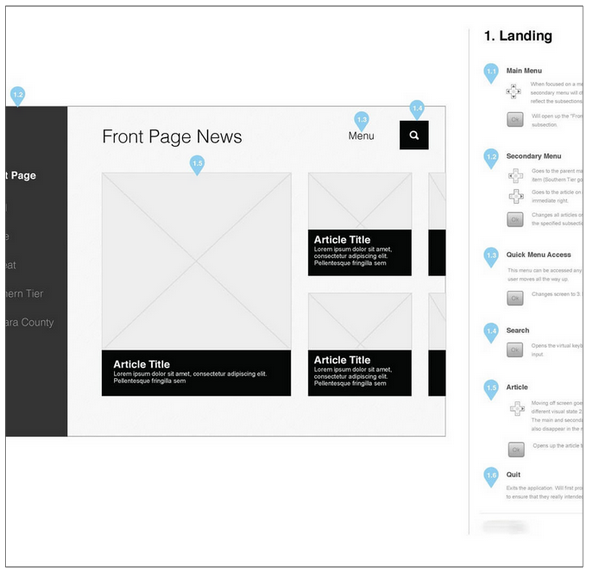
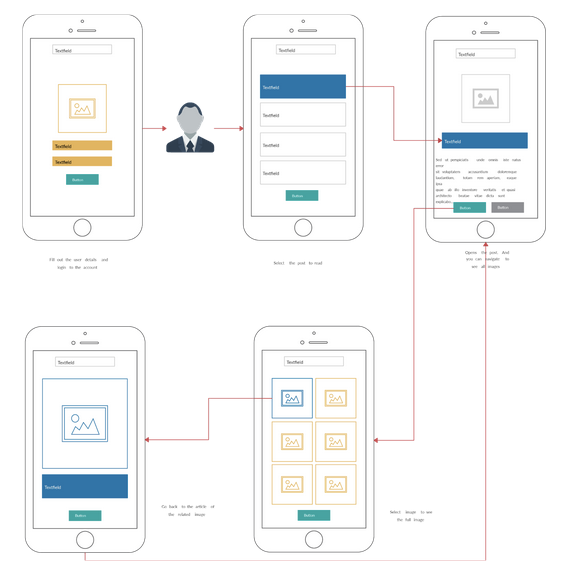
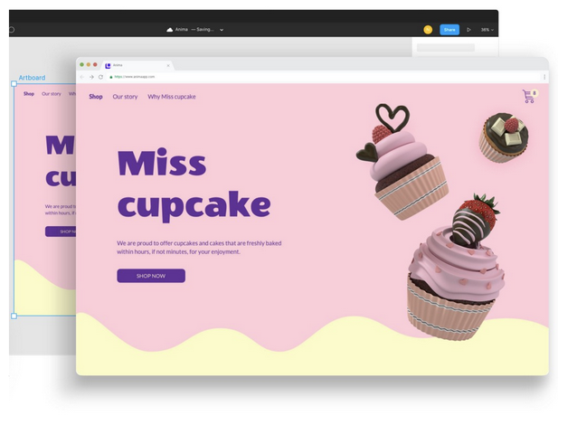

# Week 7 - Intro to Prototyping

## Intro to Prototyping

In design, there are several tools that designers use, that are fit for purpose. Tools can be defined very broadly from frameworks and best practices, to applications and templates.

## Why Prototype

- Provides a platform to support evaluation with users
- Creates a single source of truth between designers and product owners
- Provides a visual artefact to illustrate concepts that might otherwise be hard to describe
- Allows for early observation of user performance and interaction
- Creates an early opportunity to gather feedback from stakeholders

## Wireframes

A wireframe is a schematic representation of a page interface that shows where the content and functional elements should be placed on the page. Wireframes provide a framework for prototypes and assist in defining relationships between different pages.

## Types of Wireframes

- **Low Fidelity**
  - Paper / Sketch Wireframes
  - Reference Zone Wireframes
- **Mid Fidelity**
  - Annotated Wireframes
  - Flow Diagram Wireframes
- **High Fidelity**

### Low Fidelity: Paper / Sketch Wireframes

The main benefit of low fidelity wireframing is that it can be created quickly, which makes it a very useful tool for brainstorming sessions.
The goal of low fidelity wireframes is to make it easier to assess how logically the content and functional elements are arranged on individual pages.
Because of this, low fidelity wireframes typically don't employ any styling; they don't have colours, imagery, type styling, or anything else that might detract from the wireframe's primary goal.

### Low Fidelity: Reference Zone Wireframes

Similar to Paper/Sketch Wireframes, Reference Zone Wireframes are created quickly with no styling.
Reference Zone wireframes however are simpler in that only block outlines are drawn out which are then labelled to describe what is contained within.

### Mid Fidelity: Annotated Wireframes

Wireframe annotations are brief text explanations around a wireframe, that describe the functional purpose of individual elements or of the screens themselves.

These annotations can help reviewers, including client stakeholders, understand the reasoning behind specific design choices.
Annotations can include a brief description of the following information:

- What the element is (“A sign-up button”)
- What the element does (“Allows users to register a new account”)
- How it performs that action (“When users click on this button, they are directed to a new page with the sign-up form.”)

### Mid Fidelity: Flow Diagram Wireframes

There are commonly two uses for flow diagrams.

1. First, they simulate user interactions with your product as described in a particular use case. A use case, for instance, might refer to numerous screens and explain how they are used. Based on this knowledge, you may create a user interface-flow diagram that depicts the single use case's behavioral viewpoint.

2. Second, they enable you to gain a high-level overview of the user interface for your application. This overview is effectively the combination of all the behavioral views derived from your use cases.

Furthermore, these diagrams can also be used to assess the usability of a user interface.
If your system has a lot of boxes and connections, it may be too complicated for individuals to learn and comprehend.

### High Fidelity Wireframes

High fidelity (hi-fi) prototypes are made to look and behave as closely as possible to the finished product.

Teams typically develop high-quality prototypes when they have a clear idea of the product they intend to develop and need to test it with actual users or obtain stakeholder agreement for the final design.

The fundamental qualities of a high fidelity prototype are as follows:

- **Visual design:** Detailed and realistic design that looks exactly like a real app or website in terms of spacing, interface elements, and visuals.
- **Content:** Designers employ actual or related-to-real content. The majority or all of the content that will be present in the final design is present in the prototype.
- **Interactivity:** Prototypes are highly realistic in their interactions.

