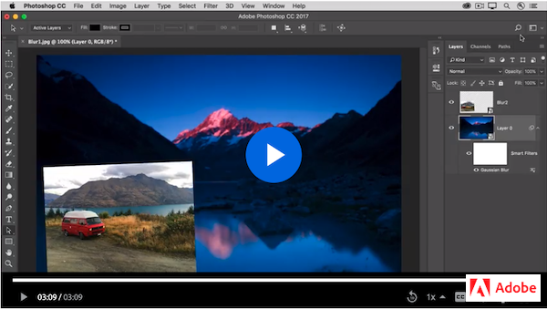

# Week 7 - Nondestructive editing & image composite

## Make me look good!

To make an image look good, we will first go over the **Fundation of Design for Layout & Composition**.

<YouTube
  title="Beginning Graphic Design: Layout & Composition"
  url="https://www.youtube.com/embed/a5KYlHNKQB8"
/>

Now, let's get familiar with the powerful feature of **nondestructive editing layers** in Photoshop. We will composite images with text layers, shape layers, layer effects, adjustment layers, smart filter layers, smart objects, and the blending mode to make changes to an image without overwriting its original image data.

## Nondestructive Image Editing 

[*Techniques for nondestructive editing* -](https://helpx.adobe.com/ca/photoshop/using/nondestructive-editing.html) Because nondestructive editing doesn’t remove data from an image, the image quality doesn’t degrade when you make edits. Now, we will use the type and shape tools to create layers. 

### TEXTS & SHAPES

Text and shape layers are editable in Photoshop just like they are in Illustrator. This set of video tutorials covers the basics of [adding texts and shapes layers.](https://helpx.adobe.com/photoshop/how-to/adding-text-shapes-basics.html)

- Add text
- Edit text
- Create a graphic shape
- Add a built-in custom shape

### LAYER STYLES

[*Layer effects and styles*](https://helpx.adobe.com/photoshop/using/layer-effects-styles.html) cover how a layer style is one or more effects applied to a layer or layer group. They change the appearance of a layer’s contents in a non-destructive way. 

The video below walks us through how to use layer styles, the different types of layer styles, how to remove, copy, and add them. 

<YouTube
  title="Everything You Need To Know About Photoshop Layer Styles"
  url="https://www.youtube.com/embed/gZZKYc7l2YA"
/>

Practice more with _How to Create a Glowing NEON Sign Text Effect Using Layer Styles_ video.  

<YouTube
  title="How to Create a Glowing NEON Sign Text Effect Using Layer Styles"
  url="https://www.youtube.com/embed/lrXTg7MzVyk"
/>

### ADJUSTMENT LAYERS (BASIC)

[*Adjustment layer*](https://helpx.adobe.com/photoshop/how-to/adjustment-layer.html) lets you apply colour and tonal adjustments to your image without permanently changing pixel values. 

This video explains what Photoshop adjustment layers are and the best way to work with them. Adjustment layers allow you to change the hue and situation, contrast, colour grading and the tone curve in Photoshop. You can use the adjustment layer mask to help with more refined photoshop editing techniques.

<YouTube
  title="Photoshop adjustment layers tutorial"
  url="https://www.youtube.com/embed/RPn5fTWCZnU?t=68"
/>

### SMART FILTERS

The first video will teach us to apply creative filters using the [Filter Gallery.](https://helpx.adobe.com/photoshop/how-to/applying-filters-basics.html) The edit is applied permanently to the image.

- Browse the Filter Gallery
- Blur an image with Smart Filters

[*Apply Smart Filters*](https://helpx.adobe.com/ca/photoshop/using/applying-smart-filters.html) let you add filter to a `Smart Object` layer. Smart Filters appear in the Layers panel below the Smart Object layer applied. You can adjust, remove, or hide Smart Filters, so they are nondestructive editing. Follow along the 2nd video to [Blur an image with Smart Filters.](https://helpx.adobe.com/photoshop/how-to/applying-filters-basics.html#blur_an_image_with_smart_filters)

Don't forget to play with this FUN [*Liquify Filter!*](https://helpx.adobe.com/photoshop/how-to/face-aware-liquify.html)

### BLEND MODES 

Layer blend modes enable the colors and tones on one layer to interact with those on the layer below. We will follow this video to put everything together by combining images and applying blend modes to create an interssting composite. 

#### Extra

We can [build a composite with layer masks](https://helpx.adobe.com/photoshop/how-to/create-composite-with-layer-mask.html) which we have learned last week, and even further to [match color in a composite.](https://helpx.adobe.com/photoshop/how-to/match-color-tones-composite.html)

Get inspired by this 1-min video tutorial: [How to make a photo composite](https://create.adobe.com/2019/7/16/how_to_make_a_photo_.html)

## TODO

::: tip TODO Before next week

- If you have not read all these notes and watched the videos from this week, do that first.
- Finish reading the notes for week 7 and watch all the videos in the notes for week 9.
- Assignment 2 - Employee profile page
  :::
