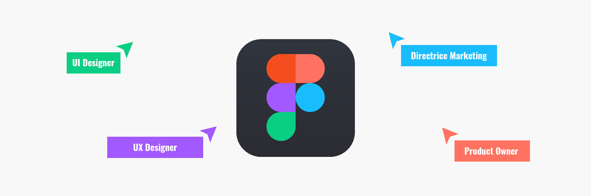
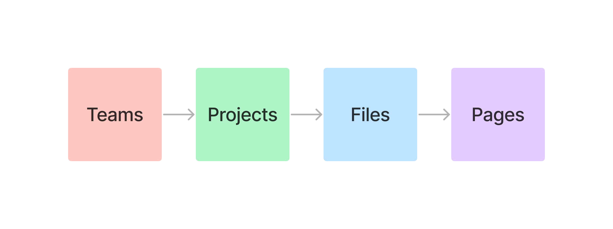
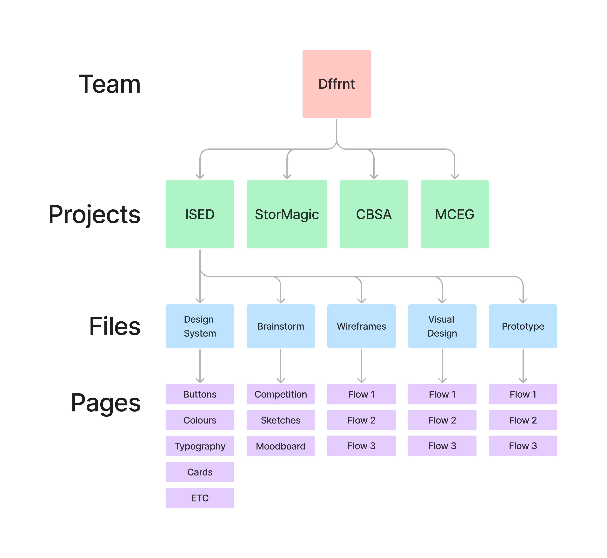
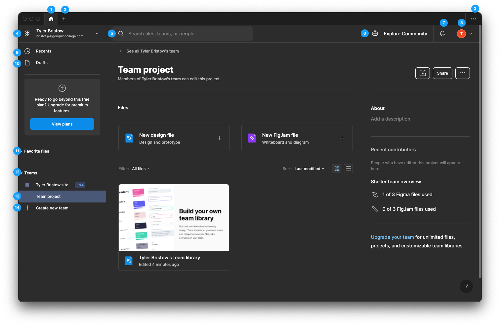
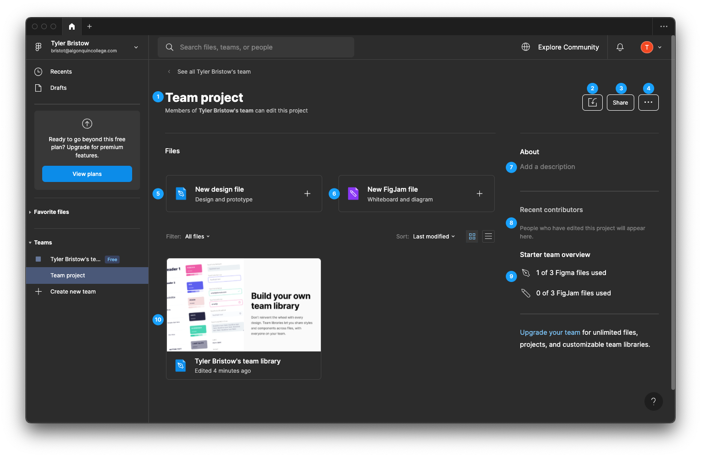
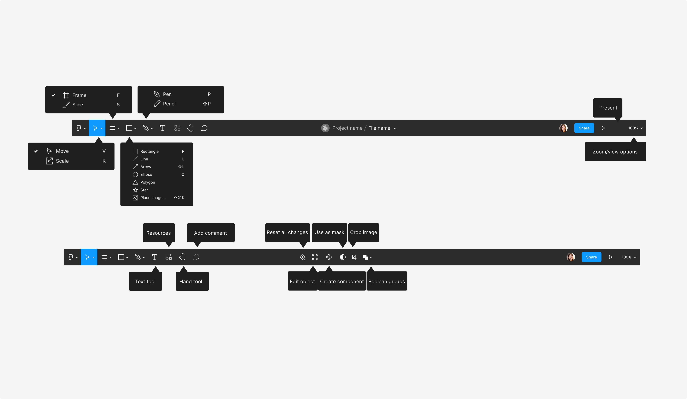
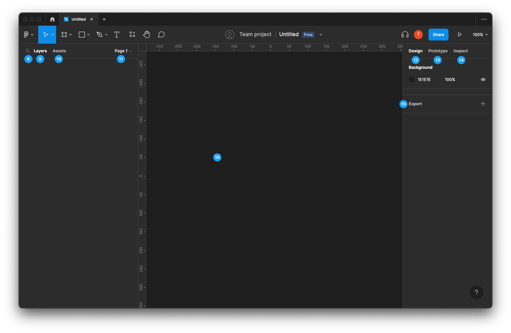
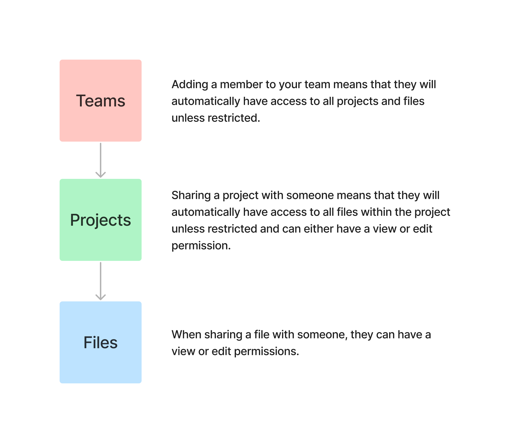
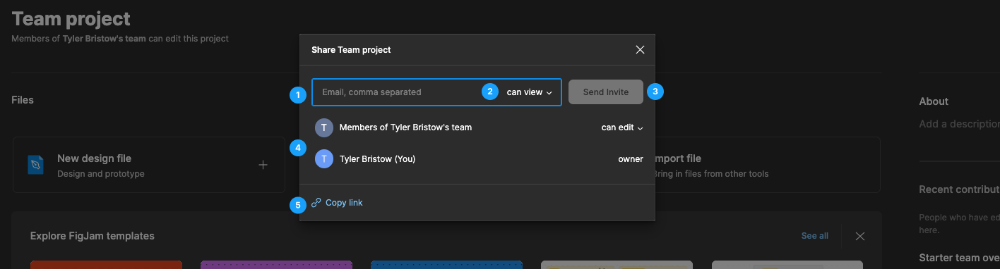
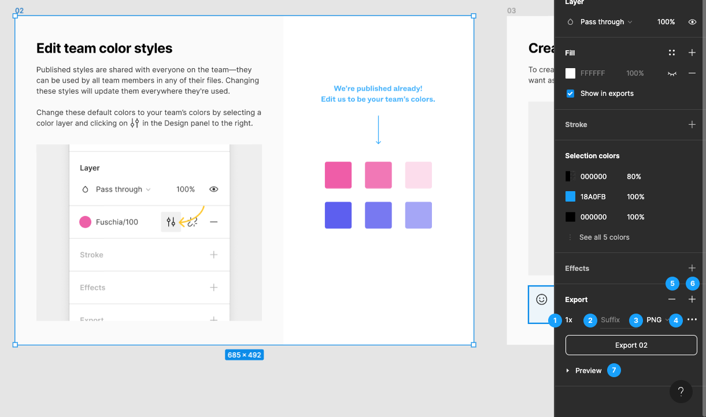

# Week 9: Part 1 - Intro to Figma

::: tip Figma Account

For you to access Figma, you must create a Figma account. Figma offers a Starter (free) plan, which will be enough for the remainder of the term. Please ensure that you make your account using your student email.

Make sure you select the Starter plan. If by some mistake you come to a screen that asks for payment information, something has gone wrong, and you will need to check the plan you selected.

A paid Figma plan is not included in your tuition as of now. This might change if Adobe integrates Figma into its Creative Cloud.

[How to create a Figma Account](https://help.figma.com/hc/en-us/articles/360039811114-Create-a-Figma-account)
:::

## What is Figma?

Figma is a web-based graphics editing and user interface design app. You can use it to do all kinds of graphic design work from wireframing websites, designing mobile app interfaces, prototyping designs, crafting social media posts, and everything in between.

Figma is different from other graphics editing tools. Mainly because it works directly on your browser. This means you get to access your projects and start designing from any computer or platform without having to buy multiple licenses or install software.

At its core, Figma is a tool made for user interface design and prototyping having a very beginner-friendly editor where you can create designs from scratch or using pre-made templates. There are plenty of resources for learning how to use Figma.

## Figma File Structure

### Teams

Teams give you access to a dedicated environment where you can create files and projects. Use teams to collaborate with others, or to structure and organize your own work. You can create or join multiple teams from a single Figma account.

### Projects

Projects allow you to group your related design files together in a single space, like a folder in a file system. They're only available in teams. You can create teams for your own work, or for collaborating within a group.

### Files

**Design Files**

Figma design files are powerful, collaborative environments where you turn your ideas into responsive and interactive designs.

They're tailored to the needs of designers, UX writers, and developers. You can access all the tools, features, and functionality you need to create and design digital experiences.

Use Figma design files to create and maintain artifacts and assets, when detail and precision are of the utmost importance.

**FigJam Files**

FigJam files are online whiteboards, an approachable space where anyone can take part. They tap into the spontaneous, joyful nature of working together.

FigJam files have curated tools and an infinite board for exploration and discovery. They're great for meetings, brainstorms, diagrams, and research.

### Pages

Pages give you an extra level of organization within files and projects. Design files can contain multiple pages, giving you more space to explore your ideas.

Every page has a canvas where all of your frames, groups, and layers live. The canvas has a finite size of -65,000 through +65,000 on each axis.

---

### Structure Example

## Interface

### Basics

1. Home
2. Add Tab
3. Recently Closed Files
4. Main Menu
5. Search
6. Explore Community
7. Notifications
8. Settings
9. Recents
10. Drafts
11. Favorite Files
12. Teams
13. Projects
14. Create New Team

### Project Management

Every project you create has its own project page where you can access all the project's files.

1. Project Name
2. Import: Import files between tools with a range of different file types into Figma.
3. Share: Share files or projects with other users.
4. Actions: Additional actions like creating a new file.
5. New Design File
6. New Figjam File
7. Project Description
8. Recent Contributors
9. Team Overview
10. Files: This is where all your files within this project can be found.

**Project View**

- View contributors to the project. Most active editors are at the top, so you know exactly who to talk to about the project.
- Add a description to communicate the context for the project. You can include links to websites or external files to share related resources with collaborators.
- View, manage, and create new files within the project. Pin important files to the top of the project for easy access.
- Click the project name to access project actions, like rename, delete, and favorite the project so it appears in the sidebar.
- Share the project with others, manage team access, and update collaborator's permissions.

## File Editor

### Toolbar

**Move and Scale tools**

When you open files in the Editor, Figma will select the Move Tool V by default .

The Move tool allows you to select and reorder layers in the Layers Panel, or move objects around on the canvas.

---

**Frame and Slice tools**

If you've used design tools before, you'll be familiar with Artboards. Like Artboards, frames allow you to choose an area of the canvas to create your designs in.

Use the keyboard shortcuts A or F to select the frame tool. Create a frame with your own dimensions in the canvas, or select a frame size from Figma's presets in the right-hand panel.

Click the arrow next to the frame tool to access the Slice tool. The Slice tool allows you to specify a region of the screen you want to export.

---

**Shape tools**

In addition to drawing your own shapes using the Pen Tool, there are a number of default shapes you can use in Figma. Click the drop down menu to choose from:

---

**Pen and Pencil tools**

The Pen tool P allows you create custom shapes and icons. Build complex Vector Networks using vector paths, anchor points, and bezier curves.

The Pencil tool allows you to add freehand drawings or annotations to your design files.

Figma will apply some basic smoothing to any paths you create with the Pencil tool. Press the Enter / Return key to edit the path and any anchor points in Vector Edit mode.

---

**Text Tool**

Text is one of the crucial components of interface design. Everything from the placement and arrangement of text, to the choice of font, has a part to play.

Select the Text tool from the Toolbar, or press the T key to add text layers to your file.

- Click once in the canvas to add a text layer that grows horizontally
- Click and drag to create a text layer that is fixed in size

Learn more about creating text layers.

---

**Hand tool**

The Hand Tool allows you to click around within a file without accidentally activating hover outlines, making selections, or moving objects.

If you're using Figma on a device with a touch screen, the Hand Tool allows you to pan around a file using your fingers.

---

**Comment tool**

The Comment tool allows you to quickly exchange ideas with collaborators. Use comments to respond to feedback, tweak your designs and iterate faster - all from the original design file.

Comments are accessible to anyone with view or edit permissions to the file.
Resources modal

The Resources modal allows you browse components from enabled libraries and browse, try, and install plugins and widgets. You can also access the Figma Community from the Resources modal. Learn more about widgets and plugins in the Figma Community →

---

### Workspace

1. Find (Command + F): Search for elements within your file.
2. Layers: View, edit, arrange objects from file.
3. Assets: Publish assets, use published assets or view assets from the current file.
4. Pages: View & edit pages.
5. Design: View & edit properties for shapes, text, frames, groups, etc.
6. Prototype: View & edit settings related to prototyping.
7. Inspect: View code for a selected item in CSS, iOS or Android.
8. Export: Export files or individual assets.
9. Canvas: The area in which you create your work.

## Sharing

### Sharing Structure

### How to share

1. Email Input: Input the email address of the person you wish to share with.
2. Permissions: Restrict permissions to "can view" or give permission to edit.
3. Invite Button
4. People Shared With: List of people who have access to this file or project.
5. Copy Link: Invite users by sending them a link.

## Exporting Files

Export your designs from Figma when you're ready to share them with the world. Export settings let you to customize how Figma exports your assets. This allows you to define what you want to export and how you want to export it.

You can export the following formats:

- PNG
- JPG
- SVG
- PDF

1. Export All Frames
2. Export All Frames to PDF

### Export Individual Elements

1. Scale:

Select a scale from the defaults in the list, or use the field provided to enter a custom size or scale. Enter a number along with the following letter:

- Add an x after the value to use it as a multiplier.
- Add a w after the value to set a fixed width.
- Add an h after the value to set a fixed height.

2. Suffix: Manually enter the format type you would like to export.
3. Format: Select a present format type.
4. Export options: Adjust any extra export settings.
5. Add: Add an export or an additional export with different settings.
6. Remove: Remove an export.
7. Preview: See a preview of how your assets will look.
