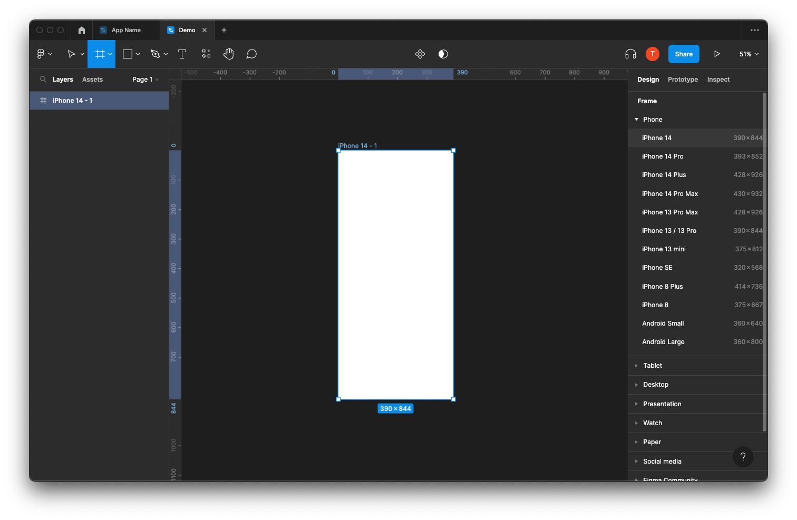
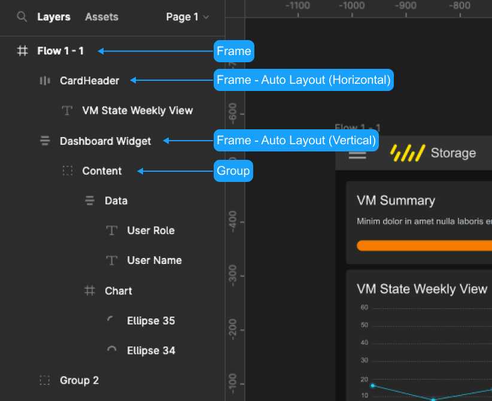
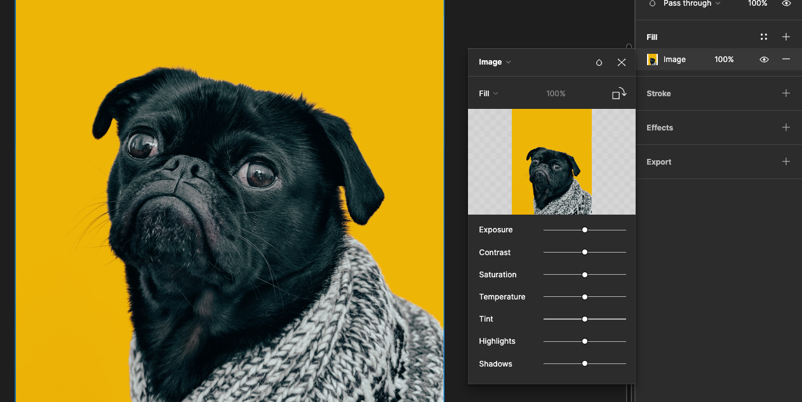
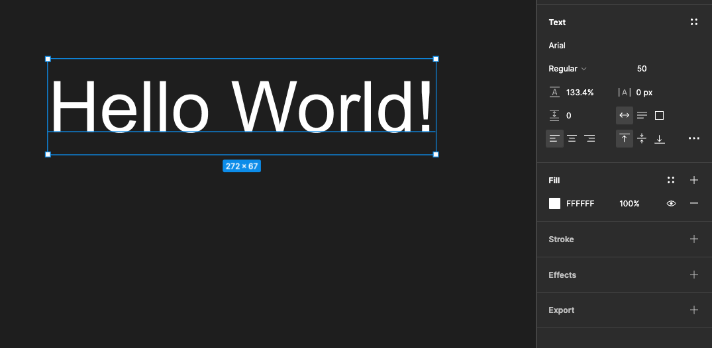

# Week 9: Part 2 - Figma Basics

::: tip Before Class

Prior to our second class of the week, you must create your Figma account.
You may also wish to download the desktop app.

If you do not remember how to create a Figma account, please refer to Week 9 in the course website.

:::

## Create a frame

To create a frame press A or F to see all frame options in the properties panel on the right-hand side and pick the size you wish to work with or simply draw your own frame.

Unlike traditional artboards, you can nest frames within each other. This allows you to create more complex designs that interact with each other. More about this later.

## Layout Grid

<YouTube
  title="Figma tutorial: Layout Grids"
  url="https://www.youtube.com/embed/zd8wrAdURN0"
/>

**Apply a layout grid to any frame** - Layout grids can only be applied to frames; this means you can apply them to any top level frames sized for a device (desktop, mobile, tablet), frames nested within your design, or even frames inside your components.

**Multiple grids on a frame** - You can add as many different layout grids to a frame. This means you could stack different types of grids on a single frame. Each of those grids can also be selected and pasted onto other frames since they are applied like other properties in the right hand sidebar.

**Grid appearance** - You can control the appearance (color and opacity) of each grid so they are easily differentiated.

## Layers and groups

On the left-hand side of your screen, you find the layers panel.

- Layers → every new element your add creates a layer automatically. You can rearrange layer by drag and drop.

- Group layers → Make sure to group layers (select layers and press cmd+G) to keep your file organized. It also helps you to quickly move and copy those groups across frames. To select an element within a croup press cmd and click on the item.

- Nested Frames → In Figma, you can also nest frames. This comes in handy when structuring and prototyping.

## Shapes

Figma uses something called Vector Networks, allowing the creation of complex shapes. Bye-bye Illustrator!

For default shapes, pick from the top menu or simply hit R(rectangle) L(line) or O(ellipse) and start drawing your shape. Hold shift to keep proportions in place. Each shape automatically creates its own layer.

To make your own, more complex shape, hit P, or pick the pen from the top menu. Once finished, simply press enter. No need to connect and close paths! Nice! You can change properties and manipulate vector shapes at any moment during your design process via the properties menu on the right-hand side. Vector Networks are very powerful if you want to know more. I recommend this in-depth tutorial from Design+Code.

<YouTube
  title="Figma tutorial: Shape Tools"
  url="https://www.youtube.com/embed/gnscqweM_NU"
/>

## Images

Drag the image onto your work area. In Figma, images are always placed inside a shape (like a mask). To change the behavior of the image go to Fill on the right-hand properties window and open the image properties.

In the dropdown you can choose:

- Fill → Image will fill the container.
- Fit → As we resize image will never be cropped or hidden
- Crop → Crop the image to the size and selection you need. Note, you don’t lose the rest of the image as in photoshop, you are only masking the image.
- Tile → Repeats the original images as necessary, and you can adjust the size of the tile.

Furthermore, Figma allows adjustment of properties such as color and saturation. Note that they are always re-adjustable and you will not lose the original image properties at any time.

<YouTube
  title="Figma tutorial: Images"
  url="https://www.youtube.com/embed/saoB8uqUAH8"
/>

## Typography

Figma comes preloaded with google fonts, which are fantastic! In case you prefer using local fonts, you either need to install Font Helper or the Desktop App for Figma. Also, make sure everyone else accessing the file has the same fonts installed.

Press T, to draw a text window or simply click and start typing. You can set all text properties on the right-hand side properties menu.

Text box behavior such as auto width, auto height and fixed-size will be relevant once we talk about auto-resizing later.

<YouTube
  title="Figma tutorial: Text Tool and Fonts"
  url="https://www.youtube.com/embed/5i-ebNTjad8"
/>

## Constraints

Constraints tell Figma how layers should respond when you resize their frames. This helps you to control how designs look across different screen sizes and devices.

<YouTube
  title="Figma tutorial: Constraints"
  url="https://www.youtube.com/embed/LHY9cm_2zwU"
/>

## Auto Layout

Auto Layout allows the creation of dynamic frames that grow or shrink as you change the content within them. This is a vast improvement as it saves you tons of time re-adjusting and will also let you check if your design works well with real content in one click.

<YouTube
  title="Figma in 5: Auto Layout"
  url="https://www.youtube.com/embed/TyaGpGDFczw"
/>

### Nested auto Layout

Auto-layout frames can be nested, combining horizontal and vertical layout properties to compelling interface design.

- Select the objects, click shift+A again, the auto-layout frame is now a child frame inside a parent frame.

You can choose vertical or horizontal distribution and white space on the right-hand properties menu. To prevent text frames from growing in one direction, make sure you choose fixed with or height.

## To Do

::: tip To Do for Next Week

- Complete Part 1 of your Final Project
- Review content from this week

  :::
