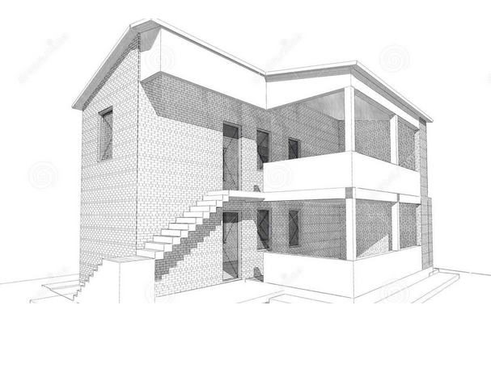
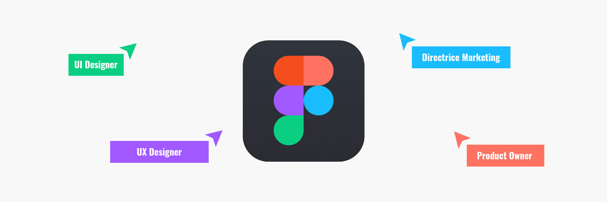
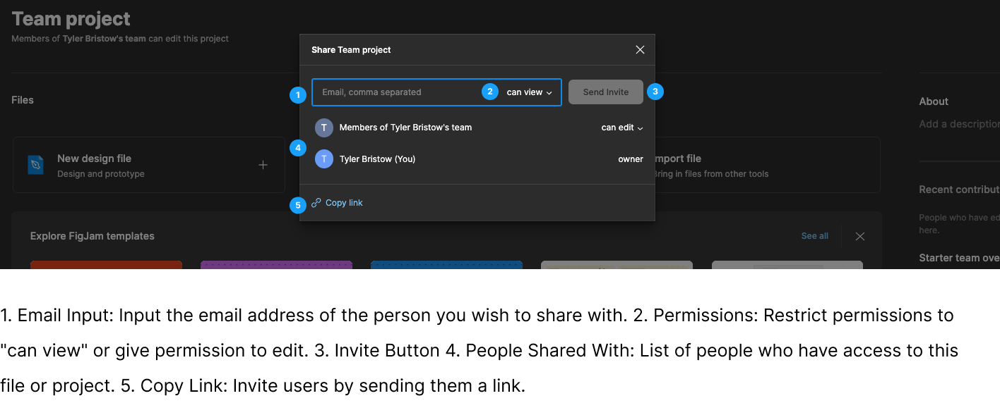
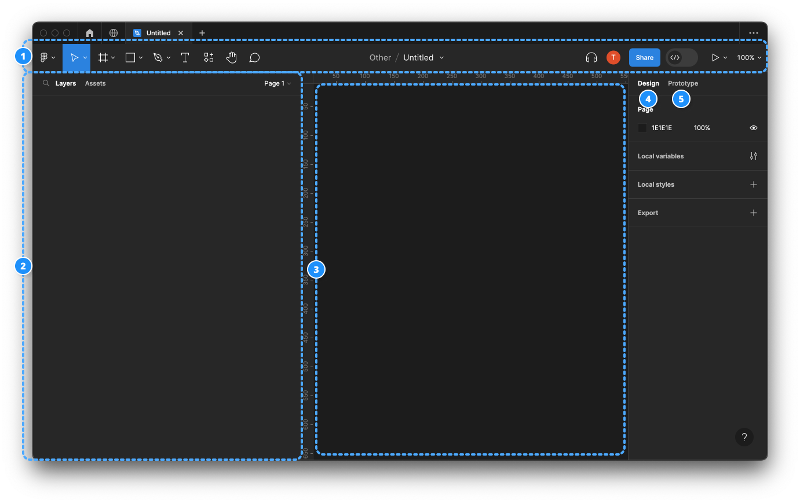

# Week 9 - Getting Started with Figma and Introduction to Prototyping

## Learning Objectives

By the end of this week, students will be able to:

1. **Understand the Importance and Purposes of Prototyping:** Explain the role of prototypes in the design process, including their use for user feedback, visualization, functionality testing, and validation.
2. **Identify Different Types of Wireframes:** Distinguish between low-fidelity, mid-fidelity, and high-fidelity wireframes, and understand their specific applications in the design process.
3. **Get Started with Figma:** Create a Figma account using a student email, understand the differences between the Starter and Education plans, and navigate the decision to use Figma's browser-based platform versus its desktop application.
4. **Navigate Figma's Interface and Utilize Basic Tools:** Familiarize with Figma's interface, including the toolbar, layers panel, canvas, design panel, and prototype panel. Gain practical experience with fundamental tools for moving, scaling, creating frames, and manipulating shapes.
5. **Engage in Real-Time Collaboration Using Figma:** Explore Figma's collaborative features, including real-time collaboration, comments and feedback, and the management of sharing and permissions at different levels (team, project, file, and page).
6. **Organize Projects and Control Access in Figma:** Understand and apply Figma's team-level sharing rules, project-level sharing rules, file-level sharing rules, and page-level sharing rules to manage design projects effectively.
7. **Introduction to Frames, Layers, and Groups in Figma:** Learn the basics of using frames for structuring designs, organizing elements with layers, and grouping elements for efficient manipulation and organization.

## Prototyping

Prototyping is a crucial step in the design process that involves creating interactive, testable representations of your design concepts. These prototypes can vary in fidelity, from low-fidelity wireframes to high-fidelity interactive simulations. Prototyping is essential for several reasons:

### Why Prototype

1. **User Feedback:** Prototypes allow you to gather early feedback from users or stakeholders. This feedback can help refine your design and identify potential issues.

2. **Visualization:** Prototypes provide a visual representation of your design ideas, making it easier for others to understand and evaluate the concept.

3. **Functionality Testing:** With interactive prototypes, you can test the functionality and user flow of your design, identifying any usability problems.

4. **Validation:** Prototypes help validate design decisions and ensure that the final product aligns with user needs and expectations.

### Wireframes

Wireframes are a type of prototype that focuses on the structural layout of a design.

### Types of Wireframes

<DetailsCard imageSrc="/w2024/moduleImages/week9/lowFidelityWireframes.png" :isFirst="true">

#### Low-fidelity

Low-fidelity wireframing offers the advantage of rapid creation, making it an invaluable tool for brainstorming sessions. Its primary purpose is to facilitate the evaluation of the logical arrangement of content and functional elements on individual pages. In the pursuit of this objective, low-fidelity wireframes intentionally avoid the use of styling elements such as colors, images, and typography, ensuring that the wireframe's core purpose remains undistracted.

**Types of Low-fidelity Wireframes:**

- [Paper Sketches](https://www.uxpin.com/studio/blog/paper-prototyping-the-practical-beginners-guide/)
- [Grey-Box Wireframes](https://www.arcstone.com/blog/what-is-a-wireframe-and-why-is-it-all-grey-boxes)
- Reference Zone Wireframes

</DetailsCard>

<DetailsCard imageSrc="/w2024/moduleImages/week9/midFidelityWireframes.png">

#### Mid-fidelity

Mid-fidelity wireframes are a balanced approach, offering a clearer depiction of content structure and layout compared to low-fidelity versions. While they include basic styling and might suggest interactions and user flow, they avoid intricate details. Mid-fidelity wireframes are efficient for collaboration, feedback collection, and usability testing, making them a popular choice in the design process.

**Types of Mid-fidelity Wireframes:**

- [Annotated Wireframes](https://balsamiq.com/learn/articles/wireframe-annotations/)
- [Flow Diagram Wireframes / Wireflows](https://uxplanet.org/ux-glossary-task-flows-user-flows-flowcharts-and-some-new-ish-stuff-2321044d837d)

</DetailsCard>

<DetailsCard imageSrc="/w2024/moduleImages/week9/highFidelityWireframes.png">

#### High-fidelity

High fidelity (hi-fi) prototypes are made to look and behave as closely as possible to the finished product.

Teams typically develop high-quality prototypes when they have a clear idea of the product they intend to develop and need to test it with actual users or obtain stakeholder agreement for the final design.

**The fundamental qualities of a high fidelity prototype are as follows:**

- **Visual design:** Detailed and realistic design that looks exactly like a real app or website in terms of spacing, interface elements, and visuals.
- **Content:** Designers employ actual or related-to-real content. The majority or all of the content that will be present in the final design is present in the prototype.
- **Interactivity:** Prototypes are highly realistic in their interactions.

</DetailsCard>

## Introduction to Figma

Figma is a cloud-based design and prototyping tool that allows designers to collaborate in real-time. It's widely used for creating user interfaces, interactive prototypes, and design systems. Figma offers several advantages, including:

- **Real-time Collaboration:** Multiple team members can work on the same project simultaneously, making it easy to collaborate on designs and prototypes.

- **Browser-Based:** Figma is accessible directly from a web browser, eliminating the need for software installations and ensuring compatibility across different platforms.

- **Design and Prototyping:** Figma provides a comprehensive set of tools for both design and prototyping, making it a one-stop solution for designers.

<YouTube
  title="What's Figma?"
  url="https://www.youtube.com/embed/Cx2dkpBxst8?si=x0DY7jv7moL-fnCX"
/>

### Creating a Figma Account

For you to access Figma, you must create a Figma account. Figma offers a Starter (free) plan with an education "upgrade", which will be enough for the remainder of the term. Please ensure that you make your account using your **student email**.

Make sure you select the Starter plan. If by some mistake you come to a screen that asks for payment information, something has gone wrong, and you will need to check the plan you selected.

A paid Figma plan is not included in your tuition as of now. This might change if Adobe integrates Figma into its Creative Cloud.

[How to create a Figma Account](https://help.figma.com/hc/en-us/articles/360039811114-Create-a-Figma-account)

::: tip Education Account

[Upgrade to Education account](https://www.figma.com/education/)
Follow the steps to upgrade your Starter account to an education account.

:::

### Installing Figma Desktop Version

Figma is different from other graphics editing tools. Mainly because it works **directly on your browser**. This means you get to access your projects and start designing from any computer or platform without having to buy multiple licenses or install software.

However they now offer a desktop version! Consider Downloading the Desktop app [here](https://www.figma.com/downloads/).

### Project Organization, Controlling Access, and Collaborative Features

#### Team-Level Sharing Rules

- Figma provides team-level sharing rules, allowing you to manage access and permissions for your entire team.
- You can define the roles and permissions of team members within your Figma organization, ensuring that access to shared resources and collaborative work is controlled at the team level.

#### Project-Level Sharing Rules

- At the project level, you can control who has access to the entire project.
- You can invite team members or external collaborators to join the project and define their roles (viewer, editor, or owner).
- Project owners can manage settings like permissions, ensuring that only authorized users can view, edit, or manage the project as a whole. It's a way to maintain the privacy and security of the entire design initiative.

#### File-Level Sharing Rules

- Within each design file, you can set specific sharing rules, determining who can access and collaborate on a particular design file.
- Similar to project sharing, you can invite collaborators and assign roles (viewer, editor) at the file level, allowing you to customize access for different design files within a project.

#### Page-Level Sharing Rules

- For even more granularity, Figma allows you to specify sharing rules for individual pages within a design file.
- You can choose which team members or external collaborators have access to specific pages, which is useful when you want to restrict access to certain design iterations or components.

#### Permission Types

Figma offers different permission types, including:

- **Viewer:** Users with view-only access can see the design but cannot edit it.
- **Editor:** Users with editing access can make changes and collaborate on the design.
- **Owner:** Owners have full control over the design, including settings and permissions.

### Collaborative Features in Figma

One of Figma's standout features is its collaboration capabilities:

- **Real-Time Collaboration:** Multiple team members can collaborate in real time on the same design project, making it easy to share feedback and make changes on the fly.

- **Comments and Feedback:** Figma allows users to leave comments on specific design elements or frames, providing an excellent way to communicate design suggestions or point out issues.

- **Sharing and Permissions:** You can easily share your Figma projects with stakeholders or clients. Figma provides various permission levels to control who can view, comment, or edit your designs.

### Figma Interface

The Figma interface is designed for ease of use and efficient design work. It consists of various components:

1. **Toolbar:** The toolbar at the top provides access to various tools and functions, such as selecting, drawing, and adding elements.
2. **Layers Panel:** The layers panel allows you to manage the structure of your design, organizing elements and layers.
3. **Canvas:** This is where you create your designs and prototypes. It's the central working area.
4. **Design Panel:** This panel lets you adjust the properties of selected elements, such as their size, position, and styles.
5. **Prototype Panel:** In this panel, you can create interactive prototypes and define user flows within your design.

### Toolbar

Here is some of the items on the toolbar:

 
<TwoColumnComponent
imageSrc="/w2024/moduleImages/week9/figma.png"
title="Main Menu"
description="The Main Menu in Figma is a primary navigation interface that provides access to various essential functions and features within the application. It typically contains options for creating new files, opening existing projects, managing account settings, and accessing tools for collaboration, sharing, and organization."
imageSize="50px"
/>

<TwoColumnComponent
imageSrc="/w2024/moduleImages/week9/move.png"
title="Move"
description="The Move tool in Figma is used to reposition elements within your design canvas. It allows you to click and drag elements to new locations, ensuring precise placement."
imageSize="50px"
/>

<TwoColumnComponent
imageSrc="/w2024/moduleImages/week9/scale.png"
title="Scale"
description="The Scale tool in Figma is specifically designed for resizing elements. You can use it to adjust the size of elements, maintaining proportions if needed, to achieve the desired dimensions in your design."
imageSize="50px"
/>

<TwoColumnComponent
imageSrc="/w2024/moduleImages/week9/frame.png"
title="Frame"
description="Frames serve as containers for your design elements, helping to define the boundaries of a design. You can nest frames within each other, enabling structured layouts."
imageSize="50px"
/>

<TwoColumnComponent
imageSrc="/w2024/moduleImages/week9/section.png"
title="Section"
description="Sections are used to organize and group different parts of your design project. They help you keep your project organized and navigate through large files."
imageSize="50px"
/>

<TwoColumnComponent
imageSrc="/w2024/moduleImages/week9/slice.png"
title="Slice"
description="Slices are used for exporting specific portions of your design. You can define areas within your design file that you want to export as separate images or assets."
imageSize="50px"
/>

<TwoColumnComponent
imageSrc="/w2024/moduleImages/week9/shape.png"
title="Shapes"
description="Shape tools in Figma allow you to create fundamental design elements like rectangles, circles, and polygons. You can customize these shapes by adjusting properties such as size, color, and corner radius."
imageSize="50px"
/>

<TwoColumnComponent
imageSrc="/w2024/moduleImages/week9/creation.png"
title="Creation Tools"
description="These tools encompass a range of drawing and creation tools that enable you to create custom design elements, illustrations, and shapes."
imageSize="50px"
/>

<TwoColumnComponent
imageSrc="/w2024/moduleImages/week9/text.png"
title="Text"
description="The text tool allows you to add and customize text within your designs. You can set fonts, styles, and formatting for text elements."
imageSize="50px"
/>

<TwoColumnComponent
imageSrc="/w2024/moduleImages/week9/resources.png"
title="Resources"
description="Resources typically refer to design assets, including images, icons, and files, that are used in your project. Figma provides a way to manage and organize these resources."
imageSize="50px"
/>

<TwoColumnComponent
imageSrc="/w2024/moduleImages/week9/hand.png"
title="Hand Tool"
description="The hand tool lets you navigate and pan around the design canvas, especially when working on large or zoomed-in projects."
imageSize="50px"
/>

<TwoColumnComponent
imageSrc="/w2024/moduleImages/week9/comment.png"
title="Add Comment"
description="The comment tool enables collaboration by allowing team members to leave comments and feedback on specific parts of the design. It's valuable for communication and review during the design process."
imageSize="50px"
/>

### Tools Deep Dive

<VideoCard youtubeTitle="Figma Tutorial: Shape Tools" youtubeUrl="https://www.youtube.com/embed/gnscqweM_NU?si=EO38vKkQjpkE3veB" :isFirst="true">

#### Shapes

Shapes are fundamental building blocks in design. Figma offers a variety of shape tools, including rectangles, circles, and polygons. You can customize shapes by adjusting properties like size, color, and corner radius.

</VideoCard>

<VideoCard youtubeTitle="Figma Tutorial: Images" youtubeUrl="https://www.youtube.com/embed/saoB8uqUAH8?si=d90glHQGjqzfiKQb">

#### Images

Figma allows you to import, edit, and manipulate images within your design. You can adjust image properties, such as size, position, and opacity. Images are essential for incorporating visual elements into your design.

</VideoCard>

<VideoCard youtubeTitle="Figma Tutorial: Text Tool and Fonts" youtubeUrl="https://www.youtube.com/embed/5i-ebNTjad8?si=HgKyBLj__lRA-x2r">

#### Typography

Typography plays a significant role in design. Figma provides robust text tools, allowing you to add and style text within your designs. You can control font selection, size, alignment, and more.

In this module, you'll explore the power of Figma for design and prototyping and gain insight into the different types of wireframes and their use in the design process. Additionally, you'll become familiar with key Figma tools and features for effective design work.

</VideoCard>

<VideoCard youtubeTitle="Figma Tutorial: Pen Tool Basics & Vector Networks" youtubeUrl="https://www.youtube.com/embed/5x2uHUB_pzw?si=zFfHO7WTcksdET9r">

#### Pen Tool

Figma's Pen Tool is a versatile vector drawing tool that enables designers and illustrators to create precise and custom shapes and paths with ease. It offers full control over anchor points and curves, making it an essential tool for creating intricate and polished designs.

</VideoCard>

<VideoCard youtubeTitle="Figma Tutorial: Layout Grids" youtubeUrl="https://www.youtube.com/embed/zd8wrAdURN0?si=PLsBfMyviTA7NxL_">

#### Figma's Layout Grids:

Figma offers versatile layout grids to establish consistent spacing, alignment, and visual structure in designs. These grids are customizable for various design types, enhancing design consistency and efficiency, particularly for web and app interfaces.

</VideoCard>

### Frames, Layers, and Groups

Figma provides essential tools for organizing your design elements:

- **Frames:** Frames serve as containers for your design elements. They help define the boundaries of a design, and you can nest frames within one another.

  > - Adobe Illustrator Employs **artboards** for organized design arrangements.
  > - Adobe Photoshop Utilizes **canvases** for design containment.

- **Layers:** Layers allow you to stack and organize elements within frames. You can control the order and visibility of layers.

- **Groups:** Groups let you combine multiple elements into a single unit for easier management and manipulation.

**We will continue learning about Frames, Layers and groups next week.**
