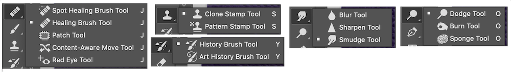
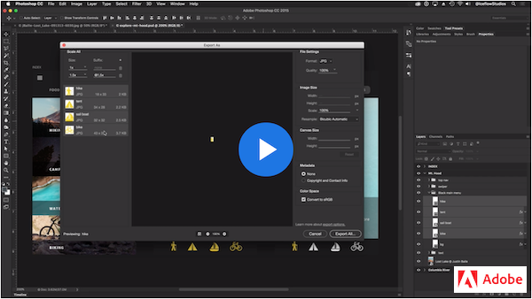

# Week 9 - Photo retouching & Image optimization

## Last but not least of Photoshop

It's time to have fun with intuitive photo retouching and restoring tools. We will work on optimizing images for the web. User hates to wait, taking 2-3 seconds to load an image is a long time for them. Our goal is to deliver high-quality images in the right format, dimension, resolution while keeping the smallest possible size with the least loading time. Finally, we will wrap up our learning by explorering the new and popular 2020 Adobe Photoshop CC features. 

## Photo Retouching & Restoration

[*Tool galleries*](https://helpx.adobe.com/photoshop/using/tools.html#tool_galleries) provides us a quick access to `Retouching tools gallery`. We will practice these tools when working on Hybrid 7 - Clean me up exercise.

### BASIC RETOUCH TOOLS

In this short video, Jeff Rojas discusses 5 basic retouching tools and where they're best used: Spot Healing Brush, Healing Brush, Patch, Content-Aware Move, and Clone Stamp tools

<YouTube
  title="5 Basic retouching tools"
  url="https://www.youtube.com/embed/30lc8fW7m2Y"
/>

### ART HISTORY BRUSH TOOLS 

You can turn a Photograph into a painting with Photoshop Art History Brush tools. This video will walk you through how to use the `Art History Brush` and `history brush` tools.

<YouTube
  title="Art History Brush in Photoshop CC"
  url="https://www.youtube.com/embed/V5UPmn9uflY"
/>

### DODGE, BURN, SPONGE

Byron Heal covers dodge tool, burn tool, sponge tool, and two dodge/burn examples in this 11-min tutorial. 

<YouTube
  title="5 Basic retouching tools"
  url="https://www.youtube.com/embed/ShmOZGt1l04"
/>

## Export as 

There are a few types of images that can be used on the web and mobile devices: JPGs, PNGs, SVGs, favicons, and GIFs. This flowchart will help you choose the appropriate format.

[*Export documents, artboards, and layers in various image file formats*](https://helpx.adobe.com/photoshop/using/export-artboards-layers.html) provides information to help you export images into correct PNG, JPG, GIF, and SVG file formats.

Let's follow along this video tutorial to pratice `Export As` feature in Photoshop. 

## Everything New in Adobe Photoshop CC 2020
[*What's new in Photoshop*](https://helpx.adobe.com/photoshop/using/whats-new.html) has the most recent Photoshop information. Photoshop CC 2020 is a big update with a lot of exciting new features. Watch this video to review and learn new tools: `Object Selection` tool, enhanced `Warp Transformation`, improved `Properties panel`, `Lens Blur` effect, `Cloud Documents` 

<YouTube
  title="What's new in 2020 Photoshop CC"
  url="https://www.youtube.com/embed/f8_S8M6ZJt4"
/>

Bonus video: Top 20 NEW Features & Updates EXPLAINED! - Photoshop 2020

<YouTube
  title="What's new in 2020 Photoshop CC"
  url="https://www.youtube.com/embed/ZIXM37H0mzs"
/>

## TODO

::: tip TODO Before next week

- If you have not read all these notes and watched the videos from this week, do that first.
- Read the notes and watch all the videos for Week 10.
- Hybrid 7 - In-class: Clean me up
  :::
