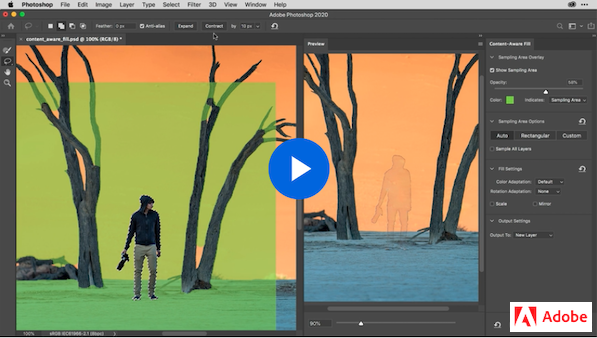

# Week 9 - Photo retouching & Image optimization

## Last but not least of Photoshop

It's time to have fun with intuitive photo retouching and restoring tools. We will work on optimizing images for the web. User hates to wait, taking 2-3 seconds to load an image is a long time for them. Our goal is to deliver high-quality images in the right format, dimension, resolution while keeping the smallest possible size with the least loading time. Finally, we will wrap up our learning by explorering the popular 2020 Adobe Photoshop new features. 

## Photo Retouching & Restoration

[*Tool galleries*](https://helpx.adobe.com/photoshop/using/tools.html#tool_galleries) provides us a quick access to `Retouching tools gallery`. We will practice these tools when working on Hybrid 7 - Clean me up exercise.

### BASIC RETOUCH TOOLS

In this short video, Jeff Rojas discusses 5 basic retouching tools and where they're best used: Spot Healing Brush, Healing Brush, Patch, Content-Aware Move, and Clone Stamp tools

<YouTube
  title="5 Basic retouching tools"
  url="https://www.youtube.com/embed/30lc8fW7m2Y"
/>

### DODGE, BURN, SPONGE

Byron Heal covers dodge tool, burn tool, sponge tool, and two dodge/burn examples in this 11-min tutorial. 

<YouTube
  title="5 Basic retouching tools"
  url="https://www.youtube.com/embed/30lc8fW7m2Y"
/>

Let's combine your skills in this content-aware technology for object removal tutorial.

## Export as 

There are a few types of images that can be used on the web and mobile devices: JPGs, PNGs, SVGs, favicons, and GIFs. This flowchart will help you choose the right format.

[*Export documents, artboards, and layers in various image file formats*](https://helpx.adobe.com/photoshop/using/export-artboards-layers.html) article provides information to help you export images into correct PNG, JPG, GIF, and SVG file formats.

Let's follow along this video tutorial to pratice Export As featuer in Photoshop. 

## TODO

::: tip TODO Before next week

- If you have not read all these notes and watched the videos from this week, do that first.
- Finish reading the notes for week 9 and watch all the videos in the notes for week 10.
  :::
