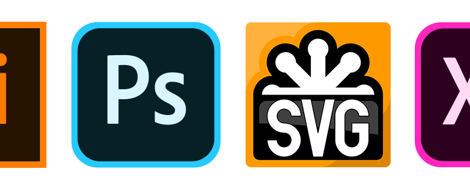

# MAD9011 - Mobile Design Fundamentals

::: tip
Students are introduced to mobile design fundamentals and graphical user interface design tools. The design concepts include mobile user interface visual elements, principles, accessibility and usability. Students learn industry standard tools and production techniques to create effective interfaces for mobile-first websites and mobile applications. Hands-on learning is the focus by which they use different software packages to design mobile interface visual elements, icons, splash graphics, scalable vector graphic (SVG), SVG animations, and wireframes. 

:::

## Course Description

- [Course Outline](https://ecoursemap.com/Outline?coursecode=MAD9011&courseversion=&academicyearid=107)
- [Course Section Information (CSI)](https://brightspace.algonquincollege.com/d2l/le/content/282592/Home)

## Student Workload Expectations

- 3 hours/week (instructional activity)
- Two hours in class 
- One hour of online exercises
- 3 hours per week of tutorials/videos/exercises/studying/practicing outside class

## Schedule

Zoom Calssroom

**Section 300:** 

- Thursday 10am - 12pm
- one hour online

**Section 310:**

- Wednesday 8am - 10am
- one hour online

## Technology Stack

<!-- <section style="
  display: grid; 
  grid-template-columns: repeat( auto-fit, minmax(160px, 1fr) );
  grid-template-rows: 130px;
  grid-auto-rows: 130px;
  justify-items: center;
  align-items: center;
  grid-gap: 1.5rem;
  margin-bottom: 2rem;"> -->

<!--  -->

<!--  -->

<!-- </section> -->

## Core Topics

- Basic design concepts and vector-based graphics
- Adobe Illustrator (Ai)
- Layout concepts and raster-based graphics
- Adobe Photoshop (Ps)
- Scalable Vector Graphics (SVG) and SVG mockups 
- User interface interaction design concepts – Putting it all together
- Adobe XD (Xd)

## Course Policy

The students will be learning online, guided by a curriculum with video tutorials, discussions and quizzes. They will reflect what they have learned on weekly homework and apply practical knowledge to assignments and final project. The in-class time will not be a lesson therefore each student must complete the curriculum modules themselves to move through this course. Participating in peer reviews, chats and forums will be a big part of the activities learned.

### Late Penalty

Assignments will be penalized for being late at the rate of 10% per day to a maximum of 30%. After 10 days beyond the due date, assignments will be given a grade of zero. 

Students may still submit their assignments after the ten days but it will only be for the purpose of receiving feedback on their work. No grade will be given.

### Performance Requirement

In-class work progress review is part of the performance assessment. A student must pass the combined term work (marked exercises, discussions, assignments, and quizzes) and score higher than 50% in all graded assignments, project, and 2 quizzes to pass this course. 

### Discussions

Under the Discussion section, you will already find some started, remember the conversation history exists as long as the course exists. Discussions will be moderated by your instructor for coherence. Please participate, ask questions, respond to some, also attach some of your better design for peer viewing and thoughts. Participation counts for 13% of the total for the course so please join in.

### Copyright

This course complies with the college directives. Please complete this [**Plagiarism Declaration**](https://brightspace.algonquincollege.com/d2l/le/content/187946/viewContent/4088957/View)

## Contacts

<ContactCard 
  name="SuCheng Lee"
  title="Professor"
  img-url="/F2020/slee_h.png"
  bio="Professor of the Mobile Application Design & Development Program at Algonquin College."
  :details="[
      { label: 'email', value: 'lees1@algonquincollege.com' }, 
      { label: 'github', value: 'lees1' },  
      { label: 'office', value: 'Zoom Meeting ID:713 343 1761' },
      { label: 'twitter', value: '@UXResearchLab' },
    ]"
/>

<ContactCard 
  name="Adam Robillard"
  title="Instructor"
  bio="Instructor of the Mobile Application Design & Development Program at Algonquin College."
  :details="[
      { label: 'email', value: 'instructor@algonquincollege.com' }, 
      { label: 'github', value: 'instructor' }, 
      { label: 'phone', value: '(613) 727-4723 x0' }, 
      { label: 'office', value: 'Zoom Meeting ID:' }
    ]"
/>

<ContactCard 
  name="Deborah Buck"
  title="Student Success Specialist"
  bio=""
  :details="[
      { label: 'email', value: 'buckd@algonquincollege.com' }, 
      { label: 'phone', value: '(613) 727-4723 x5503‬' }, 
      { label: 'office', value: 'N219' }
    ]"
/>

<ContactCard 
  name="Jody White"
  title="Student Success Specialist"
  bio=""
  :details="[
      { label: 'email', value: 'whitej@algonquincollege.com' }, 
      { label: 'phone', value: '(613) 727-4723 x‬2188' }, 
      { label: 'office', value: 'T111a' }
    ]"
/>
